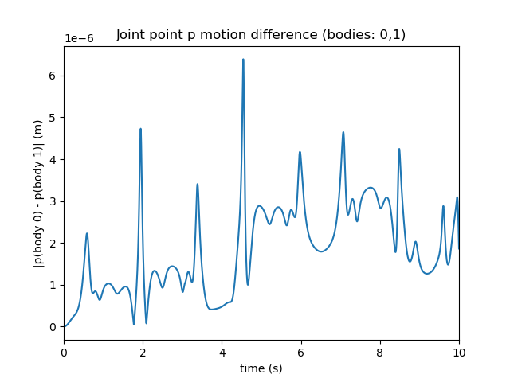
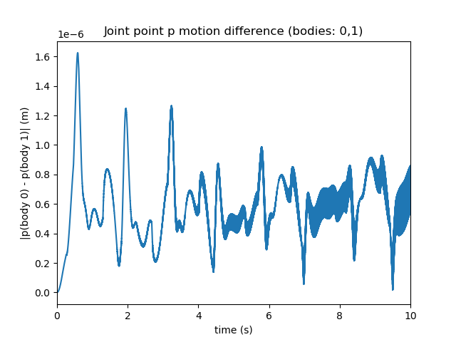
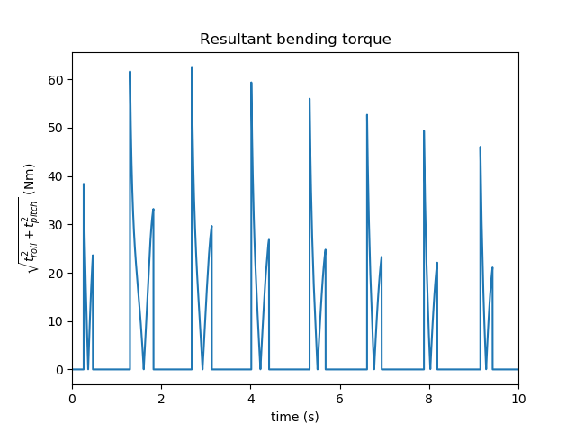
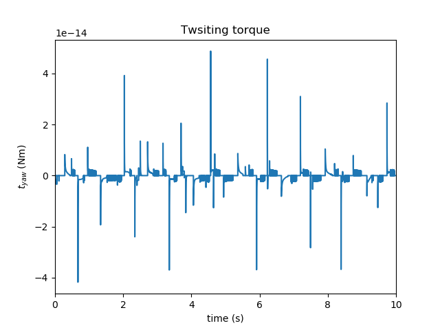

.. post:: Jul 31, 2018
   :tags: parmec, joints, algebraic, pendulum, torsion
   :author: Tomek

Parmec ball joint and articulated pendulum example
==================================================

PARMEC includes its first algebraic joint -- a ball joint -- which is realised by nullifying relative velocity
of a coincident point between two particles. :ref:`BALL_JOINT command <parmec-command-BALL_JOINT>` is used to define
a pair of particles and the point. Since joints are realised as algebraic constraints they do not influence the
stable time step. Instead a linear system is solved at every time step. Any number of joints can be added to the system,
although linear dependence should be avoided (QR solver can be used in such case, see the `Config.mak <https://github.com/tkoziara/parmec/blob/master/Config.mak>`_
file). The `articulated pendulum example <https://github.com/tkoziara/parmec/blob/master/examples/articulated_pendulum.py>`_
demonstrates performance of the ball joint, also in conjunction with the :ref:`torsional spring <parmec-command-TORSION_SPRING>`.
The example is summarised below. (...)

.. youtube:: https://www.youtube.com/watch?v=5ITLIV_tkT8
   :width: 640
   :height: 360

The above animation depicts a two-element articulated pendulum in two variants: the model on the left includes only
algebraic ball joints, the model on the right includes also damped torsion springs. One can see that the amount of
joint flexing is limited by the torsion spring.

The following two figures illustrate the time history of the distance between the coincident points of the ball
joint between the two bars, during the 10 second long simulation. The amount of joint leeway is controlled by the
time step and it remains bounded during the simulation (it is O(1E-6) in this case).

   Ball joint only variant of the example.

   Ball joint and torsion spring variant.

The final two figures illustrate the time histories of the torques of the torsional spring between the two articulated
bodies. The first figure below depicts the norm of the torque in the roll-pitch plane, responsible for controlling flexing.
There is a time-dependent pattern of a non-negligible torque magnitude. The second figure shows the yaw component of the
torsion spring -- and since twisting motion has not been initiated in this example, the torque remains near numerical zero.

   Roll-pitch plane torque norm.

   Twisting torque value.
