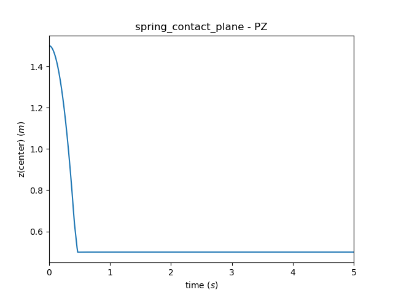
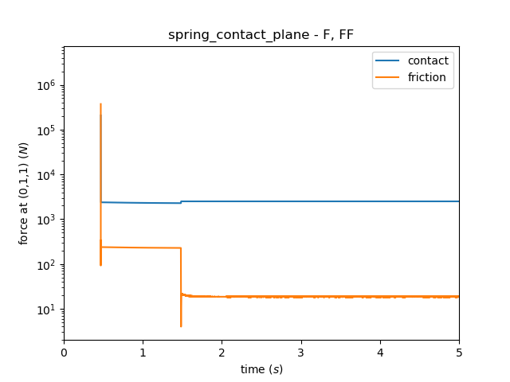

.. post:: May 23, 2018
   :tags: parmec, tests, contact, friction
   :author: Tomek

.. _blog-paremc-spring-contact:

Parmec spring contact
=====================

Parmec includes a simple spring contact modeling capability, where a contact plane on one particle can be paired up
with a contact point on another particle. Both particles can be analytical (need no geometry), while the contact spring
and dashpot curves are user defined. Friction, including sticking and slip, can also be added. An example test of this
capability is `tests/spring_contact_plane.py <https://github.com/tkoziara/parmec/blob/master/tests/spring_contact_plane.py>`_.
Parmec :ref:`SPRING command <parmec-command-SPRING>` is used to define the entire contact interactions (parameters
*spring*, *dashpot* and *friction*). Upon running it generates time history figures *tests/spring_contact_plane_{z,f_ff}.png*
and output files viewable with `ParaView <https://www.paraview.org/>`_. An animation and the figures are included below. (...)

.. youtube:: https://www.youtube.com/watch?v=uYN1jMhOJn0
   :width: 640
   :height: 360

