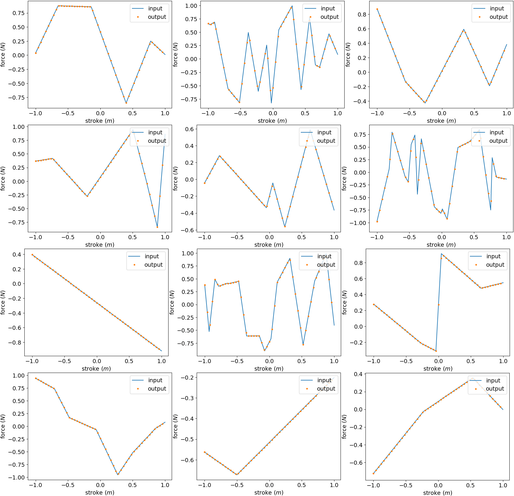

.. post:: Mar 7, 2018
   :tags: parmec, tests
   :author: Tomek

.. _blog-paremc-spring-curve-tests:

Parmec spring curve tests
=========================

Thanks to user feedback, Parmec begins to be smoothed out. An automated spring curve correctness test has now been added
as `tests/spring_curve_tests.py <https://github.com/tkoziara/parmec/blob/master/tests/spring_curve_tests.py>`_
allowing to automatically generate a number of simulations with random spring curves within a stroke-force box [-1, -1, 1, 1].
This test initiates what may become a suite of automated regression tests for Parmec. If `matplotlib <https://matplotlib.org/>`_
and `imagemagic <https://www.imagemagick.org>`_ are installed, it generates a juxtaposed image, comparing input and output curves.
An example image is included below. (...)

