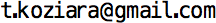

Contact
-------

You are welcome to join PARMES blog as an author as well as join software development. You are also welcome if
you would like to contribute your own code to this project or reference a commercial product that you support.
Also about any other matter, do not hesitate to contact me using the below form or via email |email|. Tomek:)

.. raw:: html

  <form id="contactform" method="POST">
  

  <input type="email" name="_replyto" placeholder="Email" size=34>
  <input type="hidden" name="_subject" value="Website contact parmes.org" />
  <input type="text" name="_gotcha" style="display:none" />
  <input type="hidden" name="_next" value="./thankyou.html" />
  

  

  <textarea name="text" placeholder="Your message" cols=36 rows=16></textarea>
  

  

  <input type="submit" value="Send">
  

  </form>
  
