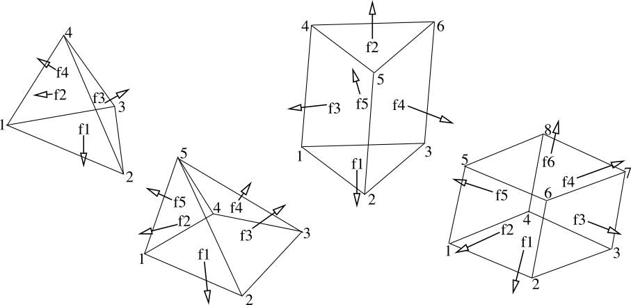

.. _parmec-input_commands:

Parmec Input Commands
=====================

.. role:: red

.. |br| raw:: html

   

PARMEC input language extends `Python <http://www.python.org/>`__.
Subroutines related to input processing are listed below.
**In all cases below, when an object number is returned,
indexing starts at 0 and increments on each call**.

ARGV
----

List command line arguments.

.. topic:: list = ARGV (| nonparmec)

  - **list** - Python list (possibly empty) of command line arguments

  - **nonparmec** - optional boolean flag enabling filtering out parmec arguments; default: True

RESET
-----

Erase all data.

.. topic:: RESET ()

  *(Can be used to run multiple simulations using one input file)*

.. _parmec-command-TSERIES:

TSERIES
-------

Create time series: a linear spline based on series of 2-points.

.. topic:: tmsnum = TSERIES (points)

  -  **tmsnum** - time series number

  -  **points** - a constant *v0*, or a list *[t0, v0, t1, v1, ....]* or
     *[[t0,v0], [t1,v1], ...]* or *[(t0,v0), (t1,v1), ...]* of points
     (where *ti < tj*, when *i < j*), or a path to a file storing pairs of
     times and values in format:

  # comment 1 ... |br|
  # comment 2 ... |br|
  t0 v0 |br|
  t1 v1 |br|

  # comment 3 ... |br|
  t2 v2 |br|
  ...

.. _parmec-command-MATERIAL:

MATERIAL
--------

Create material.

.. topic:: matnum = MATERIAL (density, young, poisson)

  -  **matnum** - material number

  -  **density** - mass density

  -  **young** - Young modulus

  -  **poisson** - Poisson ratio

SPHERE
------

Create a spherical particle.

.. topic:: parnum = SPHERE (center, radius, material, color)

  -  **parnum** - particle number

  -  **center** - tuple *:math:`\left(x,y,z\right)`* defining the center

  -  **radius** - radius

  -  **material** - material number

  -  **color** - positive integer surface color

.. _parmec-command-MESH:

MESH
----

Create a meshed particle.

.. topic:: parnum = MESH (nodes, elements, material, colors)

  -  **parnum** - particle number

  -  **nodes** - list of nodes: [\ *x0, y0, z0, x1, y1, z1, ...*\ ]

  -  **elements** - list of elements: [\ *e1, n1, n2, ..., ne1, me1, e2,
     n1, n2, ..., ne2, me2, ...*\ ], where *e1* is the number of nodes of
     the first element, *n1, n2, ..., ne1* enumerate the element nodes,
     and *me1* is the material number. Similarly for the second and all
     remaining elements. Supported numbers of nodes per element are *4, 5,
     6, and 8* for respectively *tetrahedron, pyramid, wedge, and
     hexahedron*, cf. :numref:`parmec-mesh-elements`

  -  **material** - material number

  -  **colors** - list of positive integer face colors: [\ *gcolor, f1,
     n1, n2, ..., nf1, c1, f2, n1, n2, ..., nf2, c2, ...*\ ], where
     *gcolor* is the global color for all not specified faces, *f1* is the
     number of nodes in the first specified face, *n1, n2, ..., nf1*
     enumerate the face nodes, and *c1* is the surface color of that face.
     Similarly for the second and all remaining faces. If only the global
     color is required, it can be passed as [\ *gcolor*\ ] or as *gcolor*
     alone.

.. _parmec-mesh-elements:

   Mesh element types in Parmec.

ANALYTICAL
----------

Create an analytical particle. Analytical particles have no shapes and
are not involved in contact.

.. topic:: parnum = ANALYTICAL ( \| inertia, mass, rotation, position, material, particle)

  Note, that all parameters are optional.

  -  **parnum** - particle number

  -  **inertia** - inertia tensor passed as a list [\ *Ixx, Iyy, Izz, Ixy,
     Ixz, Iyz*\ ]; optional, if **particle** parameter is used; default
     [\ *1, 1, 1, 0, 0, 0*\ ]

  -  **mass** - scalar mass; optional, if **particle** parameter is used;
     default 1

  -  **rotation** - optional orientation matrix passed as a list [\ *e1x,
     e1y, e1z, e2x, e2y, e2z, e3x, e3y, e3z*\ ], where vectors *e1*, *e2*,
     *e3* are orthonormal; default [\ *1, 0, 0, 0, 1, 0, 0, 0, 1*\ ]

  -  **position** - optional position vector passed as a tuple (*x, y,
     z*); default (*0, 0, 0*)

  -  **material** - material number; default *0*

  -  **particle** - optional; if specified, an existing particle is
     converted into an analytical particle; its properties are inherited
     or overwritten, depending on whether any of the **inertia**,
     **mass**, **rotation**, **position** parameters are used; if
     initially specified, particle shape is inherited and its animated
     motion is included into the results

OBSTACLE
--------

Create an obstacle.

.. topic:: OBSTACLE (triangles, color \| point, linear, angular)

  -  **triangles** - list of triangle tuples [(*t1x1, t1y1, t1z1, t1x2,
     t1y2, t1z2, t1x3, t1y3, t1z3), (t2x1, t2y1, t2z1, t2x2, t2y2, t2z2,
     t2x3, t2y3, t2z3), ...*\ ] defining the obstacle

  -  **color** - positive integer surface color or a list [\ *color1,
     color2, ...*\ ] of colors for each individual triangle

  -  **point** - spatial reference point

  -  **linear** - linear velocity history callback:
     :math:`\left(v_{x},v_{y},v_{z}\right)=` **linear**
     :math:`\left(t\right)`

  -  **angular** - spatial angular velocity history callback:
     :math:`\left(\omega_{x},\omega_{y},\omega_{z}\right)=` **angular**
     :math:`\left(t\right)`

.. _parmec-command-SPRING:

SPRING
------

Create a translational spring constraint. The applied force formula
reads

.. math::

  \text{force}\left(t\right)=\text{direction}\left(t\right)\cdot\left[\text{spring}
  \left(\text{stroke}\left(t\right)\right)+\text{dashpot}\left(\text{velocity}\left(t\right)\right)
  \cdot\left|\text{sign}\left(\text{spring}\left(\text{stroke}\left(t\right)\right)\right)\right|\right]

where

.. math::

  \text{direction}\left(t\right)=\left\{ \begin{array}{c}
  \text{d1}\left(t\right)=\left(\text{geom2}\left(t\right)-\text{point1}\left(t\right)\right)/\left|
  \text{geom2}\left(t\right)-\text{point1}\left(t\right)\right|\mathbf{\,if\,}\text{geom2 = }\left(x,y,z\right)\\
  \text{normal0}\left(t\right)\mathbf{\,if\,}
  \text{ geom2 =[point0, normal0]}\\\text{constant }\mathbf{direction}=\left(d_{x},d_{y},d_{z}\right)\\
  \text{d1}\left(t\right)-\text{d1}\left(t\right)\cdot\left(d_{x},d_{y},d_{z}\right)\text{if }\mathbf{planar}\text{ is enabled}
  \end{array}\right.

.. math::

  \text{point2}\left(t\right)=\left\{ \begin{array}{c}
  \text{geom2}\left(t\right)\mathbf{\,if\,}\text{geom2 = }\left(x,y,z\right)\\
  \text{proj}_{\text{geom2}}\left(\text{point1}\right)\mathbf{\,if\,}\text{ geom2 =[point0, normal0]}
  \end{array}\right.

.. math::

  \text{stroke}\left(t\right)=\text{direction}\left(t\right)\cdot\left[
  \text{point2}\left(t\right)-\text{point1}\left(t\right)\right]-\text{direction}\left(
  0\right)\cdot\left[\text{point2}\left(0\right)-\text{point1}\left(0\right)\right]

.. math::

  \text{velocity}\left(t\right)=\text{direction}\left(t\right)\cdot\frac{d}{dt}
  \left[\text{point2}\left(t\right)-\text{point1}\left(t\right)\right]

.. math::

   \text{sign}\left(x\right)=\left\{ \begin{array}{c}
   -1\text{ if }x<0\\
   0\text{ if }x=0\\
   1\text{ if }x>0
   \end{array}\right.

The :math:`\text{spring}\left(\text{stroke}\right)` and :math:`\text{dashpot}\left(\text{velocity}\right)` relationships are
defined by means of lookup tables; :math:`\text{force}\left(t\right)` is applied at :math:`\text{point2}\left(t\right)`, and
:math:`-\text{force}\left(t\right)` is applied at :math:`\text{point1}\left(t\right)`; dashpot force is not applied when
spring force is zero.

.. topic:: sprnum = SPRING (part1, point1, part2, geom2, spring \| dashpot, direction, planar, unload, ylim, inactive) :red:`(experimental)`

  -  **sprnum** - spring number

  -  **part1** - first particle number

  -  **point1** - tuple :math:`\left(x,y,z\right)` defining a point moving
     with the first particle

  -  **part2** - second particle number; :math:`-1` can be used to
     indicate a single-particle constraint

  -  **geom2** - tuple :math:`\left(x,y,z\right)` defining a second point, either moving with the second particle, or a spatial point;
     alternatively a list storing a point and a normal [:math:`\left(p_{x},p_{y},p_{z}\right)`, :math:`\left(n_{x},n_{y},n_{z}\right)`]
     defining a referential plane, moving with the second particle or spatially fixed; when a plane is defined the spring direction and
     stroke are calculated from a projection of **point1** onto this plane: in this case the input arguments **direction** and **planar**
     are ignored

  -  **spring** - spring force lookup table
     :math:`\left[\text{stroke}_{1},\text{force}_{1},\text{stroke}_{2},\text{force}_{2},...,\text{stroke}_{n},\text{force}_{n}\right]`;
     used for both loading and unloading when the **unload** table and the
     **yield** limits are not given

  -  **dashpot** - optional dashpot force lookup table
     :math:`\left[\text{velocity}_{1},\text{force}_{1},\text{velocity}_{2},\text{force}_{2},...,\text{velocity}_{m},\text{force}_{m}\right]`;
     default: :math:`\left[-\infty,0,+\infty,0\right]`

  -  **direction** - optional constant direction
     :math:`\left(d_{x},d_{y},d_{z}\right)`

  -  **planar** - optional planar spring flag; when ’ON’ spring direction
     :math:`\left(\text{point2}\left(t\right)-\text{point1}\left(t\right)\right)/\left|\text{point2}\left(t\right)-\text{point1}\left(t\right)\right|`
     is projected onto a plane orthogonal to :math:`\left(d_{x},d_{y},d_{z}\right)`; default: ’OFF’

  -  **unload** - spring unloading lookup table
     :math:`\left[\text{stroke}_{1},\text{force}_{1},\text{stroke}_{2},\text{force}_{2},...,\text{stroke}_{n},\text{force}_{n}\right]`;
     must be monotonically increasing

  -  **ylim** - tuple :math:`\left(f_{yc},f_{yt}\right)` defining the
     compression, :math:`f_{yc}<0`, and tension, :math:`f_{yt}>0`, yield
     limits; the unloading curve begins to be used once either of these
     limits is crossed; default: (0, 0)

  -  **inactive** - if *True* create an inactive spring, that can be activated by the :ref:`UNSPRING <parmec-command-UNSPRING>` command; default: *False*

.. _parmec-command-UNSPRING:

UNSPRING
--------

Undoes user defined selection of springs (**msprings**) based on the value of spring entities experienced by a different user defined
selection of springs (**tsprings**). Modifications to the spring curves occur during a simulation. Undone springs remain in the simulation
but generate zero forces.

.. topic:: UNSPRING (tsprings, msprings, limits | entity, operator, abs, nsteps, nfreq, unload, activate) :red:`(under development)`

  - **tsprings** - list of unique spring numbers whose spring entities are assessed against a criteria defined by limits; must be nonempty

  - **msprings** - list of unique spring numbers which are to be modified if **tsprings** meet the limits criteria (springs defined in **tsprings**
    are not modified unless also specified in **msprings**); must be nonempty

  - **limits** - tuple of (min, max) **tsprings operator entity** limit values which need to be exceeded for **msprings** to be modified; if either
    value is *None* then no failure limit is assumed e.g. (*None*, max) only has an upper failure limit; also min < max

  - **entity** - scalar spring entity string: (spring stroke) 'STROKE', (spring total force) 'STF', (spring force without damping) 'SF', cf.
    :ref:`HISTORY <parmec-command-HISTORY>` and :ref:`OUTPUT <parmec-command-OUTPUT>`; default: 'SF'

  - **operator** - collective **tsprings** operator string: 'SUM', 'MIN', 'MAX'; default: 'SUM'

  - **abs** - boolean, if *True* then spring forces are converted to absolute values before summation of the spring forces; default: *False*

  - **nsteps** - int, number of time steps between calls of UNSPRING; default: 1

  - **nfreq** - int, number of **nsteps** for which **tsprings** exceed **limits** before **msprings** are modified; default: 1

  - **unload** - Python dictionary (i.e. **unload** [key] = value), where *key* (int) - unique spring number (must be present in **msprings**)
    and value (int) - time series number (:ref:`TSERIES <parmec-command-TSERIES>`) defining the unload spring curve; an unloading curve must
    originate at zero and increase monotonically; once modification is activated, for each spring in **msprings**, the unloading curve is
    individually applied with a shift specific to the current displacement; both negative and positive displacement increments decrease total
    spring forces until zero; the spring force remains zero ever after; dashpot force is zero during unloading; default: instantaneous unloading
    to zero total force

  - **activate** - a list of inactive :ref:`SPRING <parmec-command-SPRING>` numbers that will be activated upon complete unloading of all **msprings**; default: empty

By default, modification of **msprings** is based on the sum of the elastic spring force values across all spring numbers defined in tsprings. This is a sum
of absolute values if **abs** = *True*. Forces in all **tsprings** must exceed the specific min/max values defined in **limits** for the spring curves to be
modified (i.e. spring curve modification is an *and* operation, not *or*). For example:

.. code-block:: python

  tsprings = (1,2)
  msprings = (3,4)
  limits = (-1.0, 1.0)
  UNSPRING(tsprings, msprings, limits)

results in the resultant elastic spring force (SF) being assessed against the (-1.0, 1.0) limits. For the spring curves of springs 3 and 4 to be modified,
the sum of the forces of springs 1 and 2 must be outside of the (-1.0,1.0) limits for **nfreq** (=1) number of **nsteps** (=1).

GRANULAR
--------

Define surface pairing for the granular contact interaction model.

.. topic:: GRANULAR (color1, color2, spring \| damper, friction, rolling, drilling, kskn)

  -  **color1** - first color (positive, or color1 = 0 and color2 = 0 to
     redefine default parameters)

  -  **color2** - second color (positive, or color1 = 0 and color2 = 0 to
     redefine default parameters)

  -  **spring** - normal spring constant

  -  **damper** - optional normal damping ratio; default: 1.0

  -  **friction** - optional Coulomb’s friction coefficient; default: 0.0;
     tuple :math:`\left(\mu_{s},\mu_{d}\right)` can be used to specify
     respectively static and dynamic friction coefficients; :red:`(experimental)`

  -  **rolling** - optional rolling friction coefficient; default: 0.0; :red:`(under development)`

  -  **drilling** - optional drilling friction coefficient; default: 0.0; :red:`(under development)`

  -  **kskn** - optional ratio of normal to tangential spring and dashpot
     parameters; default: 0.5

.. _parmec-command-RESTRAIN:

RESTRAIN
--------

Restrain particle motion.

.. topic:: RESTRAIN (parnum \| linear, angular)

  -  **parnum** - particle number

  -  **linear** - list :math:`\left[x_{1},y_{1},z_{1}\right]`,
     :math:`\left[x_{1},y_{1},z_{1},x_{2},y_{2},z_{2}\right]`, or
     :math:`\left[x_{1},y_{1},z_{1},x_{2},y_{2},z_{2},x_{3},y_{3},z_{3}\right]`
     defining directions of restrained linear motion; default:
     :math:`\left[0,0,0\right]`

  -  **angular** - list :math:`\left[x_{1},y_{1},z_{1}\right]`,
     :math:`\left[x_{1},y_{1},z_{1},x_{2},y_{2},z_{2}\right]`, or
     :math:`\left[x_{1},y_{1},z_{1},x_{2},y_{2},z_{2},x_{3},y_{3},z_{3}\right]`
     defining directions of restrained spatial rotation; default:
     :math:`\left[0,0,0\right]`

PRESCRIBE
---------

Prescribe particle motion. Prescribed motion overwrites this resulting
from dynamics and restraints.

.. topic:: PRESCRIBE (parnum \| linear, angular, kind)

  -  **parnum** - particle number

  -  **linear** - a tuple :math:`(i,j,k)` of :ref:`TSERIES <parmec-command-TSERIES>` numbers,
     or a callback: :math:`\left(v_{x},v_{y},v_{z}\right)=` **linear** :math:`\left(t\right)`,
     defining linear velocity or acceleration history; default: *not prescribed*

  -  **angular** - a tuple :math:`(i,j,k)` of :ref:`TSERIES <parmec-command-TSERIES>` numbers,
     or a callback: :math:`\left(\omega_{x},\omega_{y},\omega_{z}\right)=` **angular** :math:`\left(t\right)`,
     defining spatial angular velocity or acceleration history; default: *not prescribed*

  -  **kind** - string ’vv’, ’va’, ’av’, or ’aa’ indicating interpretation
     of respectively **linear** and **angular** time histories as either
     velocity or acceleration; default: ’vv’

VELOCITY
--------

Set particle velocity.

.. topic:: VELOCITY (parnum \| linear, angular)

  -  **parnum** - particle number

  -  **linear** - linear velocity tuple
     :math:`\left(v_{x},v_{y},v_{z}\right)`; default:
     :math:`\left(0,0,0\right)` at :math:`t=0`

  -  **angular** - angular velocity tuple
     :math:`\left(\omega_{x},\omega_{y},\omega_{z}\right)`; default:
     :math:`\left(0,0,0\right)` at :math:`t=0`

.. _parmec-command-GRAVITY:

GRAVITY
-------

Set gravity.

.. topic:: GRAVITY (gx, gy, gz)

  -  **gx** - constant :math:`x` float number, or callback
     **gx**\ :math:`(t)`, or :ref:`TSERIES <parmec-command-TSERIES>` number

  -  **gy** - constant :math:`y` float number, or callback
     **gy**\ :math:`(t)`, or :ref:`TSERIES <parmec-command-TSERIES>` number

  -  **gz** - constant :math:`z` float number, or callback
     **gz**\ :math:`(t)`, or :ref:`TSERIES <parmec-command-TSERIES>` number

DAMPING
-------

Set global damping, applied as

.. math::

   \text{force}=-m\left[\begin{array}{c}
   -d_{vx}v_{x}\\
   -d_{vy}v_{y}\\
   -d_{vz}v_{z}
   \end{array}\right],\text{ torque}=-\mathbf{\Lambda}\mathbf{J}\mathbf{\Lambda}^{T}\left[\begin{array}{c}
   -d_{\omega x}\omega_{x}\\
   -d_{\omega y}\omega_{y}\\
   -d_{\omega z}\omega_{z}
   \end{array}\right]

where :math:`m` is scalar mass, :math:`v` is linear velocity,
:math:`\mathbf{\Lambda}` is the rotation matrix, :math:`\mathbf{J}` is
the referential inertia matrix, and :math:`\omega` is spatial angular
velocity.

.. topic:: DAMPING (linear, angular)

  -  **linear** - linear damping curve callback :math:`\left(d_{vx},d_{vy},d_{vz}\right)=` **linear**
     :math:`\left(t\right)`, or a tuple :math:`(i,j,k)` of :ref:`TSERIES <parmec-command-TSERIES>` numbers

  -  **angular** - angular damping curve callback :math:`\left(d_{\omega x},d_{\omega y},d_{\omega z}\right)=`
     **angular** :math:`\left(t\right)`, or a tuple :math:`(i,j,k)` of :ref:`TSERIES <parmec-command-TSERIES>` numbers

CRITICAL
--------

Estimate critical time step.

.. topic:: h = CRITICAL ()

  -  **h** - critical time step

.. _parmec-command-HISTORY:

HISTORY
-------

Before running a simulation, request time history output.

.. topic:: list = HISTORY (entity \| source, point, h5file, h5last)

  -  **list** - output time history list (empty upon initial request,
     populated during simulation)

  -  **entity** - entity name; global entities: (output time) ’TIME’;
     particle entities: (position) ’PX’, ’PY’, ’PZ’, ’\|P\|’,
     (displacement) ’DX’, ’DY’, ’DZ’, ’\|D\|’, (linear velocity) ’VX’,
     ’VY’, ’VZ’, ’\|V\|’, (angular velocity) ’OX’, ’OY’, ’OZ’, ’\|O\|’,
     (body force) ’FX’, ’FY’, ’FZ’, ’\|F\|’, (body torque) ’TX’, ’TY’,
     ’TZ’, ’\|T\|’; spring entities: (spring length) 'LENGTH', (spring
     stroke) ’STROKE’, (spring total force) ’STF’, (spring force without
     damping) ’SF’;

  -  **source** - particle number *i*, or a list of particle numbers
     [\ *i, j, ...*\ ], or a spatial sphere defined as tuple
     :math:`\left(x,y,z,r\right)` :red:`(under development)`, or a spatial box defined as tuple
     :math:`\left(x_{\text{min}},y_{\text{min}},z_{\text{min}},x_{\text{max}},y_{\text{max}},z_{\text{max}}\right)`
     :red:`(under development)`; in case of a list of particle numbers the output entity is averaged
     over the set of particles; in case of a spatial sphere or box the
     output entity is averaged over the set of particles passing through
     it :red:`(under development)`; default: 0 (useful when entity is ’TIME’); spring number or a
     list of numbers can be used as a source in case of spring entities

  -  **point** - optional referential point used in case of a single
     particle source; default: particle mass centre

  - **h5file** :red:`(experimental)` - optional .h5 file storing existing results; in this case the history is retrieved
    from this file (if found) or an error message is issued; an appropriate output file needs to be picked depending
    on the entity, cf. :ref:`OUTPUT <parmec-command-OUTPUT>`; the output list is not populated until **h5last** = *True*;
    default: not specified

  - **h5last** :red:`(experimental)` - optional boolean flag marking a last call to HISTORY for which the **h5file** argument
    is used; for faster reading all such histories are populated once HISTORY(..., **h5file** = ..., **h5last** = *True*) is
    called; default: *False*

.. _parmec-command-OUTPUT:

OUTPUT
------

Before running a simulation, define scalar and/or vector entities
included into the output file(s). PARMEC outputs:

-  \*.dump files for spherical particles

-  \*0.vtk.\* **and/or** (\*0.h5, \*0.xmf) files for obstacles and mesh
   based particles **not** specified as **a subset** in the OUTPUT
   command

-  \*1.vtk.\*, \*2.vtk.\*, ... **and/or** (\*1.h5, \*1.xmf, \*2.h5,
   \*2.xmf, ...) files for mesh based particles specified as subsets,
   where numbers 1, 2, ... match consecutive OUTPUT calls

-  \*0rb.vtk.\* **and/or** (\*0rb.h5, \*0rb.xmf) for rigid body data of
   particles **not** specified as **a subset** in the OUTPUT command

-  \*1rb.vtk.\*, \*2rb.vtk.\*, ... **and/or** (\*1rb.h5, \*1rb.xmf,
   \*2rb.h5, \*2rb.xmf, ...) files for rigid body data of particles
   specified as subsets, where numbers 1, 2, ... match consecutive
   OUTPUT calls

-  \*0cd.vtk.\* **and/or** (\*0cd.h5, \*0cd.xmf) for contact data
   including particles **not** specified as **a subset** in the OUTPUT
   command

-  \*1cd.vtk.\*, \*2cd.vtk.\*, ... **and/or** (\*1cd.h5, \*1cd.xmf,
   \*2cd.h5, \*2cd.xmf, ...) files for contact data including particles
   specified as subsets, where numbers 1, 2, ... match consecutive
   OUTPUT calls

-  \*0sd.vtk.\* **and/or** (\*0sd.h5, \*0sd.xmf) for spring data
   including particles **not** specified as **a subset** in the OUTPUT
   command

-  \*1sd.vtk.\*, \*2sd.vtk.\*, ... **and/or** (\*1sd.h5, \*1sd.xmf,
   \*2sd.h5, \*2sd.xmf, ...) files for spring data including particles
   specified as subsets, where numbers 1, 2, ... match consecutive
   OUTPUT calls

.. topic:: OUTPUT (entities \| subset, mode, format)

  -  **entities** - list of output entities; default: [’NUMBER’, ’COLOR’,
     ’DISPL’, ’LENGTH’, ’ORIENT’, 'ORIENT1', 'ORIENT2', 'ORIENT3', ’LINVEL’,
     ’ANGVEL’, ’FORCE’, ’TORQUE’, ’F’, ’FN’, ’FT’, ’SF’, ’AREA’, ’PAIR’] where:

     -  ’NUMBER’ - scalar field of particle numbers (modes: ’SPH’, ’MESH’,
	’RB’), or scalar field of spring numbers (modes: ’SD’)

     -  ’COLOR’ - scalar field of surface colors (modes: ’SPH’, ’MESH’),
	or 2-component vector field of contact surface colors (modes:
	’CD’)

     -  ’DISPL’ - 3-component vector field of displacements (modes: ’SPH’,
	’MESH’, ’RB’), or scalar field of contact depths (modes: ’CD’), or
	scalar field of spring strokes (modes: ’SD’)

     -  ’LENGTH’ - scalar field of spring lengths (modes: 'SD')

     -  ’ORIENT’ - 9-component tensor field representing rigid rotation
        matrix (modes: 'RB'), or 3-component vector field of spring
	orientations (modes: ’SD’)

     -  ’ORIENT1’, 'ORIENT2', 'ORIENT3' - three 3-component vector fields
        representing columns of rigid rotation matrix (orientation vectors)
	(modes: ’RB’)

     -  ’LINVEL’ - 3-component vector field of linear velocity (modes:
	’SPH’, ’MESH’, ’RB’)

     -  ’ANGVEL’ - 3-component vector field of (spatially constant)
	angular velocity (modes: ’SPH’, ’MESH’, ’RB’)

     -  ’FORCE’ - 3-component vector field of (spatially constant) total
	body force (modes: ’SPH’, ’MESH’, ’RB’)

     -  ’TORQUE’ - 3-component vector field of (spatially constant) total
	body torque (modes: ’SPH’, ’MESH’, ’RB’)

     -  ’F’ - 3-component vector field of total contact forces (modes:
	’CD’), or scalar field of total spring forces (modes: ’SD’)

     -  ’FN’ - 3-component vector field of normal contact forces (modes:
	’CD’)

     -  ’FT’ - 3-component vector field of tangential contact forces
	(modes: ’CD’)

     -  ’SF’ - scalar field of spring force magnitude, without dashpot
	contribution (modes: ’CD’, ’SD’)

     -  ’AREA’ - scalar field of contact area (modes: ’CD’)

     -  ’PAIR’ - 2-component vector field of particle pair numbers (modes:
	’CD’, ’SD’)

  -  **subset** - optional particle number *i,* or a list of particle
     numbers [\ *i, j, ...*\ ], to which this specification is narrowed
     down

  -  **mode** - optional output mode or list of output modes: ’SPH’ for
     sphere output, ’MESH’ for mesh output, ’RB’ for rigid body output,
     ’CD’ for contact data output, ’SD’ for spring data output; default:
     [’SPH’, ’MESH’, ’RB’, ’CD’, ’SD’]

  -  **format** - optional output format, e.g. ’VTK’ or ’XDMF’, or list
     [’VTK’, ’XDMF’], where ’VTK’ is the text based legacy `VTK
     format <http://www.vtk.org/wp-content/uploads/2015/04/file-formats.pdf>`__,
     ’XDMF’ is the HDF5/XML based `XDMF
     format <http://www.xdmf.org/index.php/XDMF_Model_and_Format>`__;
     default: ’XDMF’

.. _parmec-command-DEM:

DEM
---

Run DEM simulation.

.. topic:: t = DEM (duration, step \| interval, prefix, adaptive)

  -  **t** - simulation runtime in seconds

  -  **duration** - simulation duration

  -  **step** - time step; initial if **adaptive** is used or constant
     otherwise

  -  **interval** - output interval (default: time step); tuple
     :math:`\left(dt_{\text{files}},dt_{\text{history}}\right)` can be
     used to indicate different output frequencies of output files and
     time histories, respectively; callback functions or :ref:`TSERIES <parmec-command-TSERIES>`
     numbers can also be used, e.g.
     :math:`dt_{\text{files}}=\text{dt_fiels}\left(t\right)` and
     :math:`dt_{\text{history}}=\text{tmsnum}`, prescribing variable
     interval frequencies, depending on current time;

  -  **prefix** - output file name prefix (default: input file name
     without the “.py” extension)

  -  **adaptive** - adaptive time step reduction factor; zero turns off
     adaptive time stepping, values :math:`>0.0` and :math:`\le1.0` turn
     it on; default: :math:`0.0` :red:`(experimental)`
