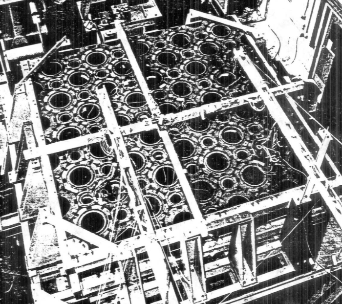
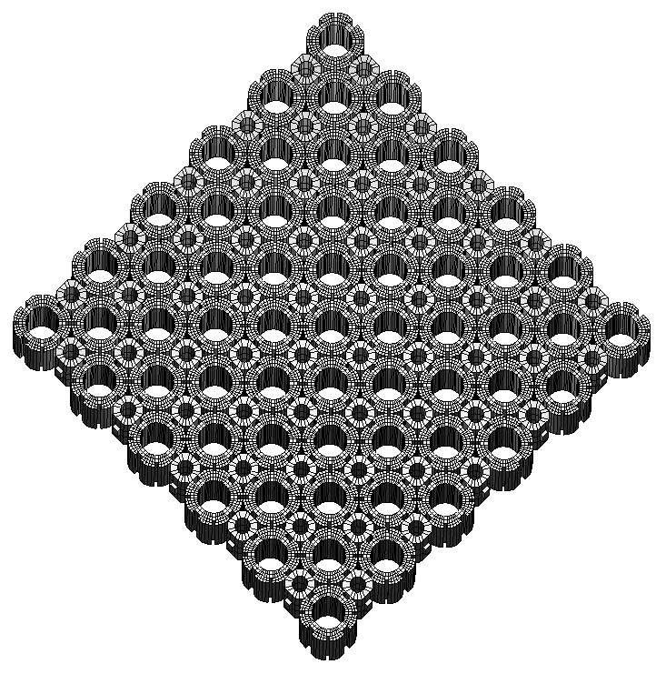
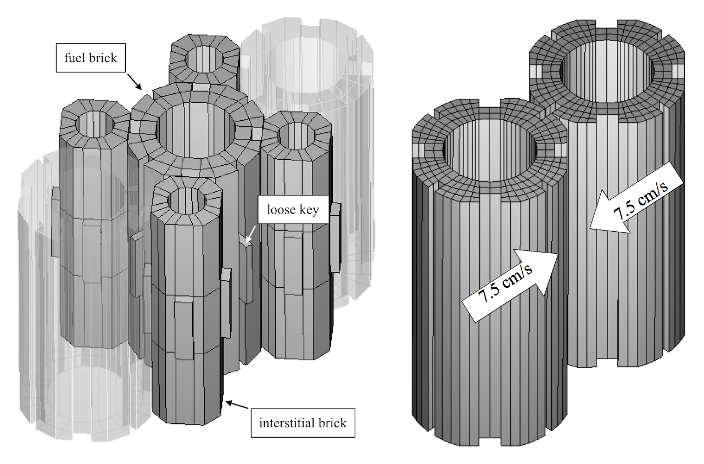
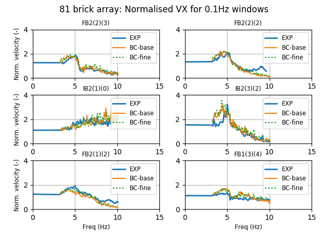
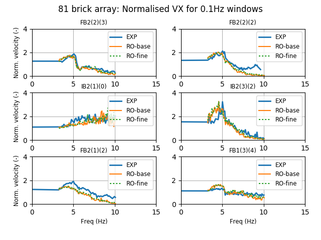
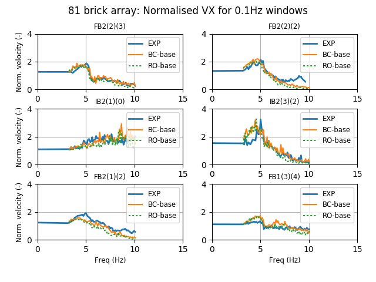
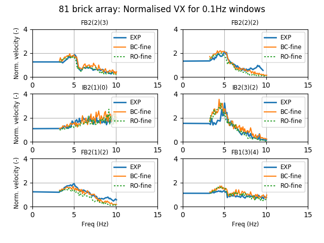
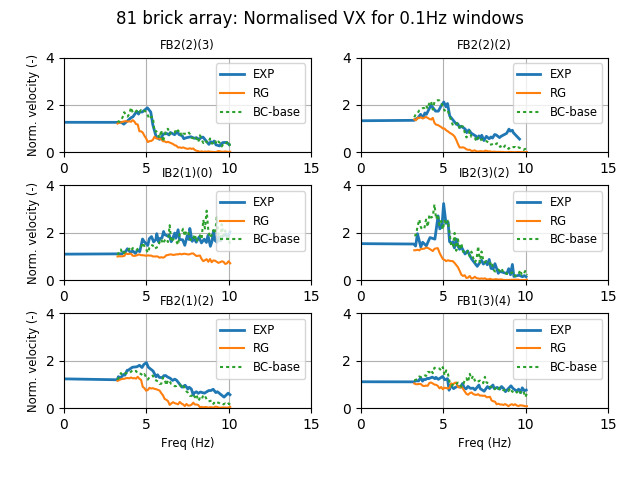
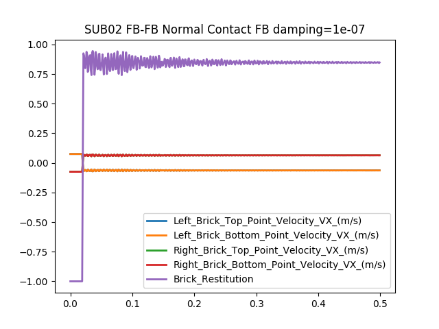

.. _solfec-1.0-examples-81array:

81 bricks array
===============

This is example illustrates multiple aspects of Solfec-1.0 functionality and serves as a validation test. It is also included with :ref:`TR1 <tr1>`.
The input files for this example are located in the `solfec/examples/81array <https://github.com/tkoziara/solfec/tree/master/examples/81array>`_
directory. These are:

- `README <https://github.com/tkoziara/solfec/blob/master/examples/81array/README>`_ -- a text based summary of the problem

- `81array.py <https://github.com/tkoziara/solfec/blob/master/examples/81array/81array.py>`_ -- array excitation analysis input file

- `81fbi.py <https://github.com/tkoziara/solfec/blob/master/examples/81array/81fbi.py>`_ -- fuel brick impact test input file

- `81postp.py <https://github.com/tkoziara/solfec/blob/master/examples/81array/81postp.py>`_ -- post--processing script for the 81array.py input deck

- `81array[*].inp files <https://github.com/tkoziara/solfec/blob/master/examples/81array/81array.inp>`_ -- `ABAQUS <https://en.wikipedia.org/wiki/Abaqus>`_ input decks used by 81array.py

- `81fbi[*].inp files <https://github.com/tkoziara/solfec/blob/master/examples/81array/81fbi.inp>`_ -- `ABAQUS <https://en.wikipedia.org/wiki/Abaqus>`_ input decks used by 81fbi.py

- `81array[*]base.pikle.gz files <https://github.com/tkoziara/solfec/blob/master/examples/81array>`_ -- saved reduced
  `POD <https://en.wikipedia.org/wiki/Principal_component_analysis>`_ base files used by 81array.py and 81fbi.py

- `FB[*].csv files <https://github.com/tkoziara/solfec/blob/master/examples/81array>`_ -- experimental results curves used by 81postp.py

- `ts81.py.bz2 file <https://github.com/tkoziara/solfec/blob/master/examples/81array>`_ -- compressed time history of a seisimic excitation signal used by 81array.py

.. _81array: https://github.com/tkoziara/solfec/tree/master/examples/81array

.. _81array-fig1:

   Example 81array_: experimental setup of the experiment.

The experiment behind this example comes from the context of the civil nuclear power generation in the UK.
A series of dynamic tests were carried out by National Nuclear Corporation in 1985 as part of the seismic
endorsement of the Heysham II / Torness AGR [*]_ core design. These tests used an array of 81 graphite bricks
as shown in :numref:`81array-fig1`, consisting of alternating ‘fuel’ and ‘interstitial’ bricks. The array was
mounted in a rigid frame on a shaker table. The boundary frame was driven in the horizontal plane with synthesized
seismic or swept--sine input motions in either one or both axes simultaneously. Measurements were taken of the
resulting velocities of certain bricks in the array (determined from accelerometer data) and also of the forces
within the keying system (using load cells built into some components). Some details of the experimental setup
has been described in [1]_ and [2]_. We note, that this example is also called the “81 bricks array”, or simply
the “81 array”, because the total number of unconstrained fuel and interstitial bricks is 81.

.. _81array-fig2:

   Example 81array_: meshed model (base mesh).

In the current demonstration we bypass many of the details of our mechanical model. The ultimate aim is modeling
the entire AGR core (:math:`\sim5\text{K}` fuel bricks), hence we are in the search for the lowest possible resolution
model. We are going to demonstrate some results for two mesh densities: denoted as a "basic mesh" and a "fine mesh",
cf. :numref:`81array-tab1`. The basic meshed model is presented in :numref:`81array-fig2`. As in the experiment all
bodies are vertically restrained so that they move in a frictionless manner in the horizontal plane. Since the behavior
of the assembly is essentially two dimensional the number of elements along the height is kept to minimum. In
:numref:`81array-fig3` one can see that the number of elements used in the horizontal brick sections is also small.
For fuel brick meshes the error in the lowest eigenmodes corresponding to planar squeezing is below 35% (as compared
with finer meshes), which we tentatively accept in the quest for a lowest possible resolution model.

.. runpy::

  import os, sys
  sys.path.insert(0, os.getcwd()+'/libpy')
  from images import merge_images
  merge_images ('trs/tr1/81module.png',
                'trs/tr1/81fbi.png',
		'solfec/examples/81array/81module_fbi.png')
 
.. _81array-fig3:

   Example 81array_: array module closeup (left: base mesh) and the binary impact test (right: fine mesh).

.. _81array-tab1:

.. table:: Example 81array_: base and fine mesh statistics. There are 61 fuel bricks, 60 interstitial bricks, and 100 loose keys in each case.

  +----------------------------------+------------+--------------------+-----------+-------------+
  |                                  | Fuel brick | Interstitial brick | Loose key | Model total |
  +------------+--------------+------+------------+--------------------+-----------+-------------+
  | BC         | base mesh    |      | 432        | 456                | 24        | 56112       |
  |            +--------------+      +------------+--------------------+-----------+-------------+
  |            | fine mesh    |      | 1512       | 456                | 24        | 121992      |
  +------------+--------------+ DOFs +------------+--------------------+-----------+-------------+
  | BC--RO     | base mesh    |      | 64         | 64                 | 24        | 10144       |
  |            +--------------+      +------------+--------------------+-----------+-------------+
  |            | fine mesh    |      | 64         | 64                 | 24        | 10144       |
  +------------+--------------+------+------------+--------------------+-----------+-------------+

The following material parameters were assumed for the graphite used in the experiment: 1.18E10Pa for Young's modulus,
0.21 for Poisson's ratio, and for mass density 1688kg/:math:`\mbox{m}^{3}`, 1637kg/:math:`\mbox{m}^{3}`, 1740kg/:math:`\mbox{m}^{3}`
for respectively fuel bricks, interstitial bricks and loose keys (the mass densities were tuned to obtain the total brick
weights reported in the experiment). The coefficient of Coulomb's friction was assumed 0.1. Among several simple impact tests
performed in the preliminary experimental work, a binary impact between fuel bricks was :numref:`81array-fig3` (right). A range
of relative input velocities was used (5--35 cm/s) for which the ratio of the output velocity to the input velocity remained
consistently in the area of 0.9. It should be noted that due to geometrical setup, this particular type of impact is not present
in our full array model. We then have two independent experiments, which we try to validate simultaneously.

We use three families of models: solely rigid (RG), body co-rotational (BC), and reduced order (BC--RO). In all cases
the time step is 0.0001s.  Co--rotated displacements from the BC simulation were sampled at 0.02s intervals and together
with the 6 algebraically generated rigid modes, for each distinct mesh instance, served as an input for the 
`Python modred package <http://pythonhosted.org/modred/>`_, to produce POD bases for the BC-RO approach: 64 modes were
used for both the fuel and the interstitial bricks. The loose keys were modeled as single elements based on the co--rotated
BC approach. For the deformable models we used damping :math:`\eta=\mbox{1E-7}`, which, for the finer mesh, roughly reproduced
the required macroscopic velocity restitution of 0.9 for the binary impact test from :numref:`81array-fig1` (right): restitution
of 0.91 was produced by the BC approach, and 0.86 by BC--RO. For the basic mesh, the reproduced coefficient of restitution was
0.85 for the BC approach, and 0.82 for BC--RO. In case of the rigid body model the impact restitution was zero, resulting in
a totally passive response.

In the initial validation of the entire array model we aimed at reproducing a swept--sine constant amplitude acceleration test.
In the experiment the array was subject to a 3s 3Hz settling dwell at start, followed by a 3Hz to 10Hz sweep with 0.1Hz/s buildup
rate and constant amplitude of 0.3g, all this amounting to the total duration of 72s. The sweep direction was aligned with one
of the sides of the array. Linear velocity histories of the centre points of several bricks were recorded at 50Hz. Magnitudes
of these velocities were then averaged using 0.1Hz window and plotted as time series normalized by the corresponding magnitudes
of the input velocity.

The input acceleration signal produces a smoothly decaying envelope of displacement, which given a fixed amount of clearance between
bricks, initially builds up their "rattling" interactions and then passes a threshold beyond which interactions cease. Initially
the displacements are much larger than the clearance and the entire array is swept back and forth. When the boundary displacements
reach the level of the clearance (few mm) the kinetic energy starts being injected into higher modes of the system. This builds up
a peak in the velocity response. When the input displacements fall below the clearance distance the bricks disengage and there is
a drop in the velocity response.

.. _81array-fig4:

   Example 81array_: frequency histories of normalized output velocity magnitudes. EXP is the experiment.
   BC--base and BC--fine denote the body co--rotational formulation using respectively the base and the fine mesh.

.. _81array-fig5:

   Example 81array_: frequency histories of normalized output velocity magnitudes. EXP is the experiment.
   RO--base and RO--fine denote the reduced order formulation using respectively the base and the fine mesh.

.. _81array-fig6:

   Example 81array_: frequency histories of normalized output velocity magnitudes. EXP is the experiment.
   BC--base and RO--base are respectively the BC and the BC--RO formulations, both using the base mesh.

.. _81array-fig7:

   Example 81array_: frequency histories of normalized output velocity magnitudes. EXP is the experiment.
   BC--fine and RO--fine are respectively the BC and the BC--RO formulations, both using the fine mesh.

:numref:`81array-fig4` -- :numref:`81array-fig7` show time histories of normalized output velocity magnitudes for selected fuel
and interstitial bricks, compared with those obtained in the experiment. One can see that relatively good agreement is obtained
for all combinations of base and fine FE meshes combined with the body co--rotational (BC) and reduced order BC--RO (dented as RO
in the figures) formulations. The best overall match seems to be obtained in case of the BC--fine model: combining the body
co--rotational formulation (BC) and the fine mesh (where only the fuel bricks are refined). This is specifically visible in :numref:`81array-fig4`
and :numref:`81array-fig7` where the performance of the BC--fine model for the FB2(2)(2) fuel brick is better than of the BC--base
and RO--fine models. There seems to be some correlation between the ability to reproduce the 0.9 binary impact velocity restitution
from the experiment, and the ability to match most of the experimental curves in :numref:`81array-fig4` -- :numref:`81array-fig7`.
On the other hand, :numref:`81array-fig8` compares the performance of the BC--base approach with that of the purely rigid body model
(RG). Clearly, the rigid body approach is not able to reproduce the experimentally observed peaks.

.. _81array-fig8:

   Example 81array_: frequency histories of normalized output velocity magnitudes. EXP is the experiment.
   RG and BC--base are respectively the rigid body and the body co--rotational formulations, both using the base mesh.

Statistics of total runtimes and average time shares of computational stages are included in :numref:`81array-tab2`. These are
collected for BC--fine/base, RO--fine/base and the rigid body models, all run using 6 MPI ranks on a single compute node, equipped
with Intel Xeon E5--2600 processing units. There is some "give and take" happening in terms of the share of the computational time
taken by various operations. The time integration runtime, which is significant for the deformable models, for RO--fine/base is shorter
compared to the fully resolved BC--fine/base models. Assembling of constraint equations, which dominates the computational time, also
takes less time in case of RO--fine/base, when compared to BC-fine/base. In the deformable model cases contact solution does not dominate
the total runtime. This reversed in case of the solely rigid model, where solving the ill--conditioned constraint equations dominates.
:numref:`81array-tab3` illustrates parallel scaling, from 3 to 24 MPI--ranks, on a 24 core cluster node equipped with two Intel Xeon
E5--2600 CPUs. Maximum speedups are 3.43/2.49 for the BC/RO--base models and 3.99/2.57 for the BC/RO--fine models. We note that currently
Solfec-1.0 does not exploit shared memory parallelism. The domain decomposition based load balancing may not be a most suitable parallelization
strategy for a problem of this size, run on a single cluster node. :numref:`81array-tab4` illustrates the size of the output storage for
the tested approaches. Naturally, the reduced order models output less, compared to the fully resolved models. Finally, video [YT0]_ shows
an animated output.

.. _81array-tab2:

.. table:: Example 81array_: comparison of runtimes, for various formulations, using 6 MPI ranks on a single Intel
           Xeon E5--2600 CPU based compute node.

  +-------------------------------------+---------------+----------------+---------------+----------------+-----------------+
  | Formulation                         | BC--fine      | BC--base       | RO--fine      | RO--base       | Rigid body      |
  +--------+----------------------------+---------------+----------------+---------------+----------------+-----------------+
  | Comp.  | Time integration           | 4.6           | 2.1            | 3.4           | 1.7            | 0.1             |
  | stage  +----------------------------+---------------+----------------+---------------+----------------+-----------------+
  | (h)    | Contact detection          | 0.9           | 0.5            | 0.8           | 0.5            | 0.4             |
  |        +----------------------------+---------------+----------------+---------------+----------------+-----------------+
  |        | Constraints equations      | 13.7          | 5.7            | 4.0           | 2.9            | 0.2             |
  |        +----------------------------+---------------+----------------+---------------+----------------+-----------------+
  |        | Constraints solution       | 0.7           | 0.9            | 1.2           | 1.3            | 3.4             |
  |        +----------------------------+---------------+----------------+---------------+----------------+-----------------+
  |        | Load balancing             | 1.3           | 0.7            | 1.0           | 0.7            | 0.3             |
  +--------+----------------------------+---------------+----------------+---------------+----------------+-----------------+
  | Total runtime (h)                   | 21.18         | 9.92           | 10.53         | 7.15           | 4.37            |
  +-------------------------------------+---------------+----------------+---------------+----------------+-----------------+

|

.. _81array-tab3:

.. table:: Example 81array_: comparison of runtime scaling, for various formulations, on a single Intel Xeon
           E5--2600 CPU based compute node. BC--base--72s and RO--base--72s used the base mesh and had 72s duration.
	   BC--fine--7.2s and RO--fine--7.2s used the fine mesh and had a 10x shorter duration of 7.2s.

  +-------------------------------------+----------+----------+----------+----------+
  | MPI ranks                           | 3        | 6        | 12       | 24       |
  +-------------------------------------+----------+----------+----------+----------+
  | BC--base--72s runtime (h)           | 17.81	   | 9.92     | 6.90     | 5.20     |
  +-------------------------------------+----------+----------+----------+----------+
  | RO--base--72s runtime (h)           | 11.94    | 7.15     | 5.56     | 4.79     |
  +-------------------------------------+----------+----------+----------+----------+
  | BC--fine--7.2s runtime (h)          | 4.31	   | 2.31     | 1.52     | 1.08     |
  +-------------------------------------+----------+----------+----------+----------+
  | RO--fine--7.2s runtime (h)          | 2.03	   | 1.19     | 0.97     | 0.79     |
  +-------------------------------------+----------+----------+----------+----------+

|

.. _81array-tab4:

.. table:: Example 81array_: comparison of storage size, for various formulations, for the 72s long runs and using the 50Hz file output frequency.

  +-----------------+----------+----------+----------+----------+------------+
  | Formulation     | BC--fine | BC--base | RO--fine | RO--base | Rigid body |
  +-----------------+----------+----------+----------+----------+------------+
  | Storage size    | 7.2GB    | 3.7GB    | 1.2GB    | 1.2GB    | 0.84GB     |
  +-----------------+----------+----------+----------+----------+------------+

|

.. [YT0] An animation of the 81array_ example DX displacement time history.

.. youtube:: https://www.youtube.com/watch?v=oDxQesw2Jco
  :width: 648
  :height: 364

Running 81 array
----------------

The 81 array example input file has several options. You can see them by invoking:

::

  solfec examples/81array/81array.py -help

which outputs

::

  ------------------------------------------------------------------------
  81 array example parameters:
  ------------------------------------------------------------------------
  -form name => where name is TL, BC, RO, MODAL, PR or RG (default: BC)
  -fbmod num => fuel brick modes (default: 64)
  -ibmod num => interstitial brick modes (default: 64)
  -afile path => ABAQUS 81 array *.inp file path (default: examples/81array/81array.inp)
  -step num => time step (default: 0.0001)
  -damp num => damping value (default: 1e-07)
  -rest num => impact restitution, >= 0, <= 1 (default: 0)
  -outi num => output interval (default: 0.02)
  -stop num => sumulation end (default: 72.0)
  -genbase => generate RO (read mode) or MODAL (write mode) bases and stop
  -help => show this help and exit
  ------------------------------------------------------------------------

The defaults are set up in such a way, that running

::

  solfec examples/81array/81array.py

starts an analysis using the body co--rotational approach (BC) and the base mesh, :numref:`81array-fig2`. A serial run like above
will take several days to complete. If possible, it may be beneficial to use a multi--core shared memory computer or a cluster and
run instead

::

  mpirun -np N solfec-mpi examples/81array/81array.py

where N is the number of MPI ranks -- corresponding to the level of available physical parallalism. If you only want to test this
example on a serial computer, you may shorten the analysis, e.g.

::

  solfec examples/81array/81array.py -stop 1.0

which will only run 1s long simulation -- and take 72x less time on average. To run the Total Lagrangian based analysis instead
add ``-form TL`` after ``solfec`` or ``solfec-mpi`` and run

::

  mpirun -np N solfec-mpi -form TL examples/81array/81array.py

Note, that the order of arguments after the Solfec-1.0 command does not matter. This example comes equipped with reduced order bases
made of 64 modes for both fuel and interstitial bricks. These are saved as
`81array[*]base.pikle.gz files <https://github.com/tkoziara/solfec/blob/master/examples/81array>`_ files and they corepond to
`81array[*].inp files <https://github.com/tkoziara/solfec/blob/master/examples/81array/81array.inp>`_ input decks: ``81array.inp``
(base mesh) and ``81array_4_2.inp`` (fine mesh). If you would like to generate your own reduced base, you first need to run BC--based
or a TL--based analysis. Once it has terminated, you then need to run it again, **in serial mode**, using the ``-genbase`` switch, e.g.

::

  solfec examples/81array/81array.py -genbase -fbbod 96 -ibmod 32

This will read the results and generate a reduced order base made of 96 modes for fuel bricks and 32 modes for interstitial bricks,
for the default body co--rotated finite element formulation employing the base mesh. Note, that this will also overwrite the default
bases stored in the ``examples/81array`` directory. You may want to make a copy of this directory when investigating various reduced
bases, e.g.

::

  cp -r examples/81array path/to/81array_copy
  solfec path/to/81array_copy/81array.py -genbase -fbbod 96 -ibmod 32

The output files are saved inside of ``out/81array[*]`` directories: what goes after the ``81array`` string depends on the paramters
used to run the analysis. E.g. the default parameters result in the following outout directory:

::

  out/81array_BC_s1.0e-04_d1.0e-07_r0/

meaning a BC--based analysis, 1E-4 time step, 1E-7 damping, and 0 restitution. The restitution coefficient here denotes the instantaneous
"Newton" impact restitution -- it is generally unphysical to use it in muli--impact simulations -- so it is here only for the sake of
experimenting. If you happened to use an output subdirectory by invoking the ``[-s sub-directory]`` Solfec-1.0 command line switch, e.g.

::

  mpirun -np 24 solfec-mpi examples/81array/81array.py -s BC24

note that the output files will now be placed inside of

::

  out/81array_BC_s1.0e-04_d1.0e-07_r0/BC24

and in order to generate the reduced bases you will need to keep informing Solfec-1.0 about this, e.g.

::

  solfec examples/81array/81array.py -genbase -fbbod 96 -ibmod 32 -s BC24

This also applies to viewing the results, e.g. you can run

::

  solfec -v  -s BC24 examples/81array/81array.py

to view results from ``out/81array_BC_s1.0e-04_d1.0e-07_r0/BC24`` or 

::

  solfec -v  examples/81array/81array.py

to view results from ``out/81array_BC_s1.0e-04_d1.0e-07_r0``.

To run the BC--MODAL analysis (body co--rotational using modal base) you will first need to generate the modal bases. This is done
as follows

::

  solfec examples/81array/81array.py -form MODAL -genbase

which results in

::

  Saved MODAL base as: out/81array_MODAL_FB64_IB64_s1.0e-04_d1.0e-07_r0/FB1_modalbase.h5
  Saved MODAL base as: out/81array_MODAL_FB64_IB64_s1.0e-04_d1.0e-07_r0/FB2_modalbase.h5
  Saved MODAL base as: out/81array_MODAL_FB64_IB64_s1.0e-04_d1.0e-07_r0/IB2_modalbase.h5
  Saved MODAL base as: out/81array_MODAL_FB64_IB64_s1.0e-04_d1.0e-07_r0/IB1_modalbase.h5
  INFO: -genbase was used to generate modal bases --> now run without [-genbase]; exiting...

You can then run the BC--MODAL analysis as hinted above

::

  mpirun -np N solfec-mpi -form MODAL examples/81array/81array.py

using the modal bases generated in the previous step.

Post--processing 81 array
-------------------------

Once you have run one or several 81 array analyses, you can generate figures, similar to :numref:`81array-fig4` -- :numref:`81array-fig8`,
by a sequence of the following steps. First, post--process individual run results, by "run them again", **in serial mode**, e.g.

::

  solfec examples/81array/81array.py

will post--process the default analysis results, provided that results are present in ``out/81array_BC_s1.0e-04_d1.0e-07_r0``.
A single **[*].thv file** is generate per--analysis and output in the same directory as the remaing result files. We then use
the `81postp.py <https://github.com/tkoziara/solfec/blob/master/examples/81array/81postp.py>`_ script to genere figures similar
to :numref:`81array-fig4`, e.g.

::

  solfec examples/81array/81postp.py out/81array_BC_s1.0e-04_d1.0e-07_r0/81array_BC_s1.0e-04_d1.0e-07_r0.thv BC

generates a ``81velo.png`` file in the current directory. To see other options of the ``81postp.py`` script run

::

  solfec examples/81array/81postp.py

This outputs the following information

::

  -----------------------------------------------------------------------------------------------
  SYNOPSIS: solfec path/to/81postp.py path/to/file_1.thv label_1 path/to/file_2.thv label_2 [...]
  No user paramters passed! Possible paramters:
  -outfig path => output figure path (default: 81velo.png)
  -----------------------------------------------------------------------------------------------
  Paths and labels can be given in any combination, only their order matters.
  For example this is also fine: solfec 81postp.py path1 path2 label1 label2.
  You must first run analysis for 81array.py and then run it again print in
  read mode to extract the  *.thv file.
  -----------------------------------------------------------------------------------------------

You can use the ``-outfig`` parameter to provide an alternative output path and figure format, e.g. ``-outfig 81velo.eps`` would generate
a figure in the `encapsulated postscript format <https://en.wikipedia.org/wiki/Encapsulated_PostScript>`_.

Running brick impact test
-------------------------

Run

::

  solfec examples/81array/81fbi.py -help

to see defaults and other available parameters

::

  ---------------------------------------------------------------------
  81 fuel brick impact example parameters:
  ---------------------------------------------------------------------
  -form name => where name is TL, BC, RO, MODAL, PR or RG (default: BC)
  -fbmod num => fuel brick modes (default: 24)
  -damp num => damping, >= 0.0 (default: 1e-07)
  -step num => time step, > 0.0 (default: 0.0001)
  -afile path => ABAQUS fuel brick impact *.inp file path (default: examples/81array/81fbi.inp)
  -rest num => impact restitution, >= 0, <= 1 (default: 0)
  -genbase => generate RO base (default: same as for 81array.py)
  -help => show this help and exit
  ---------------------------------------------------------------------

Run once

::

  solfec examples/81array/81fbi.py

to generate results for a particular test (this takes from several seconds to several minutes depending on parameters).
Then run again to post--process

::

  solfec examples/81array/81fbi.py

The last line of the printed output reads

::

  For FB damping = 1e-07  coeficient of restitution =  0.847849288204

Typically, this test would be used to tune the damping coefficient so that, for a fixed mesh and time step size, the experimental value
of 0.9 would be approximated. To overshoot this value a fine mesh and a small time step are required -- then damping can be used to
bring the macroscopic velocity restitution down to the required level. Post--processing ``81fbi.py`` results also generates a figure
in the output directory, e.g.

::
  
  out/81fbi_BC_s1.0e-04_d1.0e-07_r0/Brick_Velocity_Damp1e-07.png

included as :numref:`81array-fig9` below.

.. _81array-fig9:

   Example 81array_: example figure generated by post--processing ``81fbi.py`` results.

In this example the modal base is generate "on the fly", hence you can simply run

::

  solfec examples/81array/81fbi.py -form MODAL -fbmod 16

and then again to post--process. The reduced order impact test by default employs the same bases as the 81array.inp input deck.
If you run

::

  solfec examples/81array/81fbi.py -form RO

it will "tell"

::

  Reading out/81fbi_RO_FB24_s1.0e-04_d1.0e-07_r0/FB1_base.pickle.gz failed --> you can run -form BC -genbase to genrate this file
  Now trying to use examples/81array/81array_FB1_base.pickle.gz instead ...

When generating bases, e.g.

::

  solfec examples/81array/81fbi.py -genbase -fbmod 72

bear in mind that the number of available modes will be less than that for the 81 array input decks --
the displacement time history is "algebraically poorer" for the impact test. This will be signalled as follows

::

  FB1: calculating 72 POD modes from 506 input vectors of size 432 ...
  POD generation has failed --> it is possible that you tried to extract too many modes
                                try using [-fbmod a_smaller_number] and re-run

You can then reuse the existing results and just keep trying, e.g.

::

  solfec examples/81array/81fbi.py -genbase -fbmod 32

will work. You can than run the reduced order analysis

::

  solfec examples/81array/81fbi.py -form RO -fbmod 32

and post--process it (re--run again) to find out the restitution coefficient.

.. [*] AGR stands for an `Advanced Gass-cooled Reactor <https://en.wikipedia.org/wiki/Advanced_gas-cooled_reactor>`_.

.. [1] `Ahmed, Khalid and Stojko, Stefan, "The non--linear seismic response of AGR core graphite brick slices
   -- correlation of experimental and analytical results", Earthquake Engineering & Structural Dynamics (1987), 159--188.
   <http://onlinelibrary.wiley.com/doi/10.1002/eqe.4290150203/abstract>`_

.. [2] `Ahmed, K. M., "The dynamic response of multi-layers AGR core brick arrays", Nuclear Engineering and Design (1987),
   1--66. <http://www.sciencedirect.com/science/article/pii/0029549387903037>`_
