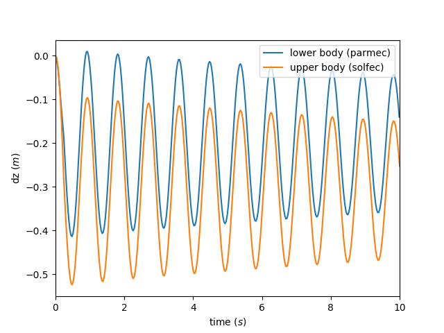

.. _solfec-examples-hybrid_modeling-hs0:

A two--body impact problem
==========================

This is a simplest application of the :ref:`HYBRID_SOLVER <solfec-command-HYBRID_SOLVER>`. The input files for this example are
located in the `solfec-1.0/examples/hybrid--solver0 <https://github.com/tkoziara/solfec/tree/master/examples/hybrid-solver0>`_ directory.
These are:

- `README <https://github.com/tkoziara/solfec/blob/master/examples/hybrid-solver0/README>`_ -- a text based specification of the problem

- `hs0--parmec.py <https://github.com/tkoziara/solfec/blob/master/examples/hybrid-solver0/hs0-parmec.py>`_ -- including the :ref:`Parmec <parmec-index>` input code

- `hs0--solfec--1.py <https://github.com/tkoziara/solfec/blob/master/examples/hybrid-solver0/hs0-solfec-1.py>`_ -- including the simpler version of the :ref:`Solfec-1.0 <solfec-index>` input code

- `hs0--solfec--2.py <https://github.com/tkoziara/solfec/blob/master/examples/hybrid-solver0/hs0-solfec-2.py>`_ -- Solfec-1.0 input file demonstrating a more elaborate usage of Parmec and Solfec-1.0 features

.. _hybrid-solver0: https://github.com/tkoziara/solfec/tree/master/examples/hybrid-solver0

.. _hs0-fig1:

.. figure:: hs0.png
   :width: 80%
   :align: center

   Example hybrid-solver0_: a two body impact problem

:numref:`hs0-fig1` states the problem. Both, the upper "Solfec-1.0" body and the lower "Parmec" body are modeled as rigid.
The upper body falls under gravity and hits the lower body, initiating vibrations. There is no impact restitution between
the two bodies, hence the two bodies stay and vibrate together, following the initial impact. We use this simple example
to illustrate the methodology of creating a hybrid model.

:numref:`hs0-lst1` includes the Parmec file `hs0--parmec.py <https://github.com/tkoziara/solfec/blob/master/examples/hybrid-solver0/hs0-parmec.py>`_.
The :ref:`material <parmec-command-MATERIAL>` is created in line 1 and the :ref:`meshed <parmec-command-MESH>` lower cube is created in line 16.
The cube's motion is :ref:`restrained <parmec-command-RESTRAIN>` along x, y translations and x, y, z rotations in line 18. The :ref:`elastic spring
<parmec-command-SPRING>` is created in line 20. We note, that no damping is applied and that the spring direction is fixed along z.
:ref:`Gravity <parmec-command-GRAVITY>` is applied in line 23. This concludes the input file.

.. literalinclude:: ../../../../solfec-1.0/examples/hybrid-solver0/hs0-parmec.py
   :linenos:
   :caption: Listing of hs0--parmec.py
   :name: hs0-lst1

The "DEM" command in line 25 can be uncommented to run parmec standalone and test this example:

::

  parmec4 examples/hybrid-solver0/hs0-parmec.py

This is useful at a stage of creating and testing of an input file: the output files generated into the hybrid--solver0
directory and be viewed using `ParaView <http://www.paraview.org>`_. 

.. note:: For the sake of using hs0--parmec.py as Parmec input in Solfec-1.0's :ref:`HYBRID_SOLVER <solfec-command-HYBRID_SOLVER>`,
          the "DEM" command in line 25 should remain commented out.

:numref:`hs0-lst2` includes the Solfec-1.0 file `hs0--solfec--1.py <https://github.com/tkoziara/solfec/blob/master/examples/hybrid-solver0/hs0-solfec-1.py>`_.
:ref:`SOLFEC object <solfec-user-solfec>` is created in line 3, specifying the output directory as 'out/hybrid--solver0' (relative where *solfec* is run from).
:ref:`Gravity <solfec-command-GRAVITY>` is applied in line 5. Volumetric :ref:`"bulk" material <solfec-command-BULK_MATERIAL>` is created in line 7
and :ref:`"suraface material" <solfec-command-SURFACE_MATERIAL>` for contact interactions is created in line 10. Then the lower :ref:`body <solfec-user-body>` "bod1"
is created in line 22. This is a *boundary body*, coinciding with the Parmec body defined in line 16 of :numref:`hs0-lst1`. *This body will be used to transfer
forces between Solfec-1.0 and Parmec, and its motion will be driven by the Parmec model.*  The upper body "bod2" is created in line 26. In both cases Solfec-1.0's
:ref:`MESH <solfec-command-MESH>` object is used to define geometry. 

.. literalinclude:: ../../../../solfec-1.0/examples/hybrid-solver0/hs0-solfec-1.py
   :linenos:
   :caption: Listing of hs0--solfec--1.py
   :name: hs0-lst2

The :ref:`Newton solver <solfec-command-NEWTON_SOLVER>` is created next in line 28. It will be used internally by the :ref:`hybrid solver <solfec-command-HYBRID_SOLVER>`
in order to resolve (non--smooth) contact interactions between the two bodies. The :ref:`HYBRID_SOLVER <solfec-command-HYBRID_SOLVER>` itself is created further, in line 32.
We pass the full relative path to the parmec input file 'examples/hybrid-solver0/hs0-parmec.py', which implies that the example will be run from the solfec
source directory. The Solfec-1.0 time step is used as the upper bound for the Parmec step. Knowing that Parmec numbers bodies starting from zero, we create a simple
dictionary mapping, {0 : bod1.id}, to define the "boundary bodies" through which forces are passed between the two codes. Finally, we pass the Newton solver
object "ns" as the last argument.

We note, that Parmec output intervals are not specified in this invocation of the hybrid solver. This means that Parmec will not create output files during the
simulation. In lines 35 and 36 we define the Solfec-1.0 output interval. Because the :ref:`"OUTPUT" <solfec-command-OUTPUT>` commands :ref:`coincide <parmec-command-OUTPUT>`
in both codes, we need to explicitly call the Solfec-1.0 command in this case. The input file is concluded with the :ref:`"RUN" command <solfec-command-RUN>` (line 38),
which executes a 10 second long simulation of the hybrid model.

The example is run by calling

::

  solfec examples/hybrid-solver0/hs0-solfec-1.py

from within the solfec source directory. After calculations are finished, this can be followed by viewing the animated results by invoking

::

  solfec -v examples/hybrid-solver0/hs0-solfec-1.py

An example animation is included below:

.. youtube:: https://www.youtube.com/watch?v=osRepFXukDo

:numref:`hs0-lst3` includes the second Solfec-1.0 file `hs0--solfec--2.py <https://github.com/tkoziara/solfec/blob/master/examples/hybrid-solver0/hs0-solfec-2.py>`_.
This input file demonstrates several more elaborate features of the :ref:`HYBRID_SOLVER <solfec-command-HYBRID_SOLVER>` and of Solfec-1.0 input usage in general:

 - creation of Parmec output files (lines 32--36)
 - creation of Parmec time histories (lines 38--40)
 - runtime plotting from Solfec-1.0 (lines 42--51)
 - an application of `matplotlib <http://matplotlib.org>`_ within Solfec-1.0 input file (lines 59--73)
 - XDMF export of Solfec-1.0 results (lines 75--80)

.. literalinclude:: ../../../../solfec-1.0/examples/hybrid-solver0/hs0-solfec-2.py
   :linenos:
   :caption: Listing of hs0--solfec--2.py
   :name: hs0-lst3

When the hybrid modeling is used, the Parmec library will generate output files if the Parmec output interval has been set.
Enabling this feature is demonstrated in lines 32--36, where the "parmec_interval" parameter of the hybrid solver is set to
value "(tms0, 0.03)". The "tms0" object is Parmec's :ref:`TSERIES <parmec-command-TSERIES>` number, which in this case defines
a variable output frequency for the Parmec output files. The second number, "0.03", defines a constant time interval, at which
:ref:`Parmec time histories <parmec-command-HISTORY>` will be generated. These are requested in the following lines 38--40.
This functionality (runtime generation of time histories) is matched in Solfec-1.0 via application of a :ref:`callback function
<solfec-command-CALLBACK>`, as demonstrated in lines 42--51. These time histories are later used, in lines 59--73, in order to
create a plot of the vertical displacement versus time, for the lower and the upper body. The result is seen in :numref:`hs0-fig2`.

.. note:: Although there is no damping in the model, some dissipative behaviour is seen in :numref:`hs0-fig2`.
  This is attributed to the force transfer mechanism between the two time--stepping methods, in Solfec-1.0 and Parmec.
  Constant forces from the previous time step in Parmec are used over the current time step in Solfec-1.0, and vice
  versa. The amount of this numerical dissipation decreases with time step size.

.. _hs0-fig2:

   Example hybrid-solver0_: time histories of vertical displacement.

:ref:`XDMF export <solfec-xdmf>` is demonstrated in lines 75--80. We note, that Solfec-1.0 needs to be run for the second time,
without the viewer -v parameter, in order for the actual export to occur:

::

  solfec examples/hybrid-solver0/hs0-solfec-1.py

While Parmec output files, also in the `XDMF format <http://www.xdmf.org>`_, are located in the 'out/hybrid--solver0' directory,
the exported Solfec-1.0 XDMF files (.h5 and .xmf files) are placed inside of 'out/hybrid--solver0/hs0--solfec' directory. These files
can be viewed using `ParaView <http://www.paraview.org>`_.  An example session is depicted in :numref:`hs0-fig3`.

.. _hs0-fig3:

.. figure:: hs0-paraview.png
   :width: 80%
   :align: center

   Example hybrid-solver0_: ParaView session exploiting the generated .xmf files.
