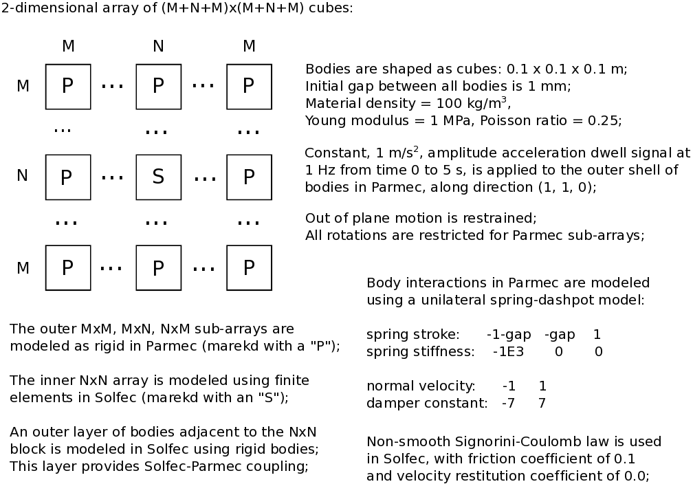
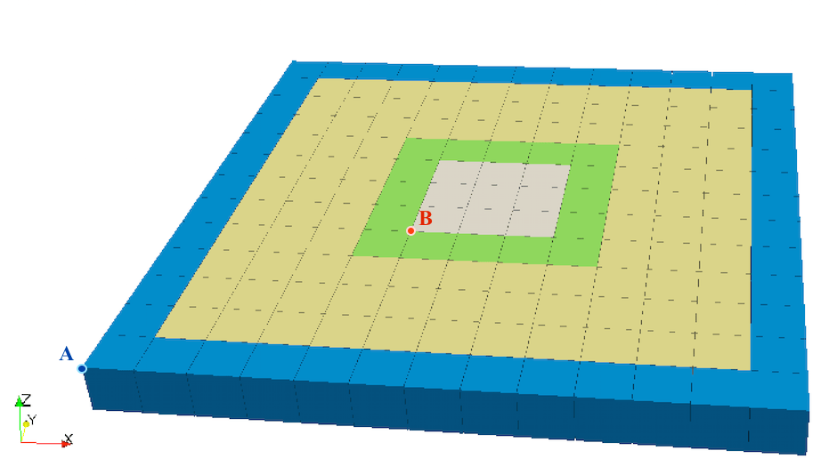
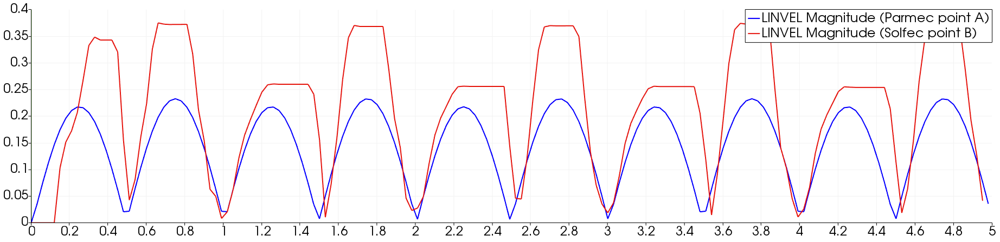
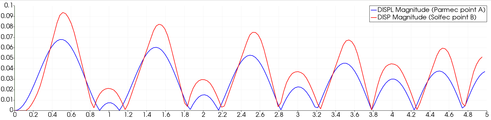
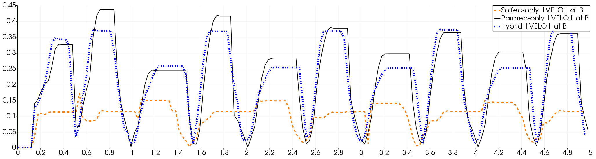
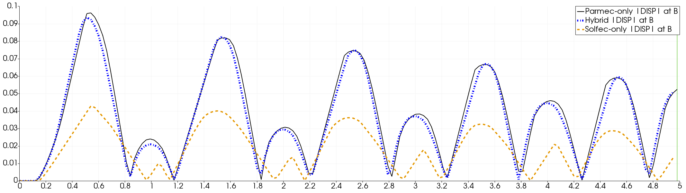

.. _solfec-1.0-examples-hybrid_modeling-hs123:

1,2,3--dimensional cube array acceleration dwell
================================================

This is a family of 1,2 and 3--dismenional examples demonstrating applications of the :ref:`HYBRID_SOLVER <solfec-1.0-command-HYBRID_SOLVER>`
on an array of cubes subject to a constant amplitude and frequency acceleration since dwell signal. The input files for these examples
are located in:

- `solfec-1.0/examples/hybrid--solver1 <https://github.com/tkoziara/solfec/tree/master/examples/hybrid-solver1>`_ for the 1--dimensional array.
- `solfec-1.0/examples/hybrid--solver2 <https://github.com/tkoziara/solfec/tree/master/examples/hybrid-solver2>`_ for the 2--dimensional array.
- `solfec-1.0/examples/hybrid--solver3 <https://github.com/tkoziara/solfec/tree/master/examples/hybrid-solver3>`_ for the 3--dimensional array.

We focus on the 2--dimensional example, leaving the 1-- and 3--dimensional cases for self--study. The
`solfec-1.0/examples/hybrid--solver2 <https://github.com/tkoziara/solfec/tree/master/examples/hybrid-solver2>`_ directory contains:

- `README <https://github.com/tkoziara/solfec/blob/master/examples/hybrid-solver2/README>`_ -- a text based specification of the problem

- `hs2--parmec.py <https://github.com/tkoziara/solfec/blob/master/examples/hybrid-solver2/hs2-parmec.py>`_ -- including the :ref:`Parmec <parmec-index>` input code

- `hs2--solfec.py <https://github.com/tkoziara/solfec/blob/master/examples/hybrid-solver2/hs2-solfec.py>`_ -- including the :ref:`Solfec-1.0 <solfec-1.0-index>` input code

- `hs2--parmec--only.py <https://github.com/tkoziara/solfec/blob/master/examples/hybrid-solver2/hs2-parmec-only.py>`_ -- including the Parmec-only version of the example

- `hs2--solfec--only.py <https://github.com/tkoziara/solfec/blob/master/examples/hybrid-solver2/hs2-solfec-only.py>`_ -- including the Solfec-1.0-only version of the example

- `hs2--state--1.pvsm <https://github.com/tkoziara/solfec/blob/master/examples/hybrid-solver2/hs2-state-1.pvsm>`_ -- `ParaView <http://www.paraview.org>`_ state for animation [1]_

- `hs2--state--2.pvsm <https://github.com/tkoziara/solfec/blob/master/examples/hybrid-solver2/hs2-state-2.pvsm>`_ -- `ParaView <http://www.paraview.org>`_ state for animation [2]_

- `hs2--state--3.pvsm <https://github.com/tkoziara/solfec/blob/master/examples/hybrid-solver2/hs2-state-3.pvsm>`_ -- `ParaView <http://www.paraview.org>`_ state for :numref:`hs2-fig3`

- `hs2--state--4.pvsm <https://github.com/tkoziara/solfec/blob/master/examples/hybrid-solver2/hs2-state-4.pvsm>`_ -- `ParaView <http://www.paraview.org>`_ state for :numref:`hs2-fig4`

- `hs2--state--5.pvsm <https://github.com/tkoziara/solfec/blob/master/examples/hybrid-solver2/hs2-state-5.pvsm>`_ -- `ParaView <http://www.paraview.org>`_ state for :numref:`hs2-fig5`

- `hs2--state--6.pvsm <https://github.com/tkoziara/solfec/blob/master/examples/hybrid-solver2/hs2-state-6.pvsm>`_ -- `ParaView <http://www.paraview.org>`_ state for :numref:`hs2-fig6`

.. _hybrid-solver2: https://github.com/tkoziara/solfec/tree/master/examples/hybrid-solver2

:numref:`hs2-fig1` states the problem and describes the hybrid model. 

.. _hs2-fig1:

   Example hybrid-solver2_: a 2--dimensional cube array acceleration dwell hybrid model

An actual array geometry is depicted in :numref:`hs2-fig2`, where the color coding is as follows:

- blue -- the outer Parmec bodies where acceleration sweep signal is applied
- yellow -- the inner Parmec bodies interacting via spring--dashpot elements
- green -- the boundary Parmec--Solfec-1.0 bodies, modeled in both codes
- grey -- the inner Solfec-1.0 bodies, interacting via a non--smooth contact law

.. _hs2-fig2:

   Example hybrid-solver2_: initial geometry.

:numref:`hs2-lst1` includes the Parmec file `hs2--parmec.py <https://github.com/tkoziara/solfec/blob/master/examples/hybrid-solver2/hs2-parmec.py>`_.
Lines 1--8 define basic parameters of the model. We note, that it is possible to transform the current example into a sine sweep test by changing
the "hifq" variable to a value greater than "lofq". Also the size of the problem can be modified by altering the "N" and "M" parameters.
Lines 10--25 are Python specific and help to find the path to the parmec source directory, in order to include the acceleration sweep generation
script into the current system path. This is then used in line 30, and further until line 38, to set up the linear motion excitation vector,
where the velocity time history, associated with the sine dwell signal, is used. Following definition of a translate cube creation function,
in lines 43--58, the array of cubes is generated in lines 60--68. Then the prescribed motion is applied to the outer shell of cubes in lines 70--76.
Finally, between the lines 78 and 98 contact spring--dashpot elements are defined and inserted into the model. For information, the critical time
step estimation for the model is printed out in line 101.

.. literalinclude:: ../../../../solfec-1.0/examples/hybrid-solver2/hs2-parmec.py
   :linenos:
   :caption: Listing of hs2--parmec.py
   :name: hs2-lst1

:numref:`hs2-lst2` includes the Solfec-1.0 file `hs2--solfec.py <https://github.com/tkoziara/solfec/blob/master/examples/hybrid-solver2/hs2-solfec.py>`_.
Lines 1--5 define the global model parameters. Lines 7--24 set up the :ref:`SOLFEC object <solfec-1.0-user-solfec>`,
:ref:`bulk <solfec-1.0-command-BULK_MATERIAL>` and :ref:`surface <solfec-1.0-command-SURFACE_MATERIAL>` materials, and a unit
cube template. Lines 26--56 contain code creating the array of Solfec-1.0 bodies as well as the mapping between the
Parmec and the Solfec-1.0 body numbers. The double loop starting in line 30 of :numref:`hs2-lst2` mimics the double loop
starting in line 62 of :numref:`hs2-lst1`. This way, it is easy to recreate the exact sequence of creation of Parmec
bodies within the Solfec-1.0 input file. Hence, it is easy to construct the *parmec2solfec* dictionary mapping of body numbers,
on the fly, while creating the Solfec-1.0 model. The inner Solfec-1.0 bodies (grey in :numref:`hs2-fig2`) are created in lines 33--45.
This same range of i, j indices is skipped in the Parmec input file (line 65 in :numref:`hs2-lst1`). Here, finite element
bodies are created, based on a 2x2x2 :ref:`hexahedral mesh <solfec-1.0-command-HEX>`. The z--direction of the bodies is :ref:`fixed <solfec-1.0-command-FIX_DIRECTION>`
to keep them in plane. The rigid "boundary" bodies for the Solfec-1.0--Parmec overlap interface are created in lines 50--53. We note,
that when a Solfec-1.0 input file is run in parallel (using *solfec-mpi*) some of the bodies that are created in the loop may actually
reside on other processor ranks. Hence we test this using the :ref:`HERE command <solfec-1.0-command-HERE>` and accordingly create
valid fragments of the parmec2solfec mapping on each MPI rank. Such fragmentary mappings are brought together during initialization
of the :ref:`HYBRID_SOLVER <solfec-1.0-command-HYBRID_SOLVER>`. In line 56 the Parmec body index is advanced, as this line corresponds
to line 67 in :numref:`hs2-lst1`, where Parmec bodies are created. The rest of the file is similar to that already detailed in the
description of :numref:`hs0-lst3`, in the context of the :ref:`two body impact example <solfec-1.0-examples-hybrid_modeling-hs0>`.

.. literalinclude:: ../../../../solfec-1.0/examples/hybrid-solver2/hs2-solfec.py
   :linenos:
   :caption: Listing of hs2--solfec.py
   :name: hs2-lst2

The example is run by invoking

::

  solfec examples/hybrid-solfec2/hs2-solfec.py

which needs to be followed by a repeated call

::

  solfec examples/hybrid-solfec2/hs2-solfec.py

in order to produce the XDMF--exported Solfec-1.0 results. These will be located in the 'out/hybrid--solver2/hs2--solfec' directory,
relative to the solfec source directory, from where this example is conveniently called. The Parmec output files are located
in the 'out/hybrid--solver2' directory. While Solfec-1.0 viewer can be used to view and post--process the Solfec-1.0 part of the results
without depending on the exported XDMF files, `ParaView <http://www.paraview.org>`_ can be used to post--process the generated .xmf files.
The application of ParaView can be simplified by utilising the two state .pvsm files distributed with the example: by selecting
"File/Load State..." menu choice in ParaView one can load a pre--set post--processing state. The videos included below depict the
forced motion of the hybrid system, visualised using the two enclosed states files.

.. [1] `ParaView <http://www.paraview.org>`_ animation based on the state file 
  `hs2--state--1.pvsm <https://github.com/tkoziara/solfec/blob/master/examples/hybrid-solver2/hs2-state-1.pvsm>`_.

.. youtube:: https://www.youtube.com/watch?v=Eg_Qm2tOtIY
  :width: 648
  :height: 432

.. [2] `ParaView <http://www.paraview.org>`_ animation based on the state file 
  `hs2--state--2.pvsm <https://github.com/tkoziara/solfec/blob/master/examples/hybrid-solver2/hs2-state-2.pvsm>`_.

.. youtube:: https://www.youtube.com/watch?v=EzyFSkX7lLM
  :width: 648
  :height: 432

:numref:`hs2-fig3` and :numref:`hs2-fig4` respectively show the linear velocity magnitude time history and the displacement magnitude
time history, at points A (Parmec) and B (Solfec-1.0), marked out in :numref:`hs2-fig2`. These plots were generated using ParaView's "Plot
Selection Over Time" feature.

.. _hs2-fig3:

   Example hybrid-solver2_: Linear velocity magnitude history at points A and B (:numref:`hs2-fig2`).

.. _hs2-fig4:

   Example hybrid-solver2_: Displacement magnitude history at points A and B (:numref:`hs2-fig2`).

Our current presentation is oriented at demonstrating the capability and performance aspects of the proposed framework. Therefore we
did not attempt to consistently model a uniform physical system by means of the three approaches: Solfec-1.0-only, Parmec-only and hybrid.
The physical parameters of the finite element (FE) Solfec-1.0-only model do not match those of the simplified Parmec-only model: the FE
model is stiffer then the mass-and-spring model. The hybrid model thus represents a stiff inclusion surrounded by a softer surrounding
material, rather than a uniform material modeled by means of two approaches. We did not attempt to fine-tune the physical parameters
of the three models, apart from choosing parameters that resulted in stable simulations at a practical time step size. Below, in
:numref:`hs2-fig5` and :numref:`hs2-fig6`, we include comparisons of linear velocity magnitude and displacement magnitude, between
the three approaches, recorded at point B of the geometry depicted in :numref:`hs2-fig2`. It is quite clear that finite element based
Solfec-1.0-only model has quite different dynamic response when compared with the latter two approaches. The Parmec-only and hybrid approaches
have similar responses because the softer surrounding material dominates the hybrid model and determines the motion of the stiffer inclusion.

.. _hs2-fig5:

   Example hybrid-solver2_: Velocity magnitude time history, at point B, for the three modeling approaches.

.. _hs2-fig6:

   Example hybrid-solver2_: Displacement magnitude time history, at point B, for the three modeling approaches.

Finally, the most basic comparison of the practical advantage of simplified modeling is depicted in :numref:`hs2-runtimes`.
The Solfec-1.0-only approach takes about 18 minutes to complete calculations. The most simplified Parmec-only approach takes only
10 seconds and is 105 times faster. The hybrid approach, on the other hard, which includes both rigid bodies (modeled in Parmec)
and finite element bodies (modeled in Solfec-1.0) takes about 5 minutes to complete. This is 3.4 times faster than the Solfec-1.0-only
case, and 31 times slower than Parmec-only. All Solfec-1.0 calculations were done using 4 MPI processes, while Parmec calculations
took full advantage of a 4-core 2.3 GHz Intel Core i7 CPU on a MacBook Pro laptop (mid 2012 model).

.. _hs2-runtimes:

.. table:: 2D array runtime comparison, between the NSCD (Solfec-1.0), DEM (Parmec) and hybrid approaches.

  +---------------+-++++------------+--------------+--------------+
  | Approach      | Solfec-1.0-only | Parmec-only  |  Hybrid      |
  +---------------+-----------------+--------------+--------------+
  | Runtime [sec] | 1053            | 10           | 308          |
  +---------------+-----------------+--------------+--------------+
