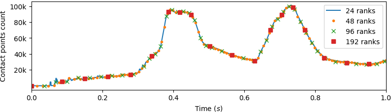

.. _solfec-examples-hybrid_modeling-hs3_scaling:

3--dimensional cube array parallel scaling
==========================================

This is a 3--dimensional case, `solfec/examples/hybrid--solver3 <https://github.com/tkoziara/solfec/tree/master/examples/hybrid-solver3>`_,
of the family of :ref:`1,2 and 3--dismenional examples <solfec-examples-hybrid_modeling-hs123>`, demonstrating applications of
the :ref:`HYBRID_SOLVER <solfec-command-HYBRID_SOLVER>` to hybrid, :ref:`Parmec <parmec-index>`--:ref:`Solfec-1.0 <solfec-1-index>` based, arrays of cubes
subject to an acceleration sine dwell signal. The specifcation of geomery and material data are exactly generalized from
:ref:`the 2--dimensional counterpart <solfec-examples-hybrid_modeling-hs123>`.
The `solfec/examples/hybrid--solver3 <https://github.com/tkoziara/solfec/tree/master/examples/hybrid-solver3>`_ directory contains:

- `README <https://github.com/tkoziara/solfec/blob/master/examples/hybrid-solver3/README>`_ -- a text based specification of the problem

- `hs3--parmec.py <https://github.com/tkoziara/solfec/blob/master/examples/hybrid-solver3/hs3-parmec.py>`_ -- including the :ref:`Parmec <parmec-index>` input code

- `hs3--solfec.py <https://github.com/tkoziara/solfec/blob/master/examples/hybrid-solver3/hs3-solfec.py>`_ -- including the :ref:`Solfec-1.0 <solfec-1-index>` input code

- `hs3--state--1.pvsm <https://github.com/tkoziara/solfec/blob/master/examples/hybrid-solver3/hs3-state-1.pvsm>`_ -- `ParaView <http://www.paraview.org>`_ state for animation [1]_

- `hs3--state--2.pvsm <https://github.com/tkoziara/solfec/blob/master/examples/hybrid-solver3/hs3-state-2.pvsm>`_ -- `ParaView <http://www.paraview.org>`_ state for animation [2]_

.. _hybrid-solver3: https://github.com/tkoziara/solfec/tree/master/examples/hybrid-solver3

.. [1] `ParaView <http://www.paraview.org>`_ animation based on the state file 
  `hs3--state--1.pvsm <https://github.com/tkoziara/solfec/blob/master/examples/hybrid-solver3/hs3-state-1.pvsm>`_.
  The see--through array is modeled in Parmec: rotations are restrained and spring--dashpot elements, emulating contact,
  are insered at the centres of faces of neighbouring cubes. The solid 3x3 inner arrays is modeled in Solfec-1.0: hexahedral
  finite elements are used and contact interactions are modeled via :ref:`a non--smooth Signorini--Coulomb law <solfec-theory-conform>`

.. youtube:: https://www.youtube.com/watch?v=7ED5jDdhrtI
  :width: 648
  :height: 364

.. [2] `ParaView <http://www.paraview.org>`_ animation based on the state file 
  `hs3--state--3.pvsm <https://github.com/tkoziara/solfec/blob/master/examples/hybrid-solver3/hs3-state-2.pvsm>`_.
  Parmec spring forces are visualised on the left hand side. On the right hand side, in the Solfec-1.0 model,
  the spheres symbolizse detected contact points, while their colors depict the magnitudes of the contact forces.

.. youtube:: https://www.youtube.com/watch?v=FfPGKxlr5kQ
  :width: 648
  :height: 364

Animations [1]_ and [2]_ are based on :math:`(M+N+M)\times(M+N+M)\times(M+N+M)` arrays, where :math:`M = 5` and :math:`N = 3`.
To test parallel scaling, a larger model, with :math:`M = 5` and :math:`N = 20`, was used. This resulted in the total number of
27000 bodies, of which the inner 8000 was modeled using :math:`2\times2\times2` finite element meshes in Solfec-1.0. The total number
of Solfec-1.0 bodies was 10408, which includes the additional layer of 2408 rigid bodies, providing an overlap with the Parmec submodel.
In order to provide a stiffer support for the larger, :math:`20\times20\times20`, inner array of bodies, the spring stifness and
damping coefficients in the Parmec submodel were multiplied by 10. One second runs with time step of 5E-4s were performed. None
of the remaining parameters of the model were changed. Animation [3]_ depicts the motion of this larger model.

.. [3] `ParaView <http://www.paraview.org>`_ animation of the 30x30x30 array with N=20. A part of the Parmec model
  is hidden so that the inner 20x20x20 Solfec-1.0 array can be seen; this also helps to visualize interaction between
  the Parmec and Solfec-1.0 submodels.

.. youtube:: https://www.youtube.com/watch?v=yt-r9cIkEzA
  :width: 648
  :height: 364

:numref:`hs3-runtimes` summarises the parallel runtimes. Total speedup of 3.87 was achieved using 192 CPU cores,
versus the baseline single cluster node run on 24 CPU cores. Intel Xeon E5--2600 CPU based nodes were used,
with 24 cores per node and InfiniBand 1 x 56 Gb/s FDR interconnect. We note, that only the inner :math:`20\times20\times20`
Solfec-1.0 array was parallelized using MPI; the entire Parmec model (the remaining 19000 bodies) was run on MPI rank 0 process,
utilising task based parallelism (in all cases all 24 cores of the single node were used).

.. _hs3-runtimes:

.. table:: Example hybrid-solver3_ (M=5,N=20): runtime scaling.

  +---------------+-------------+--------------+--------------+--------------+
  | CPU cores     | 24          |  48          |  96          |  192         | 
  +---------------+-------------+--------------+--------------+--------------+
  | Runtime [h]   | 1.82        | 1.09         | 0.69         | 0.47         |
  +---------------+-------------+--------------+--------------+--------------+

Animation [4]_ depicts load balancing of contact points within Solfec-1.0 submodel. The inner :math:`20\times20\times20`
array generates up to 100k contact points on average, as seen in :numref:`hs3-fig1`. :numref:`hs3-stats-1` summarises
the minimum, average and maximum numbers of bodies and contact points for 24--192 MPI rank (CPU cores) runs. Solfec-1.0
utilizes a single geometrical partitioning in order to balance together the bodies and the contact points. Contact
points are favoured in the load balancing due to the higher computational work related to their processing.
:numref:`hs3-stats-2` shows that contact update, detection, solution and assembling of the :ref:`local dynamics <solfec-theory-locdyn>`
take up the majority of the computational time. The remaining time is spent in load balancing. In this example,
Solfec-1.0 :ref:`solves an implicit frictional contact problem <solfec-theory-solvers>` of varying size at every time step.
:numref:`hs3-fig1` depicts the time history of the number of contact points over the one second duration of the simulation.

.. [4] :ref:`Solfec-1.0 viewer <solfec-running>` based animation of load balancing for the 30x30x30 model with N=20.
  Contact points are colored according to processor rank for the 48 CPU cores based parallel run. Solfec-1.0 utilizes
  :ref:`dynamic load balancing <dynlb-index>` in order maintain parallel balance.

.. youtube:: https://www.youtube.com/watch?v=D6Q9iQSl3Bo
  :width: 648
  :height: 364

.. _hs3-stats-1:

.. table:: Example hybrid-solver3_ (M=5,N=20): body and contact point count statistics per MPI rank.

  +---------------+-------------+--------------+--------------+--------------+
  | CPU cores     | 24          |  48          | 96           | 192          | 
  +---------------+-------------+--------------+--------------+--------------+
  | Body min      | 250         | 109          | 49           | 17           |
  +---------------+-------------+--------------+--------------+--------------+
  | Body avg      | 433         | 216          | 108          | 54           |
  +---------------+-------------+--------------+--------------+--------------+
  | Body max      | 687         | 383          | 220          | 132          |
  +---------------+-------------+--------------+--------------+--------------+
  | Contact min   | 1421        | 731          | 394          | 183          |
  +---------------+-------------+--------------+--------------+--------------+
  | Contact avg   | 1651        | 873          | 485          | 249          |
  +---------------+-------------+--------------+--------------+--------------+
  | Contact max   | 1874        | 1033         | 609          | 342          |
  +---------------+-------------+--------------+--------------+--------------+

|

.. _hs3-stats-2:

.. table:: Example hybrid-solver3_ (M=5,N=20): average computational task share percentage (%).

  +-------------------+-------------+--------------+--------------+--------------+
  | CPU cores         | 24          |  48          |  96          | 192          | 
  +-------------------+-------------+--------------+--------------+--------------+
  | Time integration  | 18.0        | 13.8         | 11.0         | 8.8          |
  +-------------------+-------------+--------------+--------------+--------------+
  | Contact update    | 8.3         | 10.3         | 11.4         | 12.7         |
  +-------------------+-------------+--------------+--------------+--------------+
  | Contact detection | 8.5         | 7.8          | 7.1          | 5.6          |
  +-------------------+-------------+--------------+--------------+--------------+
  | Local dynamics    | 14.6        | 14.3         | 14.1         | 13.3         |
  +-------------------+-------------+--------------+--------------+--------------+
  | Contact solution  | 21.1        | 19.5         | 19.4         | 16.3         |
  +-------------------+-------------+--------------+--------------+--------------+
  | Load balancing    | 29.5        | 34.3         | 36.9         | 43.1         |
  +-------------------+-------------+--------------+--------------+--------------+

|

.. _hs3-fig1:

   Example hybrid-solver3_ (M=5,N=20): time history of the contact points count.
