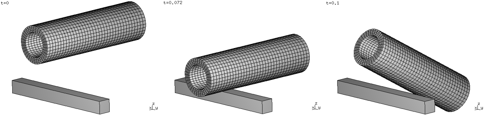
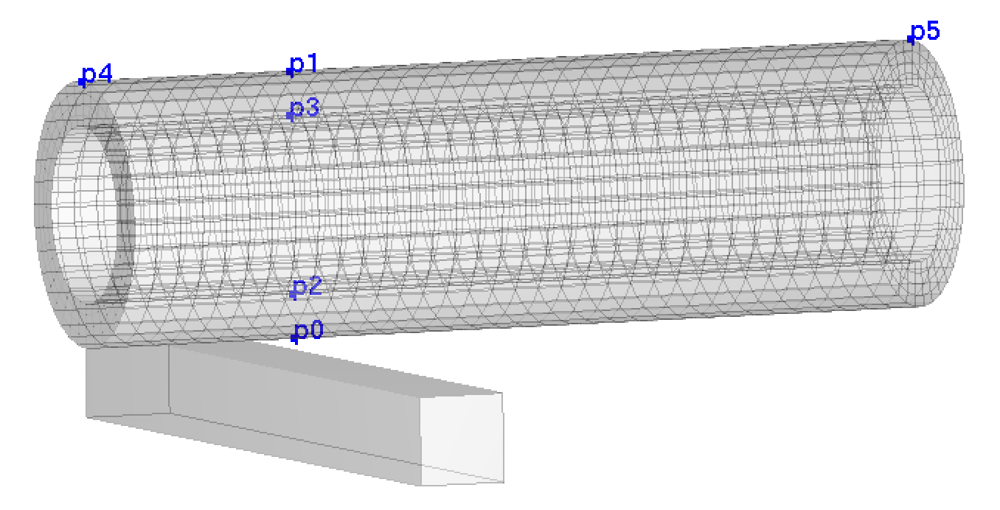
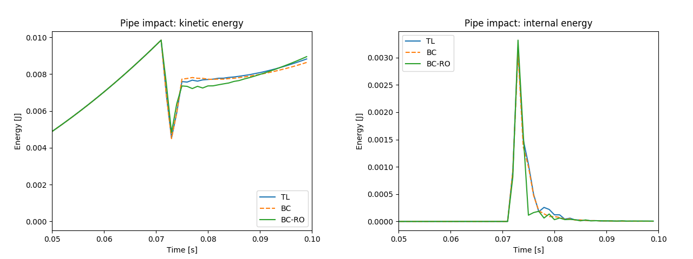
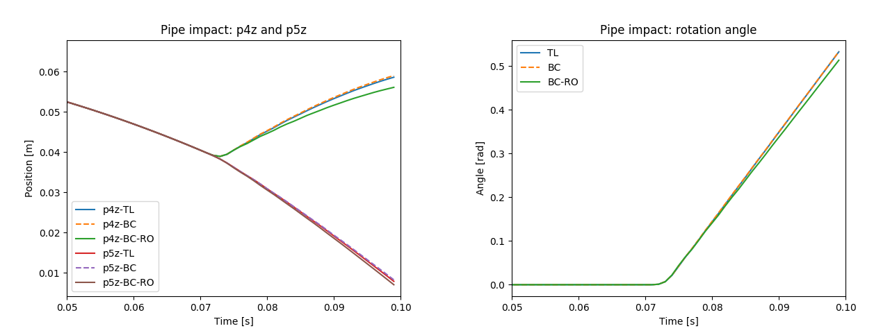
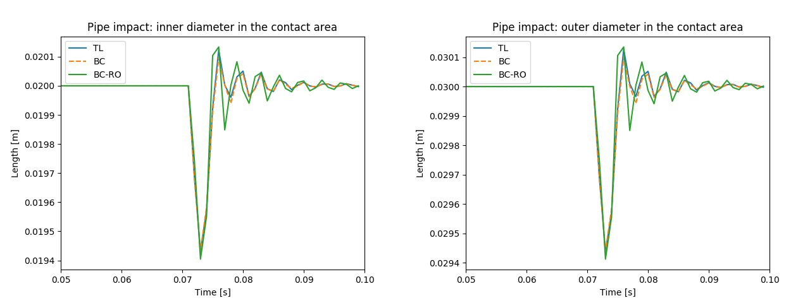

.. _solfec-1.0-examples-reduced_order-ro1:

Pipe impact
===========

This example, also included in :ref:`TR1 <tr1>`, illustrates the reduced order modeling functionality on a pipe impact problem. The input files for
this example are located in the `solfec-1.0/examples/reduced--order1 <https://github.com/tkoziara/solfec/tree/master/examples/reduced-order1>`_ directory.
These are:

- `README <https://github.com/tkoziara/solfec/blob/master/examples/reduced-order1/README>`_ -- a text based specification of the problem

- `ro1--fem--bc.py <https://github.com/tkoziara/solfec/blob/master/examples/reduced-order1/ro1-fem-bc.py>`_ -- finite element body co--rotated model

- `ro1--fem--tl.py <https://github.com/tkoziara/solfec/blob/master/examples/reduced-order1/ro1-fem-tl.py>`_ -- finite element Total Lagrangian model

- `ro1--reduced.py <https://github.com/tkoziara/solfec/blob/master/examples/reduced-order1/ro1-reduced.py>`_ -- finite element reduced order model

- `ro1--lib.py <https://github.com/tkoziara/solfec/blob/master/examples/reduced-order1/ro1-lib.py>`_ -- library functions used by other input files

- `ro1--modred.py <https://github.com/tkoziara/solfec/blob/master/examples/reduced-order1/ro1-modred.py>`_ -- calculation of a reduced
  `POD <https://en.wikipedia.org/wiki/Principal_component_analysis>`_ base

- `ro1--postp.py <https://github.com/tkoziara/solfec/blob/master/examples/reduced-order1/ro1-postp.py>`_ -- post--processing script

- `ro1--run--all.py <https://github.com/tkoziara/solfec/blob/master/examples/reduced-order1/ro1-run-all.py>`_ -- input file that runs all tests and generates all plots

- `ro1--view.py <https://github.com/tkoziara/solfec/blob/master/examples/reduced-order1/ro1-view.py>`_ -- input file suitable for use with Solfec-1.0 :ref:`viewer <solfec-1.0-running>`

.. _reduced-order1: https://github.com/tkoziara/solfec/tree/master/examples/reduced-order1

.. runpy::

  import os, sys
  sys.path.insert(0, os.getcwd()+'/libpy')
  from images import merge_horizontal
  merge_horizontal (['trs/tr1/ro1_pipe0.png',
                     'trs/tr1/ro1_pipe1.png',
                     'trs/tr1/ro1_pipe2.png'],
		    'solfec-1.0/examples/reduced_order/ro1_pipe.png')

.. _ro1-fig1:

   Example reduced-order1_: initial, impact, and final configurations (left to right).

An elastic pipe free falls onto a block obstacle. :numref:`ro1-fig1` illustrates the initial, impact and final configurations.
The inner pipe radius is 0.01 m, its thickness is 0.005 m, and its length is 0.1 m. The pipe lowest point is initially located
0.025 m above the top surface of the block. :numref:`ro1-fig2` shows the characteristic points, used to extract results. Point
p0 impacts the geometrical center of the block. Points p0, p1, p2, p3 are 0.025 m away from p4, when measuring along the pipe
length. The pipe is made of :math:`36\times36\times4` fully integrated trilinear hexahedral elements. The elastic properties
of the pipe are :math:`E=1\mbox{E7 Pa}`, :math:`\nu=0.25` and its density is :math:`\rho=1\mbox{E3 kg /}\mbox{m}^{3}`. The
obstacle has dimensions :math:`0.01\times0.1\times0.01\mbox{ m}` and it is modeled as a geometrical boundary which does not
contribute mass. The gravity along the z--direction is :math:`-10\text{ m/s}^{2}`. The simulation time step is 0.001 s, the
duration is 0.1 s, and the amount of damping is :math:`\eta=1\text{E-4}`. Schemes TL, BC, and BC--RO are compared. 100 co--rotated
displacement samples from the Total Lagrangian solution and 6 rigid motion modes are used as input for the `Python modred package
<http://pythonhosted.org/modred/>`_, to produce 18 Proper Orthogonal Decomposition modes for the BC--RO approach.

.. _ro1-fig2:

   Example reduced-order1_: mesh characteristic points.

.. runpy::

  import os, sys
  sys.path.insert(0, os.getcwd()+'/libpy')
  from images import merge_images
  merge_images ('trs/tr1/ro1_kin_energy.png',
                'trs/tr1/ro1_int_energy.png',
		'solfec-1.0/examples/reduced_order/ro1_energy.png')
  merge_images ('trs/tr1/ro1_p4z_p5z.png',
                'trs/tr1/ro1_rotation.png',
		'solfec-1.0/examples/reduced_order/ro1_p4zp5z_rot.png')
  merge_images ('trs/tr1/ro1_inner_diameter.png',
                'trs/tr1/ro1_outer_diameter.png',
		'solfec-1.0/examples/reduced_order/ro1_diameters.png')
  merge_images ('trs/tr1/ro1_p0mises.png',
                'trs/tr1/ro1_p2mises.png',
		'solfec-1.0/examples/reduced_order/ro1_p0p2_mises.png')

:numref:`ro1-fig3` illustrates the energy balance: in all cases the graphs coincide relatively well. While the BC approach closely
follows the Total Lagrangian approach (TL), the reduced order BC--RO approach slightly deviates in its post-impact response.
Similar general response characteristic can be seen in :numref:`ro1-fig4`, :numref:`ro1-fig5`, :numref:`ro1-fig6`, where other
types of results are compared: we have some variation in the post--impact response, while overall the results match. We note,
that the rotation angle in :numref:`ro1-fig4` was calculated using

.. math::

  \text{angle}=\arcsin\left(\left|\frac{\text{p5}-\text{p4}}{\left|\text{p5}-\text{p4}\right|}\times\left(-1,0,0\right)\right|\right)\text{.}

:numref:`ro1-tab1` illustrates the runtime and storage statistics. The body co--rotational (BC) approach is about 6 times faster than
TL; the reduced order (BC--RO) approach is about 50 time faster and requires about 50 times less storage. The animated output of this
example can be seen in video [1]_.

.. _ro1-fig3:

   Example reduced-order1_: kinetic (left), and internal energy between :math:`t=0.05\text{s}` and :math:`t=0.1\text{s}`.

.. _ro1-fig4:

   Example reduced-order1_: z--coordinates of points p4, p5 (left), and pipe rotation angle (about y)
   between :math:`t=0.05\text{s}` and :math:`t=0.1\text{s}`.

.. _ro1-fig5:

   Example reduced-order1_: inner :math:`\left|\text{p2}-\text{p3}\right|` (left), and outer :math:`\left|\text{p0}-\text{p1}\right|`
   pipe diameter in the contact area between :math:`t=0.05\text{s}` and :math:`t=0.1\text{s}`.

.. _ro1-fig6:

.. figure:: ro1_p0p2_mises.png
   :width: 100%
   :align: center

   Example reduced-order1_: inner point p0 (left), and outer point p2 MISES stress between :math:`t=0.05\text{s}` and :math:`t=0.1\text{s}`.

.. _ro1-tab1:

.. table:: Example reduced-order1_: runtime and storage comparison.

  +-------------------+-------------+--------------+--------------+
  | Formulation       | TL          |  BC          |  BC--RO      |
  +-------------------+-------------+--------------+--------------+
  | Runtime [s]       | 101         | 16.2         | 2.0          |
  +-------------------+-------------+--------------+--------------+
  | Storage [MB]      | 13          | 13           | 0.264        |
  +-------------------+-------------+--------------+--------------+

.. [1] An animation of the reduced-order1_ pipe impact example.

.. youtube:: https://www.youtube.com/watch?v=RoSfE7-7ZH8

.. literalinclude:: ../../../../solfec-1.0/examples/reduced-order1/ro1-fem-tl.py
   :linenos:
   :caption: Listing of ro1--fem--tl.py
   :name: ro1-lst1

:numref:`ro1-lst1` exemplifies the Total Lagrangian analysis input file. The simulation creation code
is hidden inside of the library subroutine `ro1_simulation <https://github.com/tkoziara/solfec/blob/master/examples/reduced-order1/ro1-lib.py#L10>`_,
which returns the :ref:`SOLFEC object <solfec-1.0-user-solfec>`, the pipe :ref:`BODY object <solfec-1.0-user-body>`
and the duration of the analysis, ``stop``, in line 6. When Solfec-1.0 is opened in ``'WIRITE'`` mode (no results exist)
and without the graphical viewer (--v switch not used), we sample co--rotated deformable and rigid displacements in lines 10 and 11.
:ref:`COROTATED_DISPLACEMENTS <solfec-1.0-command-COROTATED_DISPLACEMENTS>` and :ref:`RIGID_DISPLACEMENTS <solfec-1.0-command-RIGID_DISPLACEMENTS>`
commands are respectively used. Further, the simulation is run and the sampled displacements saved in lines 14--24. In case Solfec-1.0 is opened
in ``'READ'`` mode, in line 28, existing results are processed and time histories are extracted using a library routine
`ro1_read_histories <https://github.com/tkoziara/solfec/blob/master/examples/reduced-order1/ro1-lib.py#L61>`_. For comparison
:numref:`ro1-lst2` includes the BC--RO analysis input code. Since most of the input code is inside
`ro1--lib.py <https://github.com/tkoziara/solfec/blob/master/examples/reduced-order1/ro1-lib.py>`_ this file is even shorter.
The sampled displacements are used by `ro1--modred.py <https://github.com/tkoziara/solfec/blob/master/examples/reduced-order1/ro1-modred.py>`_,
invoked internally from within `ro1_simulation <https://github.com/tkoziara/solfec/blob/master/examples/reduced-order1/ro1-lib.py#L10>`_,
when creating the reduced order model of the pipe body. This is depicted in lines 34--49 of :numref:`ro1-lst3`.

.. literalinclude:: ../../../../solfec-1.0/examples/reduced-order1/ro1-reduced.py
   :linenos:
   :caption: Listing of ro1--reduced.py
   :name: ro1-lst2

.. literalinclude:: ../../../../solfec-1.0/examples/reduced-order1/ro1-lib.py
   :lines: 30-49
   :lineno-match:
   :caption: Listing of a portion of ro1--lib.py responsible for creation of the pipe body.
   :name: ro1-lst3

To run this example and generate figures presented here, enter Solfec-1.0 source directory and type

::

  solfec examples/reduced-order1/ro1-run-all.py 

After all progress messages cease, figures are saved as ``out/reduced-order1/*.png`` files.
To interactively view the animated bar, as in video [1]_, call

::

  solfec -v examples/reduced-order1/ro1-view.py 

You can type ``o`` in order to highlight the output path in the viewer and see which model you are currently looking at.
You can switch between models using ``<`` and ``>``. Right--click the mouse button to activate a drop--down menu and see
other available options and keyboard shortcuts.

