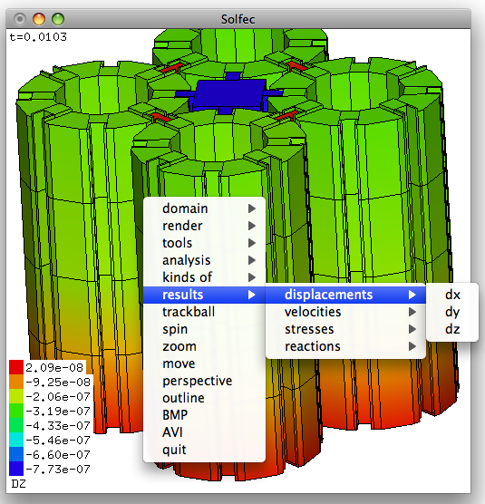

.. _solfec-1.0-running:

Running Solfec-1.0
==================

Solfec-1.0 is a command line program. It can be run sequentially (command: solfec) or in parallel
using an MPI runtime environment (command: solfec--mpi). Running it without parameters

::

  ./solfec

results in the hint

::

  VERSION: 1.04a53f2 (2019-07-05)
  SYNOPSIS: solfec [-v] [-w] [-c] [-f] [-g WIDTHxHEIGHT]
                   [-s sub-directory] [-i verbosity interval] path

The version string has syntax "1." (denoting Solfec-1.0's primary version number) followed by a shorthand
hexadecimal number (`"04a53f2" <https://github.com/parmes/solfec-1.0/commit/04a53f2d54128413d617f84df6f701c4242eb95d>`_
in this case) of a `GitHub commit <https://github.com/parmes/solfec-1.0/commits/master>`_ that most
recently modified Solfec-1.0's source code. This is followed by the date of that most recent modification
of the source code.

**The --v switch** opens the interactive graphical viewer (cf. :numref:`viewer-1`). In this mode the user
can view the geometrical model, run or step through analysis, and view results.
The right mouse click on the viewer window expands the menu.

.. _viewer-1:

   Solfec-1.0 viewer window.

**The --w switch** forces the computation (write) mode. If some results are present, Solfec-1.0 will ask:

::
  
  WARNING: Valid output files exist at path: <path>
  Would you like to overwrite them? y/[n]:

and terminate in case you answered 'n'.

**The --c switch** forces the continued computation (write) mode: if some results are present,
the analysis will be continued from where it was stopped.  *NOTE1:* this option works correctly only
if RUN is used once per input file; With --c Solfec-1.0 terminates in case RUN is used multiple times;
*NOTE2:* this option works only with the HDF5 output; in case of the XDR  output it is the same as --w;
*NOTE3:* in parallel, continuation must be done using the same number of MPI ranks
(e.g. N in “mpirun --np N ...” must not change).

**The --f switch**, together with --v, opens the viewer in the wireframe mode,
which requires substantially less memory and can be used to visualize large models.
You can then use render :math:`\to` 2D/3D wireframe selection option in order to
selectively switch on volumetric rendering of selected areas of the model.

**The --g switch** allows to specify the initial width and height of the viewer window (512 by default).
This option may be useful in case you would like to generate videos with a specific resolution.

**The --s switch** allows to output or read the results from a sub--directory. This option is useful when one
wishes to output results of similar analysis to different sub--directories of a common root directory
specified when creating a SOLFEC object. For example, the bellow commands would run a parallel example
and output the results into different sub-directories denoted by the number of processors involved in the analysis:

::

  mpirun -np 4 solfec-mpi -s 4 inp/cubes.py
  mpirun -np 16 solfec-mpi -s 16 inp/cubes.py

Because the directory out/cubes is specified when creating the SOLFEC object in the inp/cubes.py
input file, the above commands result in creation of two output directories:
out/cubes/4 and out/cubes/16. One can then view a specific set of results by running

::

  ./solfec -v -s 16 inp/cubes.py

During a parallel run Solfec-1.0 updates a file named STATE, placed in the output directory of a simulation.
It contains statistics relevant to the run, including an estimated time until the end of the simulation.
The output directory contains as well a copy of the input file, which makes reading results more self-contained
(it is harder to mismatch input and output files this way). An analysis (both serial and parallel) can be
stopped at any time by placing a file named STOP in the output directory of a simulation.

**The -i switch** allows to adjust the time interval of verbose output of runtime statistics (default is 1s).

Read/write mode
---------------

Solfec-1.0's read/write mode behavior may need some explanation.
Let's say that you created an input file called 'test.py'
inside of a directory called 'inp' and wrote in there the following code:

::
  
  solfec = SOLFEC ('DYNAMIC', 0.001, 'out/test')

  if solfec.mode == 'WRITE': print 'WRITE MODE!'
  elif solfec.mode == 'READ': print 'READ MODE!'

Hence, the results will be placed in the directory 'out/test'.  An analysis
has not yet been run for this input file and there are no results. If you run:

::

  ./solfec inp/test.py

or

::

  mpirun -np 4 ./solfec-mpi inp/test.py

the results will be written into 'out/test'.  Since during this first run no
results were found at the 'out/test' path, Solfec-1.0 will print:

::

  'WRITE MODE!'
  
and attempt to perform calculations upon a first encounter of the RUN command.
Upon completion you will be able to access results by again invoking [1]_:

::

  ./solfec inp/test.py

Since in this case some results will be found at the 'out/test' path,
this time Solfec-1.0 will print:

::

  'READ MODE!'

followed by setting up your model and ignoring all occurrences of the RUN command [2]_.

Output directory as an input path
---------------------------------

Solfec-1.0 creates a copy of an input file in the output directory. For example, if the output path is

::

  out/analysis1

the corresponding copy of the input file will be

::

  out/analysis1/analysis1.py

In order to view or post-process the results that have been saved in this directory, one can run

::

  solfec -v out/analysis1

For this approach to be robust, care needs to be taken to ensure that the input file can be correctly run from
any location (e.g. access to additional data or scripts required by an input file needs to be suitably resolved).

.. [1] *solfec--mpi* always runs in the write mode.
.. [2] When viewer is used (--v switch), the execution of the input file stops at the first occurrence of the RUN command.
