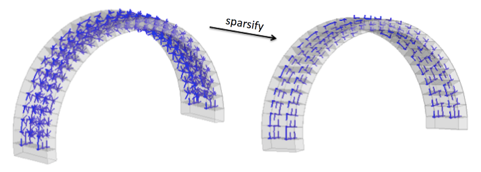
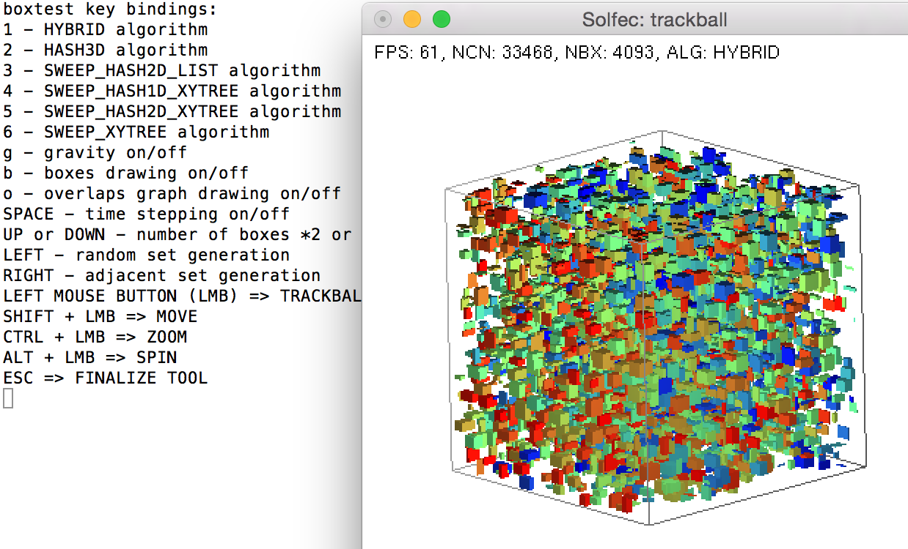

.. _solfec-theory-conpnt:

Contact points
==============

In Solfec-1.0 contact points are generated from volumetric intersections of convex primitive shapes.
For example, in case of finite elements, a single contact point is generated as a result of an
intersection of two elements. Once an intersection is calculated, a contact point is obtained as
a centroid of the intersection surface; a contact normal is calculated by averaging normal directions
of the constituent surfaces. This is illustrated in Figure :numref:`conpnt`.

.. _conpnt:

.. figure:: ../figures/conpnt.png
   :width: 100%
   :align: center

   Contact points and normals obtained from volumetric intersections of convex primitives.

Calculating volumetric intersection
-----------------------------------

Intersection of two convex polyhedra is a convex polyhedron. The convex intersection algorithm,
based on [1]_, is implemented in cvi.c and it can be summarized as follows. Let vectors

.. math::

  \mathbf{v}=\left[\begin{array}{c}
  \mathbf{v}_{1}\\
  ...\\
  \mathbf{v}_{n}
  \end{array}\right],\,\,\,\mathbf{p}=\left[\begin{array}{c}
  \mathbf{p}_{1}\\
  ...\\
  \mathbf{p}_{m}
  \end{array}\right]
  
store vertices and face planes of a polyhedron. Vertices are made of triplets of coordinates

.. math::

  \mathbf{v}_{i}=\left[\begin{array}{c}
  v_{x}\\
  v_{y}\\
  v_{z}
  \end{array}\right]_{i}
  
Planes are made of four components

.. math::

  \mathbf{p}_{i}=\left[\begin{array}{c}
  n_{x}\\
  n_{y}\\
  n_{z}\\
  d
  \end{array}\right]_{i}
  
The plane equation reads

.. math::

  n_{x}\cdot x+n_{y}\cdot y+n_{z}\cdot z+d=0
  
where :math:`\left[n_{x},n_{y},n_{z}\right]^{T}` can be interpreted as a direction normal to the plane. The convex intersection takes as input

.. code-block:: none

  va - vertices of polyhedron 'a'
  pa - face planes of polyhedron 'a'
  vb, pb - vertices and planes of polyhedron 'b'

as seen in `cvi.c:118 <https://github.com/tkoziara/solfec/blob/master/cvi.c#L118>`_.
The algorithm begins by finding a distance between, and a pair closest points in 'a' and 'b'

.. code-block:: none

  1  d,p,q = gjk(va, vb)
  2  if d > 0 return NULL
  3  else x = p

which maps to `cvi.c:132 <https://github.com/tkoziara/solfec/blob/master/cvi.c#L132>`_.
The GJK algorithm [3]_, implemented in `gjk.c:342 <https://github.com/tkoziara/solfec/blob/master/gjk.c#L342>`_, is used.
In case there is a positive separating distance between the input polyhedrons, null intersection is returned.
For the intersection algorithm to work we need a point :math:`\mathbf{x}`, that is inside of both input polyhedrons.
GJK will at best return a common point on the surfaces of both polyhedra. In the next step

.. code-block:: none

  4  x = refine_point(x)

point :math:`\mathbf{x}` is refined by pushing it deeper inside of polyhedrons 'a' and 'b'.
This maps to `cvi.c:136 <https://github.com/tkoziara/solfec/blob/master/cvi.c#L136>`_.
Once :math:`\mathbf{x}` has been refined, we transform the input plane definitions

.. code-block:: none

  5  transform(pa)
  6  transform(pb)

so that :math:`\mathbf{x}` acts as an origin of the coordinate system :math:`\left[0,0,0\right]^{T}`.
In the course of this transformation we also scale the normal direction components so that :math:`d_{i}=-1`.
This maps to `cvi.c:143-159 <https://github.com/tkoziara/solfec/blob/master/cvi.c#L143L159>`_.
In the next step

.. code-block:: none

  7  h = quickhull(normals(pa+pb))

we calculate the convex hull of the transformed normal directions of 'a' and 'b'
(`cvi.c:163 <https://github.com/tkoziara/solfec/blob/master/cvi.c#L163>`_).
The quickhull algorithm [2]_, implemented in `hul.c:555 <https://github.com/tkoziara/solfec/blob/master/hul.c#L555>`_,
is used. The result can be interpreted as a *dual polyhedron* of the intersection polyhedron of 'a' and 'b':
for a convex polyhedron :math:`\left(\mathbf{v},\mathbf{p}\right)`, its dual (or *polar*) polyhedron is made
by reinterpreting vertices as planes, and planes as vertices, as follows

.. math::

  \left[\begin{array}{c}
  v_{x}\\
  v_{y}\\
  v_{z}
  \end{array}\right]_{i}\rightarrow\left[\begin{array}{c}
  v_{x}\\
  v_{y}\\
  v_{z}\\
  -1
  \end{array}\right]_{i},\,\,\,l_{v}=\sqrt{v_{x}^{2}+v_{y}^{2}+v_{z}^{2}}

.. math::

  \left[\begin{array}{c}
  n_{x}\\
  n_{y}\\
  n_{z}\\
  -1
  \end{array}\right]_{i}\rightarrow\left[\begin{array}{c}
  n_{x}\\
  n_{y}\\
  n_{z}
  \end{array}\right]_{i},\,\,\,l_{n}=\sqrt{n_{x}^{2}+n_{y}^{2}+n_{z}^{2}}
  
where vertices at distance :math:`l_{v}` from the origin become planes at distance :math:`1/l_{v}` from the origin,
while planes at distance :math:`1/l_{n}` from the origin become vertices at distance :math:`l_{n}`. In order to obtain
vertices of the intersection polyhedron we then calculate the polar set

.. code-block:: none

  8  v = polarize(h)

which maps to `cvi.c:164 <https://github.com/tkoziara/solfec/blob/master/cvi.c#L164>`_ and is implemented in
`tri.c:351 <https://github.com/tkoziara/solfec/blob/master/tri.c#L351>`_. The vertices :math:`\mathbf{v}` of
the dual intersection polyhedron are translated back, :math:`\mathbf{v}+\mathbf{x}`, into the input coordinate
system, and triangulated

.. code-block:: none

  9  t = triangulate(v+x)

which maps to `cvi.c:170-220 <https://github.com/tkoziara/solfec/blob/master/cvi.c#L170L220>`_. The triangulation is then returned

.. code-block:: none

  10 return t

at `cvi.c:231 <https://github.com/tkoziara/solfec/blob/master/cvi.c#L231>`_.

Deriving contact points and normals
-----------------------------------

Contact points and contact normals are calculated based on the intersection surfaces obtained in the previous step.
For various pairing of geometrical objects, calculation of contact points and contact normals is implemented in
`goc.c <https://github.com/tkoziara/solfec/blob/master/goc.c>`_. For the pairing of two convex polyhedral surfaces
contact detection is implemented in `goc.c:detect_convex_convex <https://github.com/tkoziara/solfec/blob/master/goc.c#L257>`_,
where fist at `goc.c:272 <https://github.com/tkoziara/solfec/blob/master/goc.c#L272>`_, triangulation of the intersection of
the input surfaces is obtained, and next at `goc.c:274 <https://github.com/tkoziara/solfec/blob/master/goc.c#L274>`_ a contact
point and contact normal are obtained out of this triangulation. Implementation of this calculation is found at
`goc.c:130 <https://github.com/tkoziara/solfec/blob/master/goc.c#L130>`_ and it can be summarized as follows. Let :math:`\partial A`
and :math:`\partial B` be the surfaces of the input polytopes :math:`A` and :math:`B`. Let :math:`\left\{ t_{i}\right\}`  and
:math:`\left\{ \mathbf{v}_{i}\right\}`  be the sets of triangles and vertices of the intersection surface of :math:`A\cap B`. Then

.. |br| raw:: html

   

1 :math:`\,\,` :math:`\mathbf{p}=\mathbf{0}`, :math:`\mathbf{n}=\mathbf{0}`, :math:`area = 0` |br|
2 :math:`\,\,` for each :math:`t_{i}\in\left\{ t_{i}\right\}`  do |br|
3 :math:`\,\,\,\,\,\,` :math:`a = area \left(t_{i}\right)`, :math:`b = a^{2}` |br|
4 :math:`\,\,\,\,\,\,` if :math:`t_{i}\in\partial A` then :math:`\mathbf{n}=\mathbf{n}+b\cdot\text{normal}\left(t_{i}\right)` |br|
5 :math:`\,\,\,\,\,\,` else :math:`\mathbf{n}=\mathbf{n}-b\cdot\text{normal}\left(t_{i}\right)` |br|
6 :math:`\,\,\,\,\,\,` :math:`\mathbf{p}=\mathbf{p}+a\cdot\text{centroid}\left(t_{i}\right)` |br|
7 :math:`\,\,\,\,\,\,` :math:`area=area+a` |br|
8 :math:`\,\,\,\,\,\,` :math:`\mathbf{p}=\mathbf{p}/area`, :math:`\mathbf{n}=\mathbf{n}/\left\Vert \mathbf{n}\right\Vert` , :math:`area=0.5\cdot area` |br|
9 :math:`\,\,\,\,\,\,` if :math:`\mathbf{p}` outside of :math:`A` or :math:`B` return NULL |br|
10 :math:`\,\,\,\,\,` :math:`spair_{0}=\text{nearest_surface_id}\left(\mathbf{p},\partial A\right)` |br|
11 :math:`\,\,\,\,\,` :math:`spair_{1}=\text{nearest_surface_id}\left(\mathbf{p},\partial B\right)` |br|
12 :math:`\,\,\,\,\,` :math:`gap=\underset{\mathbf{v}_{i}\in\left\{ \mathbf{v}_{i}\right\} }{\min}\mathbf{n}\cdot\mathbf{v}_{i}-
\underset{\mathbf{v}_{i}\in\left\{ \mathbf{v}_{i}\right\} }{\max}\mathbf{n}\cdot\mathbf{v}_{i}` |br|
13 :math:`\,\,\,\,\,` if :math:`\left|gap\right|` seems too large |br|
14 :math:`\,\,\,\,\,\,\,\,\,` :math:`A^{\prime}=A+\mathbf{n}\cdot\left|gap\right|`, :math:`B^{\prime}=B-\mathbf{n}\cdot\left|gap\right|` |br|
15 :math:`\,\,\,\,\,\,\,\,\,` :math:`gap=\min\left(\text{gjk}\left(A^{\prime},B^{\prime}\right)-2\left|gap\right|,0\right)` |br|
16 :math:`\,\,` return :math:`\mathbf{p}`, :math:`\mathbf{n}`, :math:`area`, :math:`spair`, :math:`gap`

Lines 1-8 above map to `goc.c:141-158 <https://github.com/tkoziara/solfec/blob/master/goc.c#L141L158>`_.
Line 9 corresponds to `goc.c:160 <https://github.com/tkoziara/solfec/blob/master/goc.c#L160>`_ .
Lines 10-11 map to `goc.c:163-172 <https://github.com/tkoziara/solfec/blob/master/goc.c#L163L172>`_ .
Lines 12-15 map to `goc.c:214-243 <https://github.com/tkoziara/solfec/blob/master/goc.c#L214L243>`_.
The extra check in line 13-15 is added to improve robustness of gap calculation. We note that, apart from the contact point,
the contact normal, and the gap, we also calculate contact area, and surface pairing spair, storing identifiers of the input
surfaces that are nearest to the contact point. In line 4, accumulated normal directions are scaled by square area of triangles,
weighting down the influence of triangles with small areas. In line 9, we terminate in case the contact point fell outside of
the input surfaces due to roundoff.

.. _contact_sparsification:

Contact sparsification
----------------------

Contact geometries made of many individual convex objects often generate many contact points. Some of these contact points
are ill–conditioned, in the sense that their corresponding contact normals do not necessarily represent a most natural
direction of contact resolution. This frequently happens near corners or sharp edges, due to roundoff error. Also, for
contact problems among bodies represented by simple kinematic models (e.g. rigid or pseudo-rigid) complex geometries may
give rise to the number of contact points far exceeding the available kinematic freedom. This renders the :math:`\mathbf{W}`
matrix ill-conditioned, as already explained in :ref:`the section on local dynamics <W_matrix>`. For the above
reasons, a heuristic method of refining contact points, or *sparsification*, has been implemented in 
`dom.c:sparsify_contacts <https://github.com/tkoziara/solfec/blob/master/dom.c#L2808>`_.
The result of application of this routine is seen in :numref:`sparsification`. 

.. _sparsification:

   Heuristic filtering of redundant contact points (736 to 168).     

The sparsification approach can be summarized as follows. Let :math:`\left\{ c_{i}\right\}`  be a set of all contact points
and let :math:`threshold`, :math:`minarea` and :math:`mindist` be given. Then

1 :math:`\,\,` for all newly detected :math:`c_{i}\in\left\{ c_{i}\right\}` do |br|
2 :math:`\,\,\,\,\,\,` if :math:`\text{area}\left(c_{i}\right)<minarea` then :math:`\text{delete}\left(c_{i}\right)` |br|
3 :math:`\,\,\,\,\,\,`  for all :math:`c_{j}\in\text{adjacency}\left(c_{i}\right)` do |br|
4 :math:`\,\,\,\,\,\,\,\,\,\,` if :math:`\text{area}\left(c_{i}\right)<threshold\cdot\text{area}\left(c_{j}\right)` and |br|
:math:`\,\,\,\,\,\,\,\,\,\,\,\,\,\,\,\,` :math:`c_{i}\text{ and }c_{j}\text{ are topologically adjacent}` then :math:`\text{delete}\left(c_{i}\right)` |br|
5 :math:`\,\,\,\,\,\,\,\,\,\,` else if :math:`\left\Vert \mathbf{p}\left(c_{i}\right)-\mathbf{p}\left(c_{j}\right)\right\Vert <mindist` then :math:`\text{delete}\left(c_{i}\right)`

Contact points are “topologically adjacent” if they are generated by geometrical primitives which themselves are topologically adjacent
(e.g. finite elements that share element faces). We note, that parameters :math:`threshold`, :math:`minarea` and :math:`mindist` can be
adjusted by using the :ref:`CONTACT_SPARSIFY <solfec-command-CONTACT_SPARSIFY>` input command.

Broad phase contact detection
-----------------------------

Broad phase contact detection precedes the detailed pairwise checks, one of which is described above.
During the broad phase we only intend to find a likely candidates for the detailed pairwise overlap tests
and for this reason axis aligned bounding boxes are used to represent geometrical primitives. For example,
each finite element is represented by a corresponding bounding box, and so are spheres and ellipsoids present
in a simulation. A number of box overlap test algorithms are implemented, as seen in :numref:`boxtest`, where
a test program, implemented in `tst/boxtest.c <https://github.com/tkoziara/solfec/blob/master/tst/boxtest.c>`_,
is shown. All these algorithms are detailed in thesis [5]_. The driver interface for various box overlap algorithms
is implemented in `box.c <https://github.com/tkoziara/solfec/blob/master/box.c>`_ and `box.h <https://github.com/tkoziara/solfec/blob/master/box.h>`_.
The hybrid algorithm [4]_ is currently used in Solfec-1.0 as a fixed choice, cf. `dom.c:114 <https://github.com/tkoziara/solfec/blob/master/dom.c#L114>`_.
The `box.c:AABB_Update <https://github.com/tkoziara/solfec/blob/master/box.c#L379>`_ routine is called inside of the time
integration loop in `dom.c:3595 <https://github.com/tkoziara/solfec/blob/master/dom.c#L3595>`_. When box overlaps are
detected the callback `dom.c:overal_create <https://github.com/tkoziara/solfec/blob/master/dom.c#L344>`_ is invoked,
from within which the `goc.c:gobjcontact <https://github.com/tkoziara/solfec/blob/master/goc.c#L1339>`_ pairwise overlap
detection routined is called. Should an overlap occur, an individual contact point is created as a result,
in `dom.c:384-402 <https://github.com/tkoziara/solfec/blob/master/dom.c#L384L402>`_.

.. _boxtest:

   Box test program illustrating various box overlap detection algorithms.

.. _geometric_epsilon_section:

Geometric epsilon
-----------------

It is important to note that GEOMETRIC_EPSILON, defined in `alg.c:24 <https://github.com/tkoziara/solfec/blob/master/alg.c#L24>`_,
has significant effect on the behavior of most of the geometrical calculations in Solfec-1.0. For example, often points are regarded as
coincident if they are closer than this value. The input command :ref:`GEOMETRIC_EPSILON <solfec-command-GEOMETRIC_EPSILON>` allows
to change the default value of 1E-6.  It is recommended to use about 0.0001 to 0.01 times the dimension of a smallest significant
geometrical feature in a model.

Other implementation aspects
----------------------------

Test examples

* `tst/cvitest.c <https://github.com/tkoziara/solfec/blob/master/tst/cvitest.c>`_ for convex intersection implemented in `cvi.c <https://github.com/tkoziara/solfec/blob/master/cvi.c>`_

* `tst/gjktest.c <https://github.com/tkoziara/solfec/blob/master/tst/gjktest.c>`_ for GJK proximity query implemented in `gjk.c <https://github.com/tkoziara/solfec/blob/master/gjk.c>`_

* `tst/hultest.c <https://github.com/tkoziara/solfec/blob/master/tst/hultest.c>`_ for convex hull calculation implemented in `hul.c <https://github.com/tkoziara/solfec/blob/master/hul.c>`_

can be used to improve understanding of the pairwise overlap test described above.

.. [1] D. E. Muller and F. P. Preparata, Finding the intersection of two convex polyhedra,
       Theoretical Computer Science, 7, 217-236, 1978.
.. [2] C. B. Barber, D. P. Dobkin, and H. Huhdanpaa, The Quickhull Algorithm for Convex Hulls,
       ACM Transactions on Mathematical Software, 22 (4), 469-483, 1996.
.. [3] E. G. Gilbert, and D. W. Johnson, and S. S. Keerthi, Fast procedure for computing the distance between complex 
       bjects in three-dimensional space, IEEE journal of robotics and automation, 4 (2), 193-203, 1988.
.. [4] A. Zomorodian and H. Edelsbrunner, Fast software for box intersections, International Journal
       of Computational Geometry and Applications, 12 (1-2), 143-172, 2002.
.. [5] `Koziara, PhD thesis, 2008. <http://theses.gla.ac.uk/429/>`_
