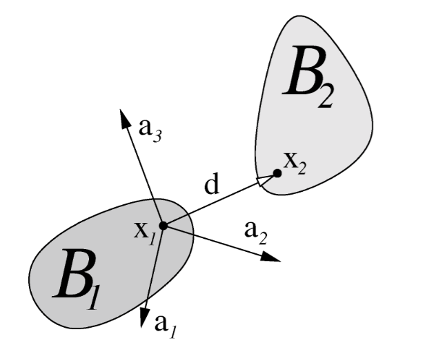

.. _solfec-theory-constraints:

Constraints
===========

Constraints allow to limit kinematic freedom of bodies, e.g. control displacements or prevent interpenetration.
This is reflected on the level of dynamics via reaction forces, which are used to produce desired kinematic effects.
Solfec-1.0 includes equality constraints, or joints, and contact constraints applied at individual contact points.
In this section we briefly demonstrate how constraints are incorporated into the time stepping schemes introduced earlier.

From global to local velocity
-----------------------------

Velocity :math:`\mathbf{u}`, as defined for :ref:`rigid <qurig>`, :ref:`pseudo-rigid
<quprb>`, and :ref:`finite--element <qufem>` bodies, can
be qualified as a global, or generalized, or body\textendash space
entity. In order to obtain a local, spatial 3--dimensional
velocity vector, :math:`\mathbf{U}`, of any spatial image :math:`\mathbf{x}`
of a referential point :math:`\mathbf{X}`, we shall use a linear transformation
of the kind

.. math::
  :label: UHu0

  \mathbf{U}=\mathbf{H}\left(\mathbf{X}\right)\mathbf{u}

Most generally the local velocity :math:`\mathbf{U}` will be expressed
in a local coordinate system, made up of three linearly independent
3--vectors, :math:`\mathbf{a}_{i}`, juxtaposed, in a column--wise
manner into a matrix :math:`\left\{ \mathbf{a}_{i}\right\}`, also called
*local frame*, cf. :numref:`localframe`. Such matrix will have an inverse
which we can denote as :math:`\left\{ \mathbf{a}^{i}\right\} ^{T}=\left\{ \mathbf{a}_{i}\right\} ^{-1}`.
The two coordinate systems, :math:`\left\{ \mathbf{a}_{i}\right\}` and
:math:`\left\{ \mathbf{a}^{i}\right\}`, are traditionally referred to
as covariant and contravariant, respectively. In Solfec-1.0 we use an
orthogonal local base :math:`\left\{ \mathbf{a}_{i}\right\}` and in this
case :math:`\left\{ \mathbf{a}^{i}\right\} =\left\{ \mathbf{a}_{i}\right\}`,
so that :math:`\left\{ \mathbf{a}^{i}\right\} ^{T}=\left\{ \mathbf{a}_{i}\right\} ^{T}`.
Consequently, the local frame is functionally equivalent to a rotation
matrix.

.. _localframe:

   A local frame between two bodies.

The linear transformation :eq:`UHu0` can be most generally derived
as follows. Take any motion

.. math::

  \mathbf{x}\left(\mathbf{X},t\right)=\chi\left(\mathbf{X},\mathbf{q}\left(t\right)\right)

and calculate its derivative with respect to time

.. math::

  \dot{\mathbf{x}}\left(\mathbf{X},t\right)=\frac{\partial\chi\left(\mathbf{X},\mathbf{q}\left(t\right)\right)}{\partial\mathbf{q}}\mathbf{u}\left(t\right)

Then transform this spatial velocity from the global Euclidean frame into the local frame

.. math::

  \mathbf{U}=\left\{ \mathbf{a}^{i}\right\} ^{T}\frac{\partial\chi\left(\mathbf{X},\mathbf{q}\left(t\right)\right)}{\partial\mathbf{q}}\mathbf{u}

Thus

.. math::
  :label: H

  \mathbf{H}\left(\mathbf{X}\right)=\left\{ \mathbf{a}^{i}\right\} ^{T}\frac{\partial\chi\left(\mathbf{X},\mathbf{q}\left(t\right)\right)}{\partial\mathbf{q}}

Specific forms of this transformation are described in sections below.

Rigid kinematics
________________

For rigid bodies, there holds

.. math::

  \dot{\mathbf{x}}=\mathbf{\Lambda}\hat{\mathbf{\Omega}}\left(\mathbf{X}-\bar{\mathbf{X}}\right)+\dot{\bar{\mathbf{x}}}

.. math::

  \mathbf{u}=\left[\begin{array}{c}
  \mathbf{\Omega}\\
  \dot{\bar{\mathbf{x}}}
  \end{array}\right]

and hence

.. math::
  :label: Hrig

  \mathbf{H}=\left\{ \mathbf{a}^{i}\right\} ^{T}\left[\begin{array}{ccc}
  \mathbf{\Lambda}\left(\hat{\bar{\mathbf{X}}}-\hat{\mathbf{X}}\right) &  & \mathbf{I}\end{array}\right]

where the :ref:`hat operator <hat>` makes an anti--symmetric matrix out of a 3--vector,
and :math:`\mathbf{I}` is a :math:`3\times3` identity matrix.

Pseudo--rigid kinematics
________________________

For pseudo-rigid bodies, there holds

.. math::

  \dot{\mathbf{x}}=\dot{\mathbf{F}}\left(\mathbf{X}-\bar{\mathbf{X}}\right)+\dot{\bar{\mathbf{x}}}

.. math::

  \mathbf{u}=\left[\begin{array}{c}
  \dot{F}_{11}\\
  \dot{F}_{12}\\
  ...\\
  \dot{\bar{\mathbf{x}}}
  \end{array}\right]

and hence

.. math::
  :label: Hprb

  \mathbf{H}=\left\{ \mathbf{a}^{i}\right\} ^{T}\left[\begin{array}{cccccc}
  \mathbf{X}^{T}-\bar{\mathbf{X}}^{T} &  &  & 1\\
   & \mathbf{X}^{T}-\bar{\mathbf{X}}^{T} &  &  & 1\\
    &  & \mathbf{X}^{T}-\bar{\mathbf{X}}^{T} &  &  & 1
    \end{array}\right]

Finite--element kinematics
__________________________

For finite--element bodies, there holds

.. math::

  \dot{\mathbf{x}}\left(\mathbf{X},t\right)=\mathbf{N}\left(\mathbf{X}\right)\mathbf{u}

and hence

.. math::
  :label: Hfem

  \mathbf{H}=\left\{ \mathbf{a}^{i}\right\} ^{T}\mathbf{N}\left(\mathbf{X}\right)

Time stepping with constraints
------------------------------

If we wish to control components of a local velocity :math:`\mathbf{U}`
at a point :math:`\mathbf{x}`, we can do this by applying a force :math:`\mathbf{R}`
at this point. Such local force :math:`\mathbf{R}` is reflected as a global,
or generalized, or body--space force, :math:`\mathbf{r}` as follows

.. math::

  \mathbf{r}=\mathbf{H}^{T}\mathbf{R}

The momentum balance is modified accordingly

.. math::

  \mathbf{M}\dot{\mathbf{u}}=\mathbf{f}+\mathbf{H}^{T}\mathbf{R}

In case of multiple forces, :math:`\mathbf{R}_{\alpha}`, applied at multiple
points :math:`\mathbf{x}_{\alpha}`, and controlling multiple local velocities
:math:`\mathbf{U}_{\alpha}`, the modified momentum balance reads

.. math::

  \mathbf{M}\dot{\mathbf{u}}=\mathbf{f}+\sum_{\alpha}\mathbf{H}_{\alpha}^{T}\mathbf{R}_{\alpha}

Our attempt to control components of local velocities can be interpreted
as applying *constraints*. With such understanding, we can call
:math:`\mathbf{U}_{\alpha}` *constraints velocities*, and :math:`\mathbf{R}_{\alpha}`
*constraints reactions*. For the sake of convenience, in case
of a multi--body system, we can use symbols :math:`\mathbf{M}`,
:math:`\mathbf{q}`, :math:`\mathbf{u}`, :math:`\mathbf{f}`, :math:`\mathbf{H}`,
:math:`\mathbf{U}`, :math:`\mathbf{R}`, etc. as suitably juxtaposing matrices and vectors of
all associated individual bodies or constraints. For example

.. math::

  \mathbf{U}=\left[\begin{array}{c}
  ...\\
  \mathbf{U}_{\alpha}\\
  ...
  \end{array}\right],\,\,\,\mathbf{R}=\left[\begin{array}{c}
  ...\\
  \mathbf{R}_{\alpha}\\
  ...
  \end{array}\right]

.. math::

  \mathbf{H}=\left[\begin{array}{ccc}
  ... & \mathbf{H}_{\alpha} & ...\end{array}\right]

.. math::

  \mathbf{M}=\left[\begin{array}{ccc}
  ...\\
   & \mathbf{M}_{i}\\
    &  & ...
    \end{array}\right],\,\,\,\mathbf{f}=\left[\begin{array}{c}
    ...\\
    \mathbf{f}_{i}\\
    ...
    \end{array}\right],\,\,\,\mathbf{u}=\left[\begin{array}{c}
    ...\\
    \mathbf{u}_{i}\\
    ...
    \end{array}\right]

With such understanding in mind, we can incorporate any set of constraints
into a multi--body system, by saying

.. math::
  :label: Muf1

  \mathbf{M}\dot{\mathbf{u}}=\mathbf{f}+\mathbf{H}^{T}\mathbf{R}

.. math::
  :label: UHu1

  \mathbf{U}=\mathbf{H}\mathbf{u}

.. math::
  :label: CUR1

  \mathbf{C}\left(\mathbf{U},\mathbf{R}\right)=\mathbf{0}

where the relation :math:`\mathbf{C}\left(\mathbf{U},\mathbf{R}\right)=\mathbf{0}`
implicitly expresses a control over local velocities :math:`\mathbf{U}_{\alpha}`,
exerted using reaction forces :math:`\mathbf{R}_{\alpha}`. Now, including
constraints, we can modify the :ref:`previously introduced time stepping
<solfec-theory-timeint>` as follows

.. _timestepping1:

.. math::
  :label: q1

  \mathbf{q}^{t+\frac{h}{2}}=\mathbf{q}^{t}+\frac{h}{2}\mathbf{u}^{t}

.. math::
  :label: u2

  \mathbf{u}^{t+h}=\mathbf{u}^{t}+\mathbf{A}^{-1}h\mathbf{f}\left(\mathbf{q}^{t+\frac{h}{2}},\mathbf{u}^{t}\right)+
  \mathbf{A}^{-1}h\mathbf{H}^{T}\left(\mathbf{q}^{t+\frac{h}{2}}\right)\mathbf{R}

.. math::
  :label: UHu2

  \mathbf{U}=\mathbf{H}\left(\mathbf{q}^{t+\frac{h}{2}}\right)\mathbf{u}

.. math::
  :label: CUR2

  \mathbf{C}\left(\mathbf{U},\mathbf{R}\right)=\mathbf{0}\label{eq:CUR2}

.. math::
  :label: q2

  \mathbf{q}^{t+h}=\mathbf{q}^{t+\frac{h}{2}}+\frac{h}{2}\mathbf{u}^{t+h}

The first step :eq:`q1` is explicit. Equations :eq:`u2`,
:eq:`UHu2`, :eq:`CUR2` are solved together, implicitly.
The final step :eq:`q2` is again explicit. This form of constrained
time integration is implemented in Solfec-1.0.

Implementation
--------------

Calculation of the global to local velocity mapping :math:`\mathbf{H}` is implement in
`bod.c <https://github.com/tkoziara/solfec/blob/master/bod.c>`_ (rigid, pseudo--rigid)
and `fem.c <https://github.com/tkoziara/solfec/blob/master/bod.c>`_ (finite--element) files.
A constraint data structure, including the local frame :math:`\left\{ \mathbf{a}_{i}\right\}`,
the spatial point :math:`\mathbf{x}`, the constraint velocity :math:`\mathbf{U}`,
and rection :math:`\mathbf{R}`, is declared in
`dom.h <https://github.com/tkoziara/solfec/blob/master/dom.h#L63>`_ as follows:

.. literalinclude:: ../../../solfec-1.0/dom.h
   :lines: 67-78
   :lineno-start: 67
   :linenos:

.. literalinclude:: ../../../solfec-1.0/dom.h
   :lines: 124
   :lineno-start: 124
   :linenos:

.. |br| raw:: html

   

Evaluation of :eq:`H` in accessed via `bod.c:BODY_Gen_To_Loc_Operator <https://github.com/tkoziara/solfec/blob/master/bod.c#L1829>`_. |br|
Assembling of :eq:`Hrig` is in `bod.c:rig_operator_H <https://github.com/tkoziara/solfec/blob/master/bod.c#L216>`_. |br|
Assembling of :eq:`Hprb` is in `bod.c:prb_operator_H <https://github.com/tkoziara/solfec/blob/master/bod.c#L429>`_. |br|
Assembling of :eq:`Hfem` is in `fem.c:FEM_Gen_To_Loc_Operator <https://github.com/tkoziara/solfec/blob/master/fem.c#L3371>`_. |br|
