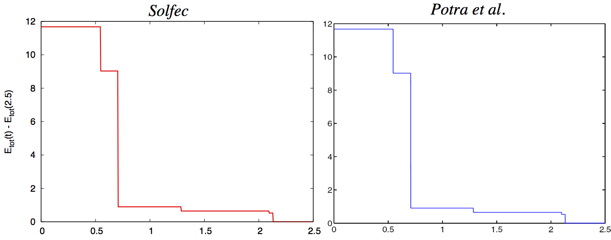
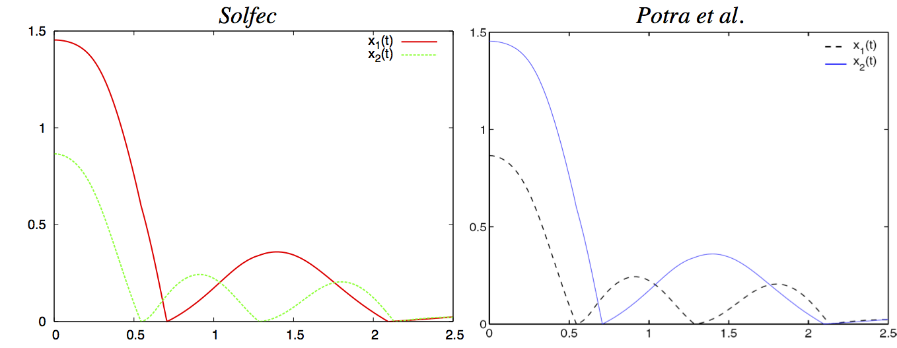

.. _solfec-validation-double_pendulum:

Double pendulum impacting a rigid wall
======================================

.. |br| raw:: html

   

+---------------------------------------------------------------------------------------------------------------------------------+
| **Reference:** `Florian A. Potra, Mihai Anitescu, Bogdan Gavrea, Jeff Trinkle. A linearly implicit trapezoidal method for       |
| integrating stiff multibody dynamics with contact, joints, and friction. International Journal for Numerical Methods in         |
| Engineering, vol. 66, pp. 1079-1124, 2006. <http://onlinelibrary.wiley.com/doi/10.1002/nme.1582/abstract>`_                     |
| |br|                                                                                                                            |
| **Analysis:** Explicit dynamics, frictionless impact, bilateral constraints.                                                    |
| |br|                                                                                                                            |
| **Purpose:** Examine the accuracy of an analysis involving frictionless impact and bilateral constraints.                       |
| |br|                                                                                                                            |
| **Summary:** A double pendulum composed of two mass points connected by weightless rods impacts a rigid wall. Position and      |
| energy plots are compared against those available in the source paper.                                                          |
+---------------------------------------------------------------------------------------------------------------------------------+

.. _double_pendulum0:

.. figure:: double_pendulum/double-pendulum.png
   :width: 35%
   :align: center

   Double pendulum in the initial configuration.

The reference [1]_ uses the Poisson impact model, while Solfec-1.0 uses the Newton model. Both models are equivalent in case of frictionless
impact if all restitution coefficients are identical [2]_. This is the case in the example, thus the comparison is feasible. As Solfec-1.0 does
not handle contacts between objects with zero volume, mass points were approximated by spheres and the distance between the wall and the rest
configuration of the pendulum was shifted by the sphere radius.

Input parameters
----------------

+---------------------------------------------------+--------------------------------------------------------------------------------------------+
| Mass :math:`\left(kg\right)`                      | :math:`m_{1}=m_{2}=1`                                                                      |
+---------------------------------------------------+--------------------------------------------------------------------------------------------+
| Length :math:`\left(m\right)`                     | :math:`l_{1}=l_{2}=1`                                                                      |
+---------------------------------------------------+--------------------------------------------------------------------------------------------+
| Point :math:`\mathbf{x}_{0} \left(m\right)`       | :math:`\mathbf{x}_{0}=\left[0,0,2\right]`                                                  |
+---------------------------------------------------+--------------------------------------------------------------------------------------------+
| Point :math:`\mathbf{x}_{1} \left(m\right)`       | :math:`\mathbf{x}_{1}=\left[\sin\left(\frac{\pi}{3}\right),                                |
|                                                   | 0,2-\cos\left(\frac{\pi}{3}\right)\right]`                                                 |
+---------------------------------------------------+--------------------------------------------------------------------------------------------+
| Point :math:`\mathbf{x}_{2} \left(m\right)`       | :math:`\mathbf{x}_{2}=\left[\sin\left(\frac{\pi}{3}\right)+\sin\left(\frac{\pi}{5}\right), |
|                                                   | 0,2-\cos\left(\frac{\pi}{3}\right)-\cos\left(\frac{\pi}{5}\right)\right]`                  |
+---------------------------------------------------+--------------------------------------------------------------------------------------------+
| Initial velocities :math:`\left(m/s\right)`       | all zero                                                                                   |
+---------------------------------------------------+--------------------------------------------------------------------------------------------+
| Gravity acceleration :math:`\left(m/s^{2}\right)` | :math:`\mathbf{g}=\left[0,0,-9.81\right]`                                                  |
+---------------------------------------------------+--------------------------------------------------------------------------------------------+
| Velocity restitution                              | :math:`\epsilon=0.1`                                                                       |
+---------------------------------------------------+--------------------------------------------------------------------------------------------+
| Coulomb friction coefficient                      | :math:`\mu=0`                                                                              |
+---------------------------------------------------+--------------------------------------------------------------------------------------------+

Results
-------

Simulation over the time interval :math:`\left[0,2.5\right]` was performed with the time step :math:`h=0.001`. As the reference [1]_ does
not specify numerical values of the results, a visual comparison of the total energy and the :math:`x`-coordinate histories of the mass
points is provided in :numref:`double_pendulum1` and :numref:`double_pendulum2`.

.. _double_pendulum1:

   Comparison the total energy plots versus time.

.. _double_pendulum2:

   Comparison of the :math:`x`-coordinate plots (:math:`x_{i}\left(t\right)` stands for the :math:`i`-th mass point :math:`x`-coordinate).

.. _double_pendulum3:

.. figure:: double_pendulum/double-pendulum.gif
   :width: 50%
   :align: center

   Animation of the double pendulum motion (reload page or click on image to restart).

.. [1] `Florian A. Potra, Mihai Anitescu Bogdan Gavrea Jeff Trinkle, "A linearly implicit trapezoidal method for integrating stiff
  multibody dynamics with contact, joints, and friction", International Journal for Numerical Methods in Engineering (2006), 1079--1124.
  <http://onlinelibrary.wiley.com/doi/10.1002/nme.1582/abstract>`_

.. [2] `Christoph Glocker, "On Frictionless Impact Models in Rigid-Body Systems", Philosophical Transactions: Mathematical,
  Physical and Engineering Sciences (2001), 2385--2404. <http://rsta.royalsocietypublishing.org/content/359/1789/2385>`_
