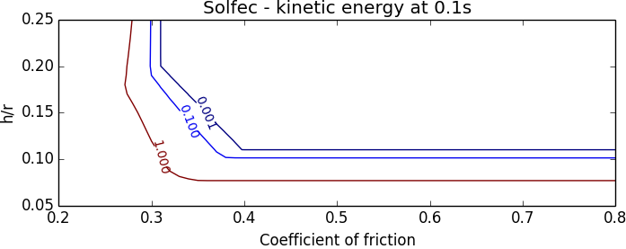

.. _solfec-1.0-validation-masonry_arch:

Masonry arch
============

.. |br| raw:: html

   

+---------------------------------------------------------------------------------------------------------------------------------+
| **Reference:** `Gilbert, M. and Casapulla, C. and Ahmed, H. M., Limit analysis of masonry block structures with non-associative |
| frictional joints using linear programming, Computers and Structures, vol. 84, pp. 873-887, 2006.                               |
| <http://dx.doi.org/10.1016/j.compstruc.2006.02.005>`_                                                                           |
| |br|                                                                                                                            |
| **Analysis:** Explicit dynamics, frictional contact.                                                                            |
| |br|                                                                                                                            |
| **Purpose:** Examine applicability of the dynamic scheme to the limit-state analysis of frictional block structures.            |
| |br|                                                                                                                            |
| **Summary:** A semicircular arch is composed of 27 blocks, subjected to the uniform gravitational field. The dynamic stability  |
| of the arch is investigated for varying ratios of the thickness to centreline radius :math:`h/r`. The results are compared      |
| against the available findings based on the limit-state analysis.                                                               |
+---------------------------------------------------------------------------------------------------------------------------------+

Gilbert et al. [1]_ present a numerical solution to the classical problem of the stability of a semicircular arch under gravity load.
The analysis provided in [1]_ spans friction coefficients from the interval :math:`\left[0.2,0.8\right]` and identifies three geometrical
failure modes (:numref:`masonry_arch0`). The classical analysis provided by Heyman [2]_ assumes no frictional slip, and therefore covers
only one case of mechanism formation (mode I -- typical for large friction).

.. _masonry_arch0:

.. figure:: masonry_arch/arch-modes.png
   :width: 80%
   :align: center

   Symmetrical arch problem: influence of friction coefficient on minimum arch thickness (after Gilbert et al. [1]_).

Several factors need to be taken into account when considering reproduction of the results presented in :numref:`masonry_arch0`:

1. A linear programming based limit--state formulation is employed in [1]_, whereas the dynamic contact algorithm is used in Solfec-1.0.
2. The analysis provided in [1]_ is two--dimensional, whereas Solfec-1.0 deals with a three--dimensional model.
3. A node to face contact model is employed in [1]_, whereas the face to face (or more generally element to element) contact model is employed in Solfec-1.0.

Due to the modeling differences (inertial effects, contact resolution) is it reasonable to accept a margin of discrepancy between the results
obtained by both methods. The dynamic stability analysis will be based on the observation of the kinetic energy histories, calculated for
arches with thicknesses varying around the documented in [1]_ stability limits. :numref:`masonry_arch1` summarizes the geometry and discretization
adopted in the Solfec-1.0 model. In order to geometrically capture the hinging effect from the first moments of simulation, the subdivision along the block
thickness comprises two narrow elements at the extrados and intrados of the arch.

.. _masonry_arch1:

.. figure:: masonry_arch/arch-model.png
   :width: 60%
   :align: center

   The three--dimensional arch model in Solfec-1.0. Each of the 27 blocks is composed of 6 elements: two along the width :math:`w`,
   and three along the thickness :math:`h`. Thus six contact points are established initially between a pair of blocks.

Input parameters
----------------

Under the assumptions discussed by Heyman [2]_, formation of a failure mechanism is of purely geometrical nature.
Therefore the material parameters can be chosen arbitrary (none have been reported in [1]_). The table below summarizes
the assumed parameters.

+---------------------------------------------------+-------------------------------------------------+
| Mass density :math:`\left(kg/m^{3}\right)`        | :math:`\rho=1`                                  |
+---------------------------------------------------+-------------------------------------------------+
| Centreline radius :math:`\left(m\right)`          | :math:`r=10`                                    |
+---------------------------------------------------+-------------------------------------------------+
| Arch width :math:`\left(m\right)`                 | :math:`w=5`                                     |
+---------------------------------------------------+-------------------------------------------------+
| Number of blocks                                  | 27                                              |
+---------------------------------------------------+-------------------------------------------------+
| Initial velocities :math:`\left(m/s\right)`       | all zero                                        |
+---------------------------------------------------+-------------------------------------------------+
| Gravity acceleration :math:`\left(m/s^{2}\right)` | :math:`\mathbf{g}=\left[0,0,-9.81\right]`       |
+---------------------------------------------------+-------------------------------------------------+
| Velocity restitution                              | :math:`\epsilon=0`                              |
+---------------------------------------------------+-------------------------------------------------+
| Time step :math:`\left(s\right)`                  | :math:`h=0.001`                                 |
+---------------------------------------------------+-------------------------------------------------+
| Simulated duration :math:`\left(s\right)`         | :math:`0.1`                                     |
+---------------------------------------------------+-------------------------------------------------+

Results
-------

:numref:`masonry_arch2` illustrates the kinetic energy of the arch model at the end of the 0.1s simulated duration.
A range of values of the coefficient of friction and arch thickness to radius ratios :math:`h/r` was used. The region
above the 0.001--level contour line corresponds to the “numerical zero” level of kinetic energy, where the arch remains
stable. For the parameters below this level curve the arch begins to collapse.

.. _masonry_arch2:

   Kinetic energy map at the end of the 0.1s simulations over a grid of friction coefficients and :math:`h/r` ratios.

:numref:`masonry_arch3` superimposes :numref:`masonry_arch0` from [1] with :numref:`masonry_arch2`. We can see that the transition
lines coincide. :numref:`masonry_arch3` also includes the failure modes I, II, and III reproduced from three longer Solfec-1.0 simulations
(to allow for more deformation). It is seen that the six--hinge mechanism is exactly formed for large friction (mode I). The mode II
mechanism is qualitatively well captured in :numref:`masonry_arch3`. The four--hinge mechanism does form in the initial phase of the
dynamic solution, yet, due to the sensitivity of the dynamic simulation, one of the top hinges “takes over” at a later stage (no deformation
scaling was applied in the figures). Also the the qualitative nature of mode III deformation in :numref:`masonry_arch3` reflects the
corresponding mode in :numref:`masonry_arch0`. Small differences owe to the modeling discrepancies.

.. _masonry_arch3:

.. figure:: masonry_arch/arch-energy-compare.png
   :width: 90%
   :align: center

   Level curves from :numref:`masonry_arch2` obtained from Solfec-1.0 superimposed with :numref:`masonry_arch0` from [1].
   The corresponding three modeled failure modes are included.

.. [1] `Gilbert, M. and Casapulla, C. and Ahmed, H. M., Limit analysis of masonry block structures with non-associative
  frictional joints using linear programming, Computers and Structures, vol. 84, pp. 873-887, 2006.
  <http://dx.doi.org/10.1016/j.compstruc.2006.02.005>`_   

.. [2] Heyman, Jacques, "Equilibrium of Shell Structures", Clarendon Press (1977).
