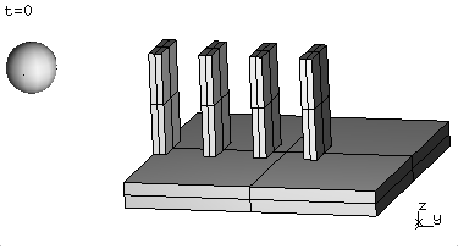
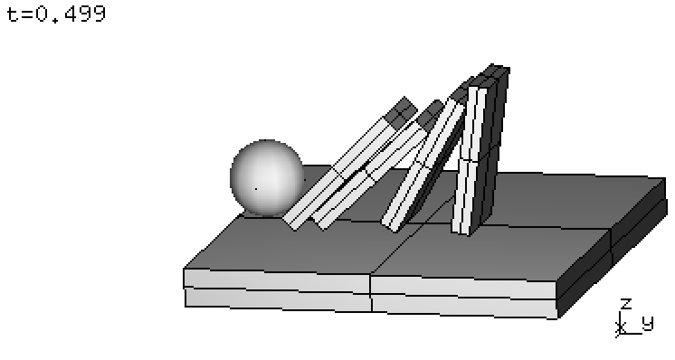
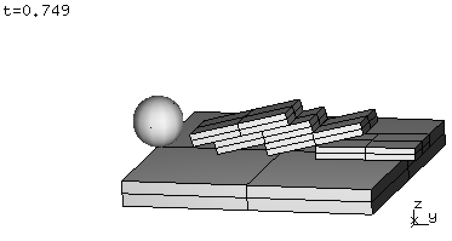

.. _solfec-xdmf-example:

Export domino example
=====================

The source code below demonstrate the XDMF export functionality using a domino toppling example.
Lines 1--16 set up the simulation. Lines 18--23 either export the initial geometry or run simulation.
Lines 25--40 exemplify the remaining export capability. Within Solfec-1.0 sources
this example can be found as `inp/devel/xdmf-export.py
<https://github.com/tkoziara/solfec/blob/master/inp/devel/xdmf-export.py>`_.

.. literalinclude:: ../../../solfec-1.0/inp/devel/xdmf-export.py
   :linenos:

Assuming we are inside of Solfec-1.0 source directory, this example can be executed as follows:

::
  
  ./solfec inp/devel/xdmf-export.py --geom0

to first demonstrate the export of initial geometry in 'WRITE' mode. In this case no calculations
were done and only one, initial state was saved in *out/xmftest0* directory. The saved files are:

- *out/xmftest0/xmftest0_grids.xmf* -- storing grids markup
- *out/xmftest0/xmftest0_spheres.xmf* -- storing spheres markup
- *out/xmftest0/xmftest0.h5* -- storing all remaining data

We note that:

::
  
  solfec.cleanup = 'ON'

in line 22 allows Solfec-1.0 to delete the output directory *out/domino* in case no results were saved.
This is just a matter of convenience, allowing us to run Solfec-1.0 without the --w switch:

::
  
  ./solfec inp/devel/xdmf-export.py

to perform calculations, by invoking line 23. Calculations finish after several seconds
and results are saved into the *out/domino* directory. :numref:`domino-0-3` includes several
screenshots captured using a viewer session:

::
  
  ./solfec inp/devel/xdmf-export.py -v

.. |dom1| image:: figures/xdmf-domino-1.png    
   :width: 90%
   :align: middle

.. _domino-0-3:

.. table:: Domino animation at times :math:`t\in\{0.0, 0.25, 0.5, 0.75\}`.

  +--------+--------+--------+--------+
  | |dom0| | |dom1| | |dom2| | |dom3| |
  +--------+--------+--------+--------+

We then need to run Solfec-1.0 one last time:

::
  
  ./solfec inp/devel/xdmf-export.py

in order to execute lines 25--40 and output the *out/xdmftest[1--5]* directories. Recall, that when results
are present Solfec-1.0 runs in the 'READ' mode, facilitating access to post--processing routines.

The first export instance in line 28:

::

  XDMF_EXPORT (solfec, 0.5, 'out/xmftest1')

outputs the simulation state at time :math:`t = 0.5` into the *out/xmftest1* directory. The second export instance in line 30:

::

  XDMF_EXPORT (solfec, (0.0, 1.0), 'out/xmftest2')

outputs the entire 1000 steps of the simulation into the *out/xmftest2* directory. We note that in both cases an extra file
has been created in the output directories, e.g.:

- *out/xmftest2/xmftest2_constraints.xmf* -- storing constraints markup

Exporting all time steps of a simulation may not always be desirable. Sometimes we might like to store more results within the large
hard drives of a HPC facility and only export subsets for local post--processing. In line 32 we define a list of 101 time instants:

::
  
  times = [0.01*i for i in range(0, 101)]

which allows us to export only the nearest saved simulation states in line 34:

::

  XDMF_EXPORT (solfec, times, 'out/xmftest3')

Finally, instead of exporting data for all bodies defined within our model, it is also possible to use a subset of bodies
and further specialise our export. This is done in the fourth export instance in line 36:

::

  XDMF_EXPORT (solfec, times, 'out/xmftest4',
    subset = [(0.4, 0, 0, 0.6, 0.05, 0.2), 'Domino2', ball])

where we used a combination of a bounding box, a body label, and a BODY object to define a subset. Bodies, whose bounding boxes
overlap the box defined by two corners :math:`[0.4, 0, 0]` and :math:`[0.6, 0.05, 0.2]` at time :math:`t = 0` will be exported
together with the domino piece labeled 'Domino2' and the ball used to initially topple the domino set.

The last example, in line 39, demonstrates the usage of a regular expression based subset definition:

::

  XDMF_EXPORT (solfec, times, 'out/xmftest5',
      subset = 'Domino[2,3]', attributes = ['VELO', 'RELV'])

together with a non-default definition of exported attributes. In this case domino pieces labeled 'Domino2' and 'Domino3'
will be exported. Only the velocity field will be saved as a grid attribute and only relative constraint velocities
will be saved as constraints attributes.

In the :ref:`following section <solfec-xdmf-paraview>` we are going to use `Paraview <http://www.paraview.org>`_ in order to
view some of the XDMF files generated by the current example.
