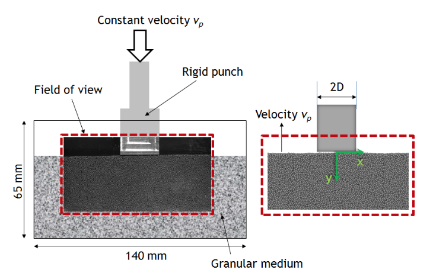

.. _solfec-applications-kinematic_flow_patterns:

Kinematic flow patterns
=======================

.. |br| raw:: html

   

Solfec was utilised by Viswanathan et al. [1]_ in the context of modeling of granular flow patterns.
The abstract and figures below quote directly from reference [1]_.

.. [1] Koushik Viswanathan, Anirban Mahato, Tejas G. Murthy, Tomasz Koziara, Srinivasan Chandrasekar,
  Kinematic flow patterns in slow deformation of a dense granular material, Granular Matter,
  October 2015, Volume 17, Issue 5, pp 553–565. 
  `Journal link <http://link.springer.com/article/10.1007%2Fs10035-015-0576-y>`_, 
  `Preprint link <https://arxiv.org/abs/1507.05354>`_.

**Abstract** |br|
The kinematic flow pattern in slow deformation of a model dense granular medium is studied at high
resolution using *in situ* imaging, coupled with particle tracking. The deformation configuration is indentation
by a flat punch under macroscopic plane--strain conditions. Using a general analysis method, velocity gradients and
deformation fields are obtained from the disordered grain arrangement, enabling flow characteristics to be quantified.
The key observations are the formation of a stagnation zone, as in dilute granular flow past obstacles; occurrence of
vortices in the flow immediately underneath the punch; and formation of distinct shear bands adjoining the stagnation zone.
The transient and steady state stagnation zone geometry, as well as the strength of the vortices and strain rates in the
shear bands, are obtained from the experimental data. All of these results are well--reproduced in exact--scale Non--Smooth
Contact Dynamics (NSCD) simulations. Full 3D numerical particle positions from the simulations allow extraction of flow
features that are extremely difficult to obtain from experiments. Three examples of these, namely material free surface
evolution, deformation of a grain column below the punch and resolution of velocities inside the primary shear band,
are highlighted. The variety of flow features observed in this model problem also illustrates the difficulty involved
in formulating a complete micromechanical analytical description of the deformation.

.. _kinematic_flow_patterns-1:

   Problem setup. (Left) Schematic of the experimental setup with sample image frame superimposed over the field of view (highlighted in red).
   (Right) Reference frame with punch stationary, showing the coordinate system used. The punch width 2D, used for normalizing lengths, is also depicted.
   (cf. Figure 1 in [1]_)

.. _kinematic_flow_patterns-2:

.. figure:: kinematic_flow_patterns-2.png
   :width: 30%
   :align: center

   Stagnation (or dead material) zone and its evolution. Sequence of 100 experimental (top) and simulation (bottom) frames superimposed,
   showing the flow pattern. The streaks correspond to particle pathlines. The stagnation zone (white dashed line) appears motionless,
   as revealed by lack of streaklines. (cf. Figure 4 in [1]_)

.. _kinematic_flow_patterns-3:

.. figure:: kinematic_flow_patterns-3.png
   :width: 50%
   :align: center

   Particle velocities and vorticity field near the punch. Arrows represent velocity of individual particles, estimated from successive images;
   arrow size is proportional to velocity magnitude. Background is colored based on vorticity using linear interpolation from values at particle
   locations. Vorticity is scaled between -1 (blue, clockwise) and 1 (red, counterclockwise). (a) Experimental image. (b) Corresponding image
   from NSCD simulation. (cf. Figure 5 in [1]_)
