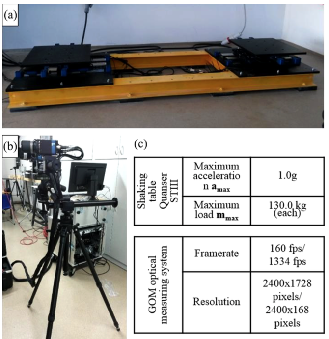
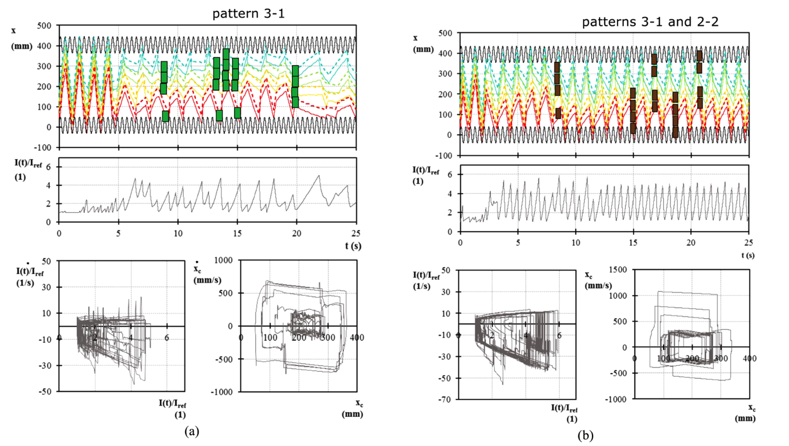

.. _solfec-applications-multibody_pattern_formation:

.. |br| raw:: html

   

Multibody pattern formation
===========================

Solfec was utilised by Bićanić et al. [1]_ in the context of multibody pattern formation.
The abstract and figures below quote directly from reference [1]_.

.. [1] Nenad Bićanić, Jean-Francois Camenen, Nina Čeh, Tomasz Koziara, Characterisation of pattern formation
  in constrained multiblock assembly subjected to horizontal harmonic excitation, Int. J. Masonry Research and
  Innovation, Vol. 1, No. 4, 2016. `Journal link <http://www.inderscienceonline.com/doi/abs/10.1504/IJMRI.2016.081271>`_.

**Abstract** |br|
Pattern formation for a constrained one--dimensional assembly comprising a number of blocks undergoing external harmonici
excitation of the basin boundary is investigated. The importance of the relationship between the excitation amplitude and
the basin size which leads to repeatable response patterns of the single and multiple blocks is established, considering
in addition the role of the energy dissipation due to inter block collisions and collisions with the moving boundary.
Experimental results for the four-- and eight--block assembly control problems, exposed to a range of amplitudes and frequencies,
are included and compared with the two sets of computational simulation frameworks, the explicit discrete element method and the
non--smooth contact dynamics. In the characterisation of the dynamic sensitivity response of the multiblock assemblies, several
attributes and indices (kinetic energy index, block assembly mass centroid and mass inertia index, presented through time histories
and phase planes) are extracted from both the experimental and computational simulation results and successfully compared.

.. _multibody_pattern_formation-1:

   SOLFEC computational model (cf. Figure 3 in [1]_)

.. _multibody_pattern_formation-2:

  
   Experimental set--up. (a) Shaking tables, (b) optical measuring system and (c) equipment characteristics (see online version for colours) 
   (cf. Figure 5 in [1]_)

.. _multibody_pattern_formation-3:

   Fig. (a) Trajectory histories of blocks’ edges (top), mass inertia index of the assembly history (middle), mass inertia index phase plane
   (bottom left) and centroid of the assembly phase plane (bottom right) for the case with excitation a = 40 mm and f = 2.5 Hz obtained from
   NSCD simulation platform SOLFEC. (b) Trajectory histories of blocks’ edges (top), mass inertia index of the assembly history (middle),
   mass inertia index phase plane (bottom left) and centroid of the assembly phase plane (bottom right) for the case with excitation a = 40 mm
   and f = 2.5 Hz obtained from DEM--based MATLAB code (see online version for colours) (cf. Figure 7 in [1]_)
