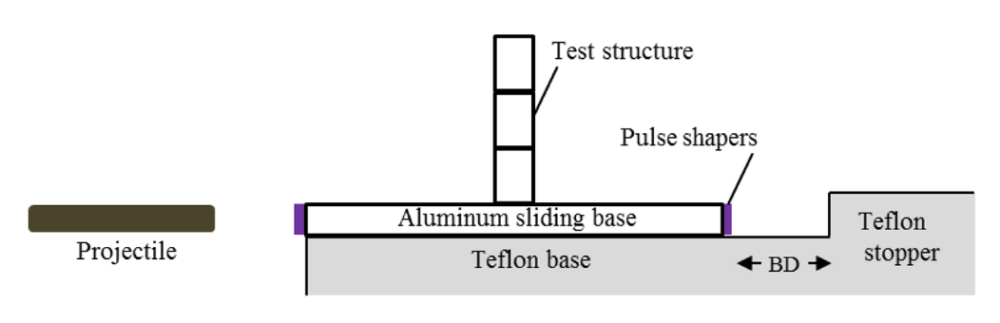
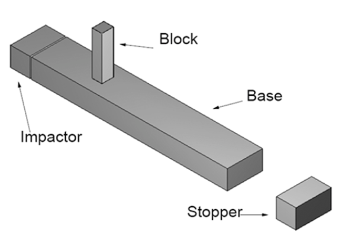
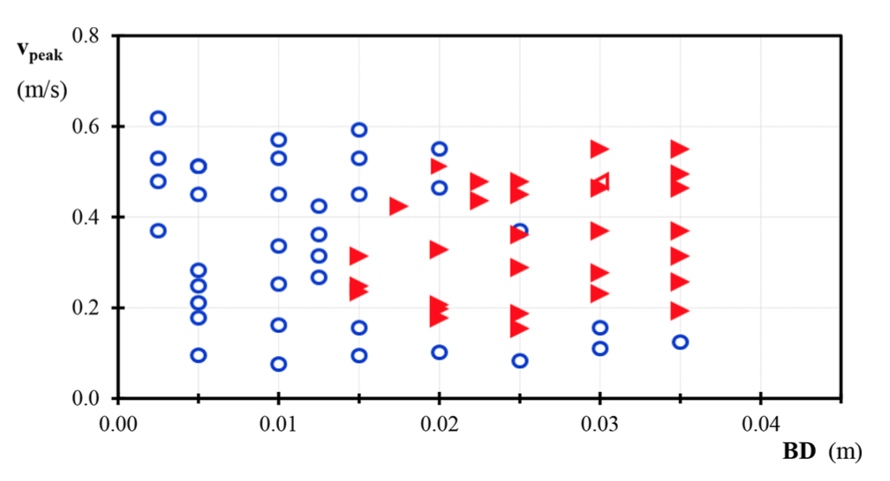
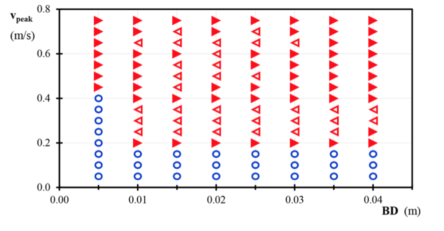

.. _solfec-applications-overturning_block_stacks:

Overturning of multiple-block stacks
====================================

.. |br| raw:: html

   

Solfec was utilised by Nina Čeh and Jean-Francois Camenen et al. [1]_ in the context of analysis of overturning of multiple-block stacks.
The abstract and figures below quote directly from reference [1]_.

.. [1] Nina Čeh, Jean-Francois Camenen, Nenad Bićanić, Antonio Pellegrino, Nik Petrinić, Overturning of multiple--block
  stacks -- dynamic sensitivity parameters and scaling effect, Int. J. Masonry Research and Innovation, Vol. 1, No. 4, 2016.
  `Journal link <http://www.inderscienceonline.com/doi/abs/10.1504/IJMRI.2016.081279>`_.

**Abstract** |br|
Both experimental and computational dynamic sensitivity study of multiple-block stacks subjected to a double pulse base excitation
are examined. Series of test experiments was conducted at the Oxford Impact Engineering Laboratory on a bespoke platform for a controlled
double (initial and reverse) pulse base excitation history. For the computational simulations and validation, the base of the block stack
was subjected to a constant acceleration of a finite duration until the desired peak-base velocity, corresponding to the measured experimental
values, was achieved. Different overturning modes (forward, backward, global and partial) in both simulations and experiments were characterised
as a function of the peak initial base velocity and the timing of the reverse impulse, controlled by the stop gap distance between the base
and the stopper. The influence of the block sample scales has also been examined. The conducted set of validation benchmarks is believed to be
valuable for researchers, code developers, safety case engineers and industry regulators.

.. _overturning_block_stacks-1:

   Schematic view of the ROORI-1 test facility in Impact Engineering Laboratory,
   University of Oxford (see online version for colours) (cf. Figure 2 in [1]_)

.. _overturning_block_stacks-2:

  
   SOLFEC NSCD simulations of the ROORI-1 experimental set-up: set-up scheme;
   (cf. Figure 5(a) in [1]_)

.. _overturning_block_stacks-3:

   Modes of overturning of a single-block structure (Scale 1) from experimental study (see online version for colours)
   (cf. Figure 9 in [1]_)

.. _overturning_block_stacks-4:

   Modes of overturning of a single-block structure (Scale 1) from computational simulation study (see online version for colours)
   (cf. Figure 10 in [1]_)
