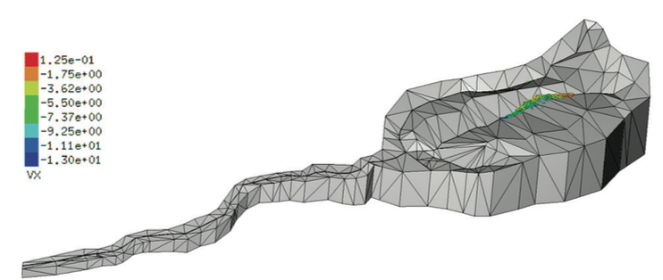
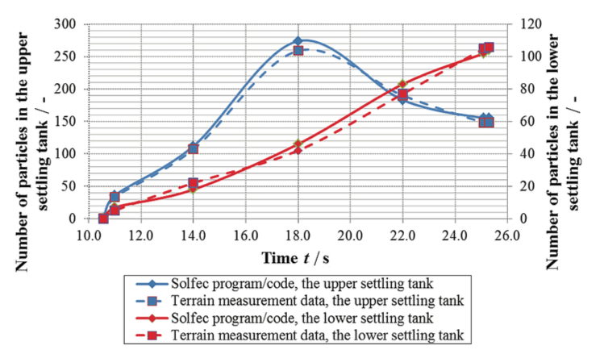

.. _solfec-applications-suspended_sedminent_propagation:

.. |br| raw:: html

   

Suspended sediment propagation
==============================

Solfec was utilised by Žic et al. [1]_ in the context of suspended sediment propagation.
The abstract and figures below quote directly from reference [1]_.

.. [1] Žic, E., Bićanić, N., Koziara, T., and Ožanić, N. (2014) The numerical modelling of suspended sediment propagation in
  small torrents with the application of the Contact Dynamics method. Technical Gazette, 21(5), pp. 939-952.
  `Journal link <http://hrcak.srce.hr/index.php?show=clanak&id_clanak_jezik=190604>`_.

**Abstract** |br|
This paper describes the SOLFEC computational code used to simulate multi--body systems with constraints.
The code implements an instance of the Contact Dynamics (CD) method by Moreau and Jean, therefore the constraints
are handled implicitly. One of the main goals of the software is to provide a user-friendly platform for testing
formulations and solution methods for the (dynamical) frictional contact problem. This paper also describes a method
used to develop a computer code written in the Python programming language that is needed to produce a numerical model
of suspended sediment propagation. The paper also provides graphical representations of the Mud Flow simulation in the
hypothetical example inside of the Salt Creek stream erosional base in Croatia.

.. _suspended_sedminent_propagation-1:

.. figure:: suspended_sedminent_propagation-1.png
   :width: 70%
   :align: center

   Fig. a) Salt Creek stream (winter period), fig. b) erosion base of the Salt Creek stream (Photo: Elvis Žic) (cf. Figure 6 in [1]_)

.. _suspended_sedminent_propagation-2:

   
   Digital elevation model of the Salt Creek erosional base created in the SOLFEC program. (cf. Figure 9 in [1]_)

.. _suspended_sedminent_propagation-3:

   Graphical comparison of calculated (SOLFEC program) and measured (terrain measurements) values of the number of
   transient stone pebbles after a certain period of time. (cf. Figure 22 in [1]_)
