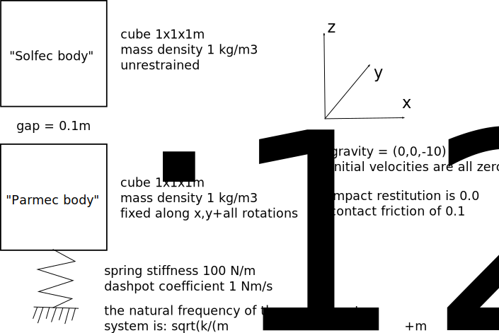

:orphan:

.. _solfec-examples-hybrid_modelling-hs0:

A two--body impact problem
==========================

This is a simplest application of the :ref:`HYBRID_SOLVER <hybrid-solver>`. The input files for this example are
located in the `solfec/examples/hybrid--solver0 <https://github.com/tkoziara/solfec/tree/master/examples/hybrid-solver0>`_ directory.
These are:

- `README <https://github.com/tkoziara/solfec/blob/master/examples/hybrid-solver0/README>`_ -- a text based specification of the problem

- `hs0--parmec.py <https://github.com/tkoziara/solfec/blob/master/examples/hybrid-solver0/hs0-parmec.py>`_ -- including the :ref:`Parmec <parmec-index>` input code

- `hs0--solfec--1.py <https://github.com/tkoziara/solfec/blob/master/examples/hybrid-solver0/hs0-solfec-1.py>`_ -- including the simpler version of the :ref:`Solfec <solfec-index>` input code

- `hs0--solfec--2.py <https://github.com/tkoziara/solfec/blob/master/examples/hybrid-solver0/hs0-solfec-2.py>`_ -- Solfec input file demonstrating a more elaborate usage of Parmec and Solfec features

The problem statement is provided in :numref:`hs0-fig1`.

.. _hs0-fig1:

   Hybrid solver example 0 -- a two body impact problem

