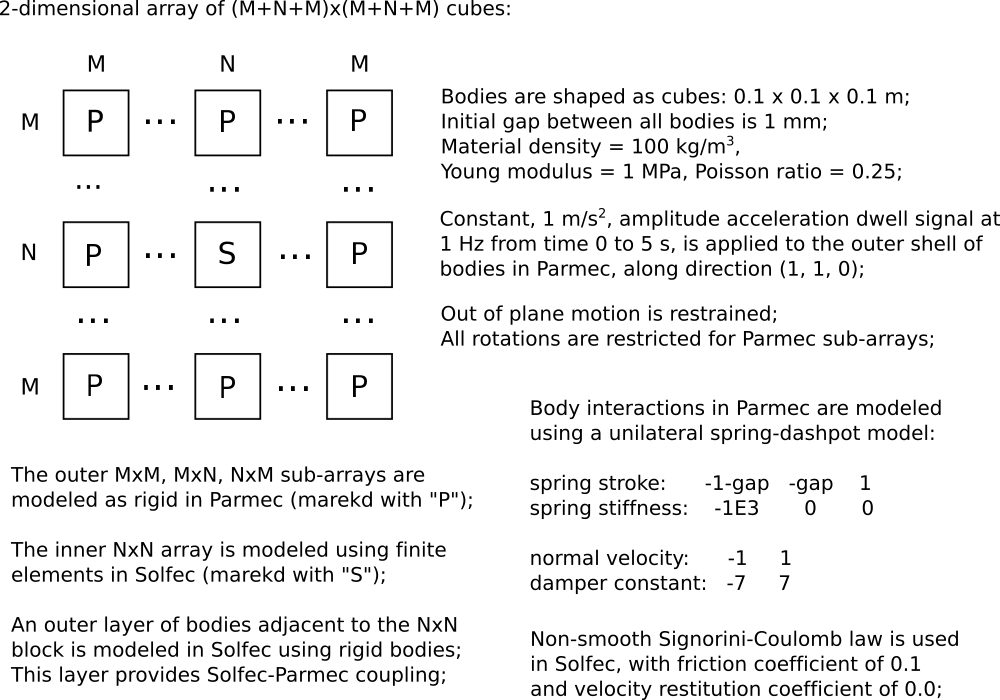
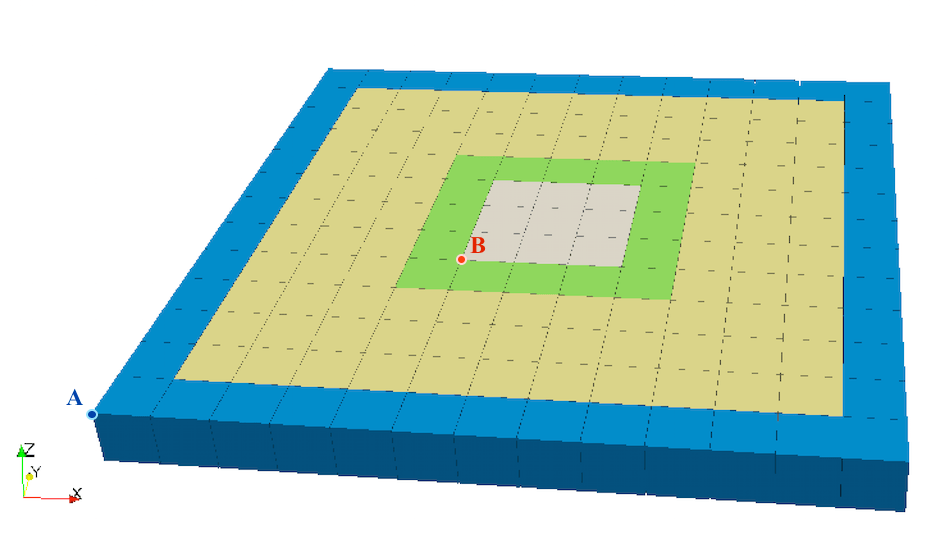

.. _solfec-examples-hybrid_modelling-hs123:

1,2,3--dimensional cube array acceleration dwell
================================================

This is a family of 1,2 and 3--dismenional examples demonstrating applications of the :ref:`HYBRID_SOLVER <hybrid-solver>` on
an array of cubes subject to a constant amplitude and frequency acceleration since dwell signal. The input files for these examples
are located in:

- `solfec/examples/hybrid--solver1 <https://github.com/tkoziara/solfec/tree/master/examples/hybrid-solver1>`_ for the 1--dimensional array.
- `solfec/examples/hybrid--solver2 <https://github.com/tkoziara/solfec/tree/master/examples/hybrid-solver2>`_ for the 2--dimensional array.
- `solfec/examples/hybrid--solver3 <https://github.com/tkoziara/solfec/tree/master/examples/hybrid-solver3>`_ for the 3--dimensional array.

We focus on the 2--dimensional example, leaving the 1-- and 3--dimensional cases for self--study. The
`solfec/examples/hybrid--solver2 <https://github.com/tkoziara/solfec/tree/master/examples/hybrid-solver2>`_ directory contains:

- `README <https://github.com/tkoziara/solfec/blob/master/examples/hybrid-solver2/README>`_ -- a text based specification of the problem

- `hs2--parmec.py <https://github.com/tkoziara/solfec/blob/master/examples/hybrid-solver2/hs2-parmec.py>`_ -- including the :ref:`Parmec <parmec-index>` input code

- `hs2--solfec.py <https://github.com/tkoziara/solfec/blob/master/examples/hybrid-solver2/hs2-solfec.py>`_ -- including the :ref:`Solfec <solfec-index>` input code

- `hs2--state--1.pvsm <https://github.com/tkoziara/solfec/blob/master/examples/hybrid-solver2/hs2-state-1.pvsm>`_ -- `ParaView <http://www.paraview.org>`_ state file for post--processing

- `hs2--state--2.pvsm <https://github.com/tkoziara/solfec/blob/master/examples/hybrid-solver2/hs2-state-2.pvsm>`_ -- another `ParaView <http://www.paraview.org>`_ state file

.. _hybrid-solver2: https://github.com/tkoziara/solfec/tree/master/examples/hybrid-solver2

:numref:`hs2-fig1` states the problem and describes the hybrid model. 

.. _hs2-fig1:

   Example hybrid-solver2_: a 2--dimensional cube array acceleration dwell hybrid model

An actual array geometry is depicted in :numref:`hs2-fig2`, where the color coding is as follows:

- blue -- the outer Parmec bodies where acceleration sweep signal is applied
- yellow -- the inner Parmec bodies interacting via spring--dashpot elements
- green -- the boundary Parmec--Solfec bodies, modelled in both codes
- grey -- the inner Solfec bodies, interacting via a non--smooth contact law

.. _hs2-fig2:

   Example hybrid-solver2_: the array initial geometry.

:numref:`hs2-lst1` includes the Parmec file `hs2--parmec.py <https://github.com/tkoziara/solfec/blob/master/examples/hybrid-solver2/hs2-parmec.py>`_.

.. literalinclude:: ../../../../solfec/examples/hybrid-solver2/hs2-parmec.py
   :linenos:
   :caption: Listing of hs2--parmec.py
   :name: hs2-lst1
