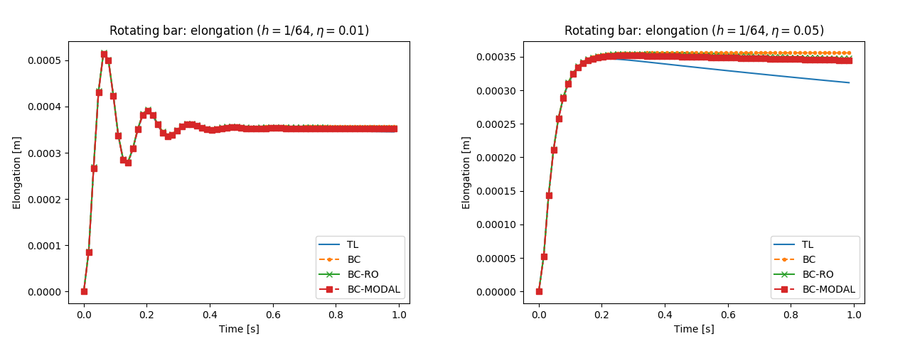
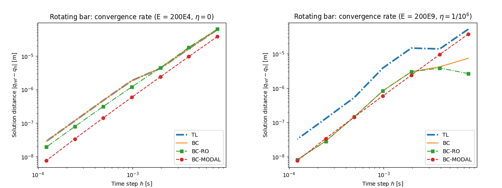

.. _solfec-examples-reduced_order-ro0:

Rotating bar
============

.. warning:: Under construction

This is a simplest application of the reduced order modeling functionality. This example is also included in :ref:`TR1 <tr1>`. The input files for
this example are located in the `solfec/examples/reduced--order0 <https://github.com/tkoziara/solfec/tree/master/examples/reduced-order0>`_ directory.
These are:

- `README <https://github.com/tkoziara/solfec/blob/master/examples/reduced-order0/README>`_ -- a text based specification of the problem

- `ro0--convtest.py <https://github.com/tkoziara/solfec/blob/master/examples/reduced-order0/ro0-convtest.py>`_ -- convergence test runs and plotting

- `ro0--elong.py <https://github.com/tkoziara/solfec/blob/master/examples/reduced-order0/ro0-elong.py>`_ -- elongation test runs and time history plotting

- `ro0--energy.py <https://github.com/tkoziara/solfec/blob/master/examples/reduced-order0/ro0-energy.py>`_ -- energy balance test runs and time history plotting

- `ro0--gen--bases.py <https://github.com/tkoziara/solfec/blob/master/examples/reduced-order0/ro0-gen-bases.py>`_ -- calculation of a reduced
  `POD <https://en.wikipedia.org/wiki/Principal_component_analysis>`_ base

- `ro0--lib.py <https://github.com/tkoziara/solfec/blob/master/examples/reduced-order0/ro0-lib.py>`_ -- library functions used by other input files

- `ro0--run--all.py <https://github.com/tkoziara/solfec/blob/master/examples/reduced-order0/ro0-run-all.py>`_ -- input file that runs all tests and generates all plots

- `ro0--view.py <https://github.com/tkoziara/solfec/blob/master/examples/reduced-order0/ro0-view.py>`_ -- input file suitable for use with Solfec :ref:`viewer <solfec-running>`

.. _reduced-order0: https://github.com/tkoziara/solfec/tree/master/examples/reduced-order0

.. _ro0-fig1:

.. figure:: ../../../trs/tr1/ro0_mesh.png
   :width: 20%
   :align: center

   Example reduced-order0_: geometry of the :math:`2\times2\times20` mesh.

A prismatic bar with :math:`x,y,z` dimensions :math:`0.1\times0.1\times1\mbox{ m}` and material parameters
:math:`E\in\left\{ 200\mbox{E4 Pa},200\mbox{E9 Pa}\right\}`, :math:`\nu=0.26,\rho=7.8\mbox{E3 kg /}\mbox{m}^{3}`
is rotating about the :math:`x`--axis with an initial angular velocity of :math:`1\mbox{ rad/s}`. We use the
smaller Young's modulus in most demonstrations since in this case the time scales of the rigid and deformable
motions are not far apart. For :math:`E=200\mbox{E9 Pa}` the material parameters correspond to steel. In this
case the time scale of elastic deformations is much faster then that of the rigid rotation. We use this material
to test performance of the proposed integrators when applied with large time steps. In what follows, unless stated
otherwise, the value :math:`E=200\mbox{E4}` is used by default.

.. [1] An animation of the reduced-order0_ rotating bar example.

.. youtube:: https://www.youtube.com/watch?v=c136dWHwWNU
  :width: 648
  :height: 364

The bar is discretized with :math:`2\times2\times20` fully integrated trilinear hexahedral elements, :numref:`ro0-fig1`
and animation [1]_. This results in 576 degrees of freedom for the full order model. For the reduced order
BC--RO approach we used 100 co--rotated displacement samples from the Total Lagrangian solution (with rigid rotation
factored out) and 6 rigid motion modes (generated algebraically) as input for the `Python modred package <http://pythonhosted.org/modred>`_
and calculated 11 Proper Orthogonal Decomposition modes. In the current example, we also include the BC--MODAL approach,
for which the 6 rigid modes where combined with deformable modes 14, 19, 26, 34, 39 (of the initial linearized system), picked by hand
as visually corresponding to the predominantly longitudinal deformation of the bar. Hence, the BC--MODAL case also had 11 degrees of freedom. 

.. runpy::

  import os, sys
  sys.path.insert(0, os.getcwd()+'/libpy')
  from images import merge_images
  merge_images ('trs/tr1/ro0_elongation_h64_d0.png',
                'trs/tr1/ro0_elongation_h256_d0.png',
		'solfec/examples/reduced_order/ro0_elongation_d0.png')
  merge_images ('trs/tr1/ro0_elongation_h64_d0.01.png',
                'trs/tr1/ro0_elongation_h64_d0.05.png',
		'solfec/examples/reduced_order/ro0_elongation_d0.05.png')
  merge_images ('trs/tr1/ro0_energy_h64_d0_100s.png',
                'trs/tr1/ro0_energy_h256_d0_100s.png',
		'solfec/examples/reduced_order/ro0_energy_d0_100s.png')
  merge_images ('trs/tr1/ro0_convtest_undamped_E200E4.png',
                'trs/tr1/ro0_convtest_damped_E200E9.png',
		'solfec/examples/reduced_order/ro0_convtest.png')

.. _ro0-fig2:

.. figure:: ro0_elongation_d0.png
   :width: 100%
   :align: center

   Example reduced-order0_: time history of the elongation for :math:`h\in\left\{ 1/64\mbox{s},1/256\mbox{s}\right\}` and :math:`1\mbox{s}` runs.

.. _ro0-fig3:

   Example reduced-order0_: time history of the elongation for :math:`h=1/64\mbox{s}, \eta\in\left\{ 0.01,0.05\right\}` and :math:`1\mbox{s}` runs.

We first compare the solutions for damped and undamped cases. :numref:`ro0-fig2` illustrates the time history of the elongation
of the bar, measured between the top and bottom center nodes, for undamped :math:`1\mbox{s}` runs with time steps 
:math:`h\in\left\{ 1/64\mbox{s},1/256\mbox{s}\right\}`. It can be seen that the results compare well between the formulations
proposed here and the Total Lagrangian approach integrated in an analogous manner. A damped case is illustrated in :numref:`ro0-fig3`
for the large time step of :math:`h=1/64\mbox{s}`. Also in this case the agreement is good. The Total Lagrangian based solution
deviates from the co--rotational solution since for the TL the stiffness matrix magnitude changes with configuration, which affects
the stiffness proportional damping. We can conclude the 5 deformable modes used by the BC--RO and BC--MODAL approaches represent
well the longitudinal oscillation accompanying the rotational motion of the bar.

.. _ro0-fig4:

   Example reduced-order0_: time history of total energy for :math:`h\in\left\{ 1/64\mbox{s},1/256\mbox{s}\right\}`  and :math:`100\mbox{s}` runs.

:numref:`ro0-fig4` illustrates the time history of the total energy of the bar for 100s runs with time steps
:math:`h\in\left\{ 1/64\mbox{s},1/256\mbox{s}\right\}`. For all but the BC--RO approach, the small oscillation of energy remains
bounded with time. The full space co--rotational BC approach is better behaved than BC--MODAL: in nearly coincides with the
Total Lagrangian approach. The relatively small oscillation of energy, present in TL, BC, and BC--MODAL cases, is characteristic
for the adopted time stepping and it has been also demonstrated [2]_ on simpler model problems. The larger oscillation and dissipation
of energy, clear in case of the BC--RO approach, remains a shortcoming and it may be addressed in future revisions of :ref:`TR1 <tr1>`.

.. _ro0-fig5:

   Example reduced-order0_: second order convergence of displacements for soft undamped (:math:`E=200\mbox{E4, }\eta=0`) and
   stiff damped (:math:`E=200\mbox{E9, }\eta=1/10^{6}`) materials.

The second order convergence rate is illustrated in :numref:`ro0-fig5`. Two cases are considered: undamped motion
of a soft bar :math:`E=200\mbox{E4}` and damped motion of stiff bar :math:`E=200\mbox{E9}`. In both cases the
reference solution :math:`q_{ref}` was obtained at time :math:`t=1/2^{4}\mbox{s}` with time step :math:`h=1/2^{16}\mbox{s}`.
For the softer material the time scales of the rigid and deformable motion are not far apart and hence it is easier
to observe the second order convergence for larger time steps. For the stiffer model we used damping :math:`\eta=1/10^{6}`
in order to damp out the high frequency oscillations that could not be well represented for the large time steps used here.

.. [2] `ANM, 25(2--3): 297--302, 1997. <http://www.sciencedirect.com/science/article/pii/S0168927497000664>`_
