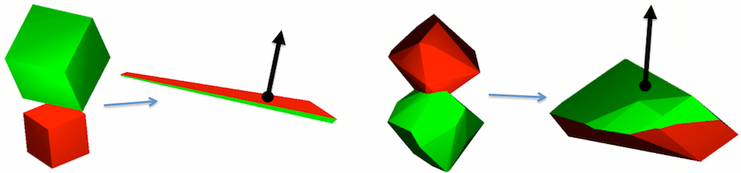

.. _solfec-theory-conpnt:

Contact points
==============

In Solfec contact points are generated from volumetric intersections of convex primitive shapes.
For example, in case of finite elements, a single contact point is generated as a result of an
intersection of two elements. Once an intersection is calculated, a contact point is obtained as
a centroid of the intersection surface; a contact normal is calculated by averaging normal directions
of the constituent surfaces. This is illustrated in Figure :numref:`conpnt`.

.. _conpnt:

   Contact points and normals obtained from volumetric intersections of convex primitives.

Calculating volumetric intersection
-----------------------------------

Intersection of two convex polyhedra is a convex polyhedron. The convex intersection algorithm,
based on [1]_, is implemented in cvi.c and it can be summarized as follows. Let vectors

.. math::

  \mathbf{v}=\left[\begin{array}{c}
  \mathbf{v}_{1}\\
  ...\\
  \mathbf{v}_{n}
  \end{array}\right],\,\,\,\mathbf{p}=\left[\begin{array}{c}
  \mathbf{p}_{1}\\
  ...\\
  \mathbf{p}_{m}
  \end{array}\right]
  
store vertices and face planes of a polyhedron. Vertices are made of triplets of coordinates

.. math::

  \mathbf{v}_{i}=\left[\begin{array}{c}
  v_{x}\\
  v_{y}\\
  v_{z}
  \end{array}\right]_{i}
  
Planes are made of four components

.. math::

  \mathbf{p}_{i}=\left[\begin{array}{c}
  n_{x}\\
  n_{y}\\
  n_{z}\\
  d
  \end{array}\right]_{i}
  
The plane equation reads

.. math::

  n_{x}\cdot x+n_{y}\cdot y+n_{z}\cdot z+d=0
  
where :math:`\left[n_{x},n_{y},n_{z}\right]^{T}` can be interpreted as a direction normal to the plane. The convex intersection takes as input

.. code-block:: none

  va - vertices of polyhedron 'a'
  pa - face planes of polyhedron 'a'
  vb, pb - vertices and planes of polyhedron 'b'

as seen in `cvi.c:118 <https://github.com/tkoziara/solfec/blob/master/cvi.c#L118>`_.
The algorithm begins by finding a distance between, and a pair closest points in 'a' and 'b'

.. code-block:: none

  1  d,p,q = gjk(va, vb)
  2  if d > 0 return NULL
  3  else x = p

which maps to `cvi.c:132 <https://github.com/tkoziara/solfec/blob/master/cvi.c#L132>`_.
The GJK algorithm [3]_, implemented in `gjk.c:342 <https://github.com/tkoziara/solfec/blob/master/gjk.c#L342>`_, is used.
In case there is a positive separating distance between the input polyhedrons, null intersection is returned.
For the intersection algorithm to work we need a point :math:`\mathbf{x}`, that is inside of both input polyhedrons.
GJK will at best return a common point on the surfaces of both polyhedra. In the next step

.. code-block:: none

  4  x = refine_point(x)

point :math:`\mathbf{x}` is refined by pushing it deeper inside of polyhedrons 'a' and 'b'.
This maps to `cvi.c:136 <https://github.com/tkoziara/solfec/blob/master/cvi.c#L136>`_.
Once :math:`\mathbf{x}` has been refined, we transform the input plane definitions

.. code-block:: none

  5  transform(pa)
  6  transform(pb)

so that :math:`\mathbf{x}` acts as an origin of the coordinate system :math:`\left[0,0,0\right]^{T}`.
In the course of this transformation we also scale the normal direction components so that :math:`d_{i}=-1`.
This maps to `cvi.c:143-159 <https://github.com/tkoziara/solfec/blob/master/cvi.c#L143L159>`_.
In the next step

.. code-block:: none

  7  h = quickhull(normals(pa+pb))

we calculate the convex hull of the transformed normal directions of 'a' and 'b'
(`cvi.c:163 <https://github.com/tkoziara/solfec/blob/master/cvi.c#L163>`_).
The quickhull algorithm [2]_, implemented in `hul.c:555 <https://github.com/tkoziara/solfec/blob/master/hul.c#L555>`_,
is used. The result can be interpreted as a *dual polyhedron* of the intersection polyhedron of 'a' and 'b':
for a convex polyhedron :math:`\left(\mathbf{v},\mathbf{p}\right)`, its dual (or *polar*) polyhedron is made
by reinterpreting vertices as planes, and planes as vertices, as follows

.. math::

  \left[\begin{array}{c}
  v_{x}\\
  v_{y}\\
  v_{z}
  \end{array}\right]_{i}\rightarrow\left[\begin{array}{c}
  v_{x}\\
  v_{y}\\
  v_{z}\\
  -1
  \end{array}\right]_{i},\,\,\,l_{v}=\sqrt{v_{x}^{2}+v_{y}^{2}+v_{z}^{2}}

.. math::

  \left[\begin{array}{c}
  n_{x}\\
  n_{y}\\
  n_{z}\\
  -1
  \end{array}\right]_{i}\rightarrow\left[\begin{array}{c}
  n_{x}\\
  n_{y}\\
  n_{z}
  \end{array}\right]_{i},\,\,\,l_{n}=\sqrt{n_{x}^{2}+n_{y}^{2}+n_{z}^{2}}
  
where vertices at distance :math:`l_{v}` from the origin become planes at distance :math:`1/l_{v}` from the origin,
while planes at distance :math:`1/l_{n}` from the origin become vertices at distance :math:`l_{n}`. In order to obtain
vertices of the intersection polyhedron we then calculate the polar set

.. code-block:: none

  8  v = polarize(h)

which maps to `cvi.c:164 <https://github.com/tkoziara/solfec/blob/master/cvi.c#L164>`_ and is implemented in
`tri.c:351 <https://github.com/tkoziara/solfec/blob/master/tri.c#L351>`_. The vertices :math:`\mathbf{v}` of
the dual intersection polyhedron are translated back, :math:`\mathbf{v}+\mathbf{x}`, into the input coordinate
system, and triangulated

.. code-block:: none

  9  t = triangulate(v+x)

which maps to `cvi.c:170-220 <https://github.com/tkoziara/solfec/blob/master/cvi.c#L170L220>`_. The triangulation is then returned

.. code-block:: none

  10 return t

at `cvi.c:231 <https://github.com/tkoziara/solfec/blob/master/cvi.c#L231>`_.

Deriving contact points and normals
-----------------------------------

Contact sparsification
----------------------

Broad phase contact detection
-----------------------------

Other implementation aspects
----------------------------

.. [1] D. E. Muller and F. P. Preparata, Finding the intersection of two convex polyhedra,
       Theoretical Computer Science, 7, 217-236, 1978.
.. [2] C. B. Barber, D. P. Dobkin, and H. Huhdanpaa, The Quickhull Algorithm for Convex Hulls,
       ACM Transactions on Mathematical Software, 22 (4), 469-483, 1996.
.. [3] E. G. Gilbert, and D. W. Johnson, and S. S. Keerthi, Fast procedure for computing the distance between complex 
       bjects in three-dimensional space, IEEE journal of robotics and automation, 4 (2), 193-203, 1988.
