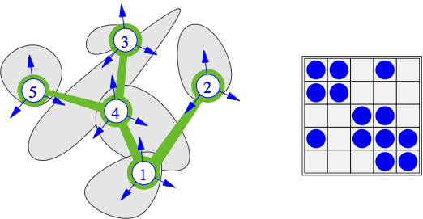

.. _solfec-theory-locdyn:

Local dynamics
==============

Let us start by restating the constrained time stepping
scheme from the :ref:`previous section <timestepping1>`

.. math::
  :label: q1

  \mathbf{q}^{t+\frac{h}{2}}=\mathbf{q}^{t}+\frac{h}{2}\mathbf{u}^{t}

.. math::
  :label: u2

  \mathbf{u}^{t+h}=\mathbf{u}^{t}+\mathbf{A}^{-1}h\mathbf{f}\left(\mathbf{q}^{t+\frac{h}{2}},\mathbf{u}^{t}\right)+
  \mathbf{A}^{-1}h\mathbf{H}^{T}\left(\mathbf{q}^{t+\frac{h}{2}}\right)\mathbf{R}

.. math::
  :label: UHu2

  \mathbf{U}=\mathbf{H}\left(\mathbf{q}^{t+\frac{h}{2}}\right)\mathbf{u}

.. math::
  :label: CUR2

  \mathbf{C}\left(\mathbf{U},\mathbf{R}\right)=\mathbf{0}

.. math::
  :label: q2

  \mathbf{q}^{t+h}=\mathbf{q}^{t+\frac{h}{2}}+\frac{h}{2}\mathbf{u}^{t+h}

We said, that the equations :eq:`u2`, :eq:`UHu2`, :eq:`CUR2`
are solved together, implicitly. In practice, since a solution process
may take many iterations, it is often efficient to produce an
assembled form of the relationship between :math:`\mathbf{U}` and :math:`\mathbf{R}`,
and use it together with :math:`\mathbf{C}\left(\mathbf{U},\mathbf{R}\right)`,
to find reaction forces :math:`\mathbf{R}`. By substituting :eq:`u2`
into :eq:`UHu2` we obtain

.. math::

  \mathbf{U}=\mathbf{H}\left(\mathbf{u}^{t}+\mathbf{A}^{-1}h\mathbf{f}\right)+\mathbf{H}\mathbf{A}^{-1}h\mathbf{H}^{T}\mathbf{R}

and rewrite it as

.. math::
  :label: UBWR

  \mathbf{U}=\mathbf{B}+\mathbf{W}\mathbf{R}

where

.. math::
  :label: B0

  \mathbf{B}=\mathbf{H}\left(\mathbf{u}^{t}+\mathbf{A}^{-1}h\mathbf{f}\right)

.. math::
  :label: W0

  \mathbf{W}=h\mathbf{H}\mathbf{A}^{-1}\mathbf{H}^{T}\label{eq:W0}

Relation :eq:`UBWR` can be called *local dynamics*, since
it relates point forces and (relative) point velocities. :math:`\mathbf{B}`
can be called local free velocity, since it is a relative local velocity
of constraints when no reaction forces are applied. :math:`\mathbf{W}`
can be called a generalized inverse inertia matrix.

.. _detailed_notation:

Detailed multi--body notation
-----------------------------

So far we have presented formulas at certain level of generality.
Let us now present detailed multi--body formulas. Let :math:`\left\{ \mathcal{B}_{i}\right\}`
be a set of bodies and :math:`\left\{ \mathcal{C}_{\alpha}\right\}` be
a set of local frames. To each local frame :math:`\mathcal{C}_{\alpha}`
there corresponds a pair of bodies :math:`\mathcal{B}_{i}` and :math:`\mathcal{B}_{j}`.
Let :math:`\mathcal{B}_{j}` be the body, to which the local frame is attached.
:math:`\mathcal{B}_{j}` will be called the *master* in :math:`\mathcal{C}_{\alpha}`
and denoted by :math:`\mathcal{M}_{\alpha}`. Consequently, :math:`\mathcal{B}_{i}`
will be called the *slave* in :math:`\mathcal{C}_{\alpha}` and denoted
by :math:`\mathcal{S}_{\alpha}`. Of course, the choice is arbitrary. Considering
evolution of a multi--body system over an interval :math:`\left[t,t+h\right]`,
an analogue of equation :eq:`UBWR` can be written down for each of the local frames

.. math::
  :label: dynloc

  \mathbf{U_{\alpha}}=\mathbf{B_{\alpha}}+\sum_{\beta}\mathbf{W}_{\alpha\beta}\mathbf{R}_{\beta}

where

.. math::
  :label: U

  \mathbf{U}_{\alpha}=\mathbf{H}_{i\alpha}\mathbf{u}_{i}^{t+h}-\mathbf{H}_{j\alpha}\mathbf{u}_{j}^{t+h}

.. math::
  :label: Bal

  \mathbf{B}_{\alpha}=\mathbf{H}_{i\alpha}\left(\mathbf{u}_{i}^{t}+\mathbf{A}_{i}^{-1}h\mathbf{f}_{i}\right)-
  \mathbf{H}_{j\alpha}\left(\mathbf{u}_{j}^{t}+\mathbf{A}_{j}^{-1}h\mathbf{f}_{j}\right)

.. math::
  :label: Walbe

  \left.\mathbf{W}_{\alpha\beta}\right|_{\alpha\ne\beta}=s_{\alpha\beta}h\mathbf{H}_{k_{\beta}\alpha}\mathbf{A}_{k_{\beta}}^{-1}\mathbf{H}_{k_{\beta}\beta}^{T}

.. math::
  :label: Walal

  \mathbf{W}_{\alpha\alpha}=h\mathbf{H}_{i\alpha}\mathbf{A}_{i}^{-1}\mathbf{H}_{i\alpha}^{T}+h\mathbf{H}_{j\alpha}\mathbf{A}_{j}^{-1}\mathbf{H}_{j\alpha}^{T}

.. math::
  k_{\beta}=\left\{ \begin{array}{cc}
  i & \textrm{if }\mathcal{B}_{i}\in\mathcal{C}_{\beta}\\
  j & \textrm{if }\mathcal{B}_{j}\in\mathbf{\mathcal{C}_{\beta}}
  \end{array}\right.

.. math::
  :label: sdef

  s_{\alpha\beta}=\left\{ \begin{array}{rl}
  -1 & \textrm{if }\mathcal{B}_{k_{\beta}}\textrm{ is }\left(\mathcal{M}_{\alpha}\wedge\mathcal{S}_{\beta}\right)\vee\left(\mathcal{S}_{\alpha}\wedge\mathcal{M}_{\beta}\right)\\
  1 & \textrm{otherwise}
  \end{array}\right.

The above formulae can be conveniently applied in a computer implementation.
They stem from the following, juxtaposed algebra of multi--body dynamics.
Let :math:`\mathbf{q}`, :math:`\mathbf{u}`, :math:`\mathbf{f}`, :math:`\mathbf{A}`
gather the suitable vectors and matrices as

.. math::
  :label: qufM

  \mathbf{q}=\left[\begin{array}{c}
  \mathbf{q}_{1}\\
  \mathbf{q}_{2}\\
  ...\\
  \mathbf{q}_{n}
  \end{array}\right],\mathbf{u}=\left[\begin{array}{c}
  \mathbf{u}_{1}\\
  \mathbf{u}_{2}\\
  ...\\
  \mathbf{u}_{n}
  \end{array}\right],\mathbf{f}=\left[\begin{array}{c}
  \mathbf{f}_{1}\\
  \mathbf{f}_{2}\\
  ...\\
  \mathbf{f}_{n}
  \end{array}\right],\mathbf{A}=\left[\begin{array}{cccc}
  \mathbf{A}_{1}\\
   & \mathbf{A}_{2}\\
    &  & ...\\
     &  &  & \mathbf{A}_{n}
     \end{array}\right]

To each local frame :math:`\mathcal{C}_{\alpha}`, there corresponds a block--row
of the global :math:`\mathbf{H}` operator

.. math::
  :label: Hglob

  \mathbf{H}=\left[\begin{array}{ccccccc}
  ... & -\mathbf{H}_{j1} & ... & \mathbf{H}_{i1} & ...\\
  ... & ... & ... & ... & ... & ... & ...\\
  & ... & \mathbf{H}_{i\alpha} & ... & -\mathbf{H}_{j\alpha} & ...\\
  ... & ... & ... & ... & ... & ... & ...\\
   &  & ... & \mathbf{H}_{im} & ... & -\mathbf{H}_{jm} & ...
   \end{array}\right]

where

.. math::
  
  \mathbf{H}_{k\alpha}=\mathbf{H}\left(\left\{ \mathbf{a}^{i}\right\} \in\mathcal{C}_{\alpha},\mathbf{X}\in\mathcal{B}_{k}\right)

is evaluated according to one of the specific formulas :ref:`introduced in the section on constraints <solfec-theory-constraints>`.

.. _W_matrix:

The :math:`\mathbf{W}` matrix
-----------------------------

:math:`\mathbf{W}` maps local forces into local relative velocities.
Algebraically, it is represented by a sparse matrix, composed of dense
:math:`3\times3` blocks :math:`\mathbf{W}_{\alpha\beta}`. The sparsity pattern
of :math:`\textbf{ $\mathbf{W}$}` corresponds to the vertex connectivity in
the graph of local frames. Vertices of this graph are the local frames
:math:`\left\{ \mathcal{C}_{\alpha}\right\}`, while the edges comprise
a subset of all bodies :math:`\left\{ \mathcal{B}_{i}\right\}`, such that
:math:`\mathcal{B}_{i}\in\mathcal{C_{\alpha}}` and :math:`\mathcal{B}_{i}\in\mathcal{C}_{\beta}`
for :math:`\alpha\ne\beta`. This has been illustrated in :numref:`locgraph`.
Operator :math:`\mathbf{W}` derives from the formula

.. math::

  \mathbf{W}=\mathbf{H}\mathbf{A}^{-1}\mathbf{H}^{T}

where :math:`\mathbf{A}` is a :math:`n\times n` symmetric and positive definite
matrix, and :math:`\mathbf{H}` is an :math:`m\times n` transformation operator.
:math:`\mathbf{W}` is an :math:`m\times m` symmetric matrix. It is positive
definite, provided rows of :math:`\mathbf{H}` are linearly independent.
This is easiest to see from the flow of the actions in the above formula.
A local force :math:`\mathbf{R}` is first mapped by :math:`\mathbf{H}^{T}` into
a generalized force :math:`\mathbf{r}`. If rows of :math:`\mathbf{H}` are not
linearly independent, then there exist :math:`\mathbf{R}_{1}\ne\mathbf{R}_{2}`
such that :math:`\mathbf{H}^{T}\mathbf{R}_{1}=\mathbf{H}^{T}\mathbf{R}_{2}`
and hence :math:`\mathbf{W}` fails to be a bijection. This means, that
the null space of :math:`\mathbf{W}` is larger than :math:`\left\{ \mathbf{0}\right\}`,
so that :math:`\mathbf{W}` is not invertible in the usual sense. :math:`\mathbf{W}`
becomes singular whenever :math:`m>n`, which is trivially related to the
number of considered bodies relative to the number of constraints.
On the other hand, one can always introduce singularity of :math:`\mathbf{W}`
by using local frames between the same pair of bodies, in such a way
that their :math:`\mathbf{H}` operators are linearly dependent. This can
be related to deformability of kinematic models. For example, the
pseudo--rigid body has a linear distribution of the instantaneous velocity
over an arbitrary flat surface. Thus, the relative velocity between
two bodies over a flat surface is fully parametrized by three points.
A larger number of local frames results in the singularity of :math:`\mathbf{W}`.
So does their collinearity. In practice, :math:`\mathbf{W}` often becomes
numerically singular for many practically encountered configurations
of local frames. Indeterminacy of local forces :math:`\mathbf{R}` is then
an unavoidable consequence of either kinematic simplicity, or geometric
complexity, and as such it needs to be accepted in numerical practice.

.. _locgraph:

   A graph of local frames and the corresponding pattern of :math:`\mathbf{W}`.

Implementation
--------------

Local dynamics is implemented in files `ldy.h <https://github.com/tkoziara/solfec/blob/master/ldy.h>`_ 
and `ldy.c <https://github.com/tkoziara/solfec/blob/master/ldy.h>`_.

Off--diagonal blocks of :math:`\mathbf{W}_{\alpha\beta}` :eq:`Walal`,
diagonal block :math:`\mathbf{W}_{\alpha\alpha}` :eq:`Walal`,
and the entire :math:`\mathbf{U}=\mathbf{B}+\mathbf{W}\mathbf{R}` system :eq:`UBWR` are
declared in `ldy.h:39 <https://github.com/tkoziara/solfec/blob/master/ldy.h#L39>`_ as follows:

.. literalinclude:: ../../../solfec/ldy.h
   :lines: 39-41
   :lineno-start: 39
   :linenos:

Off--diagonal blocks of :math:`\mathbf{W}_{\alpha\beta}` :eq:`Walbe` are declared in
`ldy.h:44 <https://github.com/tkoziara/solfec/blob/master/ldy.h#L44>`_ as follows:

.. code-block:: c
  :lineno-start: 44
  :linenos:

  struct offb
  {
    double W [9];
    ...
    DIAB *dia;
    OFFB *n;
  };

.. stop ** in vim

Diagonal blocks of :math:`\mathbf{W}_{\alpha\alpha}` :eq:`Walal` and
free velocity :math:`\mathbf{B}_{\alpha}` :eq:`Bal` are declared in
`ldy.h:53 <https://github.com/tkoziara/solfec/blob/master/ldy.h#L53>`_ as follows:

.. code-block:: c
  :lineno-start: 53
  :linenos:

  struct diab
  {
    double *R, /* average reaction ... */

.. stop ** in vim

.. code-block:: c
  :lineno-start: 58
  :linenos:

           W [9], /* diagonal block of W */
	   ...
	   B [3], /* free velocity */

.. stop ** in vim

.. code-block:: c
  :lineno-start: 63
  :linenos:

    OFFB *adj;

    CON *con;  /* the underlying constraint ... */

.. stop ** in vim

.. code-block:: c
  :lineno-start: 71
  :linenos:

    DIAB *p, *n;

.. stop ** in vim

.. code-block:: c
  :lineno-start: 78
  :linenos:

  };

The local dynamics system is stored as a doubly linked list of diagonal blocs
further pointing to singly linked lists of off--diagonal blocks in
`ldy.h:81 <https://github.com/tkoziara/solfec/blob/master/ldy.h#L81>`_ as:

.. code-block:: c
  :lineno-start: 81
  :linenos:

  struct locdyn
  {

.. code-block:: c
  :lineno-start: 87
  :linenos:

  DIAB *dia; /* list of diagonal blocks */

.. stop ** in vim

.. code-block:: c
  :lineno-start: 90
  :linenos:

  };

.. |br| raw:: html

   

Symbolic insertion of rows into :math:`\mathbf{W}`, without assembling of the numeric block values,
is administered by `ldy.c:LOCDYN_Insert <https://github.com/tkoziara/solfec/blob/master/ldy.c#L485>`_. |br|
Similarly, deletion of rows from :math:`\mathbf{W}` is administered by
`ldy.c:LOCDYN_Remove <https://github.com/tkoziara/solfec/blob/master/ldy.c#L564>`_. |br|
Assembling of :math:`\mathbf{W}` and :math:`\mathbf{B}` is invoked by `ldy.c:LOCDYN_Update_Begin <https://github.com/tkoziara/solfec/blob/master/ldy.c#L619>`_.
