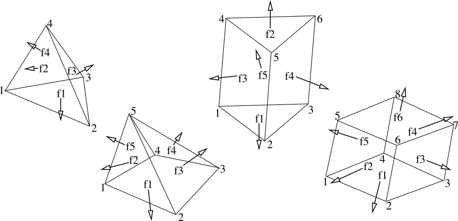

.. _solfec-user-geometry:

Geometry
========

Shapes of bodies can be defined by means of the routines defined below.
Note, that for rigid and pseudo-rigid body types, cf. :ref:`BODY <solfec-user-body>`,
a shape can comprise a list combining all possible geometry types.
For finite element type bodies, a single MESH object is used to define shape,
or a list of CONVEX objects can be used in combination with a background MESH.

CONVEX
------

An object of type CONVEX is either an arbitrary convex polyhedron, or it is a collection of such polyhedrons.

.. topic:: obj = CONVEX (vertices, faces, volid | convex)

  This routine creates a CONVEX object from a detailed input data.

  * obj -- created CONVEX object

  * vertices -- list of vertices: [x0, y0, z0, x1, y1, z1, ...]

  * faces -- list of faces: [n1, v1, v2, ..., vn1, s1, n2, v1, v2, ..., vn2, s2, ...],
    where n1 is the number of vertices of the first face, v1, v2, ...,
    vn1 enumerate the vertices in the CCW order when looking from the outside,
    and s1 is the surface identifier of the face. Similarly for the second face and so on.

  * volid -- volume identifier

  * convex (emptied) -- collection of CONVEX objects appending obj

Some parameters can also be accessed as members and methods of a CONVEX object, cf. :numref:`convex-params`.

.. _convex-params:

.. table:: CONVEX object parameters.

  +---------------------------------------------------------------------------------------------------------+
  | **Read only members and methods:**                                                                      |
  +---------------------------------------------------------------------------------------------------------+
  | **obj.nver** -- number of convex vertices                                                               |
  +---------------------------------------------------------------------------------------------------------+
  | **obj.vertex (n)** -- returns a (x, y, z) tuple storing coordinates of nth vertex                       |
  +---------------------------------------------------------------------------------------------------------+

HULL
----

This routine creates a CONVEX object as a convex hull of a point set.

.. topic:: obj = HULL (points, volid, surfid | convex)

  * obj -- created CONVEX object

  * points -- list of points: [x0, y0, z0, x1, y1, z1, ...]

  * volid -- volume identifier

  * surfid -- surface identifier common to all faces

  * convex (emptied) -- collection of CONVEX objects appending obj

MESH2CONVEX 
-----------

This routine converts a MESH object into a list of CONVEX objects.
It can be useful for containing one MESH defining a body shape inside of
another background mesh defining deformability
(see the background mesh parameters of the :ref:`BODY object <solfec-user-body>`).

.. topic:: obj = MESH2CONVEX (mesh)

  * obj -- created CONVEX object

  * mesh -- input mesh

.. _solfec-user-mesh:

MESH
----

An object of type MESH describes an arbitrary volumetric mesh, comprising tetrahedrons,
pyramids, wedges, and hexahedrons (:numref:`mesh-elems`). First order elements are currently supported.

.. _mesh-elems:

   Element types in Solfec.

.. topic:: obj = MESH (nodes, elements, surfids)

  This routine creates a MESH object from a detailed input data.

  * obj -- created MESH object

  * nodes -- list of nodes: [x0, y0, z0, x1, y1, z1, ...]

  * elements -- list of elements: [e1, n1, n2, ..., ne1, v1, e2, n1, n2, ..., ne2, v2, ...],
    where e1 is the number of nodes of the first element, n1, n2, ..., ne1 enumerate the element nodes,
    and v1 is the volume identifier of the element. Similarly for the second element and so on.

  * surfids -- list of surface identifiers: [gid, f1, n1, n2, ..., nf1, s1, f2, n1, n2, ..., nf2, s2, ...],
    where gid is the global surface identifier for all not specified faces, f1 is the number of nodes in
    the first specified face, n1, n2, ..., nf1 enumerate the face nodes, and s1 is the surface identifier
    of the face. Similarly for other specified faces. If only the gid is given, this can be done either
    as [gid] or as gid alone.

Some parameters can also be accessed as members and methods of a MESH object, cf. :numref:`mesh-params`.

.. _mesh-params:

.. table:: MESH object parameters.

  +---------------------------------------------------------------------------------------------------------+
  | **Read only members and methods:**                                                                      |
  +---------------------------------------------------------------------------------------------------------+
  | **obj.nnod** -- number of mesh nodes                                                                    |
  +---------------------------------------------------------------------------------------------------------+
  | **obj.get_data()** -- return a tuple (nodes, elements, surfids), in the same format as for MESH().      |
  | Note these are read-only - changing the returned lists does not affect the mesh.                        |
  +---------------------------------------------------------------------------------------------------------+
  | **Read-write members and methods:**                                                                     |
  +---------------------------------------------------------------------------------------------------------+
  | **obj.node (n | x, y, z)** -- returns a (x, y, z) tuple storing coordinates of nth node;                |
  | if x, y or z are given the current coordinates are overwritten                                          |
  +---------------------------------------------------------------------------------------------------------+
  | **obj.nodes_on_surface (surfid)** -- returns a list of node numbers belonging to the given surface;     |
  | *None* object is returned if the list is empty.                                                         |
  +---------------------------------------------------------------------------------------------------------+
  | **obj.set_volid(volid)** -- set all elements to have the given volume ID. Returns the volid set.        |
  | This is mostly useful for being able to distinguish bodies in the Viewer, using                         |
  | menu :math:`\to` kinds of :math:`\to` volumes. Note that materials are also assigned by volume id.      |
  +---------------------------------------------------------------------------------------------------------+

HEX
---

This routine creates a MESH object corresponding to a hexahedral shape (hexahedral elements are used).

.. topic:: obj = HEX (nodes, i, j, k, volid, surfids | dx, dy, dz)

  * obj -- created MESH object

  * nodes -- list of 8 nodes: [x0, y0, z0, x1, y1, z1, ..., x7, y7, z7].
    The hexahedral shape will be stretched between those nodes using a linear interpolation.

  * i, j, k -- numbers of subdivisions along the local x, y, z directions

  * volid -- volume identifier

  * surfids -- list of six surface identifiers: [s1, s2, ..., s6], corresponding to the faces of the hexahedral shape

  * dx, dy, dz -- lists of subdivision schemes along local x, y, z directions. By default a subdivision is uniform.
    When dx = [1, 1, 5, 5, 1, 1] is present, then this scheme will be normalised (actual numbers do not matter,
    but their ratios) and applied to the local x direction of the generated shape.

ROUGH_HEX 
---------

This routine creates a hexahedral MESH object corresponding to a given shape.
The resultant mesh properly contains the input shape and with its orientation (which is based on the inertia properties of the shape).

.. topic:: obj = ROUGH_HEX (shape, i, j, k | dx, dy, dz)

  * obj -- created MESH object

  * shape -- an input shape defined by a collection of CONVEX objects;
    a list of CONVEX objects (or their collections) [cvx1, cvx2, cvx3, ....] is as well accepted.

  * i, j, k -- numbers of subdivisions along the local x, y, z directions of the principal inertia axes

  * dx, dy, dz -- lists of subdivision schemes along local x, y, z directions. By default a subdivision is uniform.
    When dx = [1, 1, 5, 5, 1, 1] is present, then this scheme will be normalised (actual numbers do not matter,
    but their ratios) and applied to the local x direction of the generated shape.

PIPE
----

This routine creates a MESH object corresponding to a pipe (hexahedral elements are used).

.. topic:: obj = PIPE (pnt, dir, rin, thi, ndir, nrad, nthi, volid, surfids)

  * obj -- created MESH object

  * pnt -- base point tuple (x, y, z)

  * dir -- direction tuple (dx, dy, dz); length of the pipe equals to the length of the direction

  * rin -- inner radius

  * thi -- thickness

  * ndir, nrad, nthi -- number of subdivisions along the direction, radius and thickness

  * volid -- volume identifier

  * surfids -- list of four surface identifiers [s1, s2, s3, s4] corresponding to the faces of the pipe

TETRAHEDRALIZE
--------------

This routine creates a tetrahedral mesh. `Tetgen <http://wias-berlin.de/software/tetgen/>`_ is invoked internally.

.. topic:: obj = TETRAHEDRALIZE (shape, path | volume, quality, volid, surfid)

  * obj -- created MESH object

  * shape -- an input shape can be:

    * another MESH object

    * a path (e.g. 'path/to/file.stl') to an input `file supported by Tetgen <http://wias-berlin.de/software/tetgen/1.5/doc/manual/manual006.html>`_

  * path -- path to the output file that will store the mesh;
    when called again and this file is found the mesh will be red from the file rather than generated

  * volume -- maximum element volume (default: not enforced)

  * quality -- value > 1.0 indicating element quality (default: not enforced);
    values close to 1.0 result in better mesh quality (mesh generation may fail for small values)

  * volid -- volume identifier (default: 0); if only possible it is inherited from the input

  * surfid -- surface identifier (default: 0); if only possible it is inherited from the input

SPHERE
------

An object of type SPHERE represents a single sphere.

.. topic:: obj = SPHERE (center, radius, volid, surfid)

  This routine creates a SPHERE object.

  * obj -- created SPHERE object

  * center -- tuple (x, y, z) defining the center

  * radius -- sphere radius

  * volid -- volume identifier

  * surfid -- surface identifier

Some parameters can also be accessed as members of a SPHERE objec, cf. :numref:`sphere-params`.

.. _sphere-params:

.. table:: SPHERE object parameters.

  +---------------------------------------------------------------------------------------------------------+
  | **Read only members:**                                                                                  |
  +---------------------------------------------------------------------------------------------------------+
  | *obj.center, obj.radius*                                                                                |
  +---------------------------------------------------------------------------------------------------------+

ELLIP
-----

An object of type ELLIP represents a single ellipsoid.

.. topic:: obj = ELLIP (center, radii, volid, surfid)

  This routine creates an ELLIP object.

  * obj -- created ELLIP object

  * center -- tuple (x, y, z) defining the center

  * radii -- tuple (rx, ry, rz) of ellipsoid radii

  * volid -- volume identifier

  * surfid -- surface identifier

Some parameters can also be accessed as members of a ELLIP object, cf. :numref:`ellip-params`.

.. _ellip-params:

.. table:: ELLIP object parameters.

  +---------------------------------------------------------------------------------------------------------+
  | **Read only members:**                                                                                  |
  +---------------------------------------------------------------------------------------------------------+
  | *obj.center, obj.radii*                                                                                 |
  +---------------------------------------------------------------------------------------------------------+
  | **obj.rot** -- tuple :math:`\left(v_{1x},v_{1y},v_{1z},v_{2x},v_{2y},v_{2z},v_{3x},v_{3y},v_{3z}\right)`|
  | representing a rotation operator from the ellipsoid natural coordinaet (aligned with principal axes)    |
  | system to the global cooridinate system                                                                 |
  +---------------------------------------------------------------------------------------------------------+
