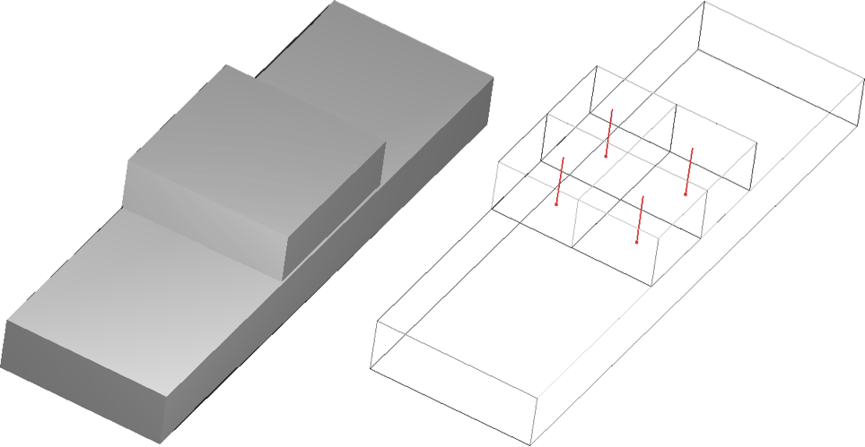
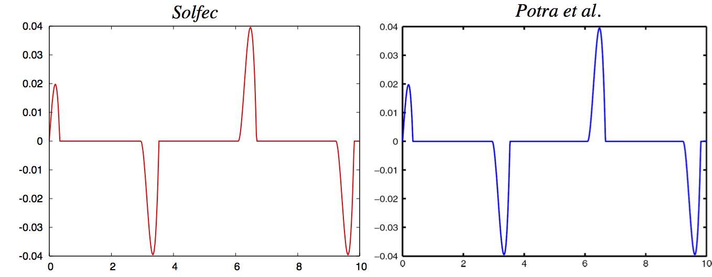
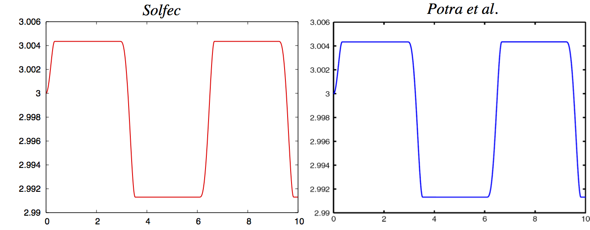

.. _solfec-validation-block_sliding:

Block sliding on a frictional table
===================================

.. |br| raw:: html

   

+---------------------------------------------------------------------------------------------------------------------------------+
| **Reference:** `Florian A. Potra, Mihai Anitescu, Bogdan Gavrea, Jeff Trinkle. A linearly implicit trapezoidal method for       |
| integrating stiff multibody dynamics with contact, joints, and friction. International Journal for Numerical Methods in         |
| Engineering, vol. 66, pp. 1079-1124, 2006. <http://onlinelibrary.wiley.com/doi/10.1002/nme.1582/abstract>`_                     |
| |br|                                                                                                                            |
| **Analysis:** Explicit dynamics, frictional stick-slip transition.                                                              |
| |br|                                                                                                                            |
| **Purpose:** Examine the accuracy of an analysis involving persistent contact and stick-slip transition.                        |
| |br|                                                                                                                            |
| **Summary:** A block subjected to a sinusoidal force slips over a frictional surface. Position and velocity plots are compared  |
| against those available in the source paper.                                                                                    |
+---------------------------------------------------------------------------------------------------------------------------------+

.. _block_sliding0:

   Block sliding on top of a frictional surface -- initial configuration with four contact points.

The block has been discretised into four hexahedral elements, thus four contact points result from the element to element contact
model implemented in Solfec. An equivalent three--dimensional model is used in Solfec as the reference [1]_ uses a two--dimensional set--up.
The external force acting on the mass centre of the cube reads

.. math::

  \mathbf{f}\left(t\right)=\left[8\cos\left(t\right),0,0\right]

Input parameters
----------------

+---------------------------------------------------+-------------------------------------------------+
| Block density :math:`\left(kg/m^{3}\right)`       | :math:`\rho=111.1(1)`                           |
+---------------------------------------------------+-------------------------------------------------+
| Block dimensions :math:`\left(m\right)`           | :math:`a\times b\times h=0.3\times0.3\times0.1` |
+---------------------------------------------------+-------------------------------------------------+
| Initial velocities :math:`\left(m/s\right)`       | all zero                                        |
+---------------------------------------------------+-------------------------------------------------+
| Gravity acceleration :math:`\left(m/s^{2}\right)` | :math:`\mathbf{g}=\left[0,0,-9.81\right]`       |
+---------------------------------------------------+-------------------------------------------------+
| Velocity restitution                              | :math:`\epsilon=0`                              |
+---------------------------------------------------+-------------------------------------------------+
| Coulomb friction coefficient                      | :math:`\mu=0.8`                                 |
+---------------------------------------------------+-------------------------------------------------+

Results
-------

Simulation over the time interval :math:`\left[0,10\right]` was performed with the time step :math:`h=0.001`.
As the reference [1]_ does not specify numerical values of the results, a visual comparison of the :math:`v_{x}`
velocity component and the :math:`x`-coordinate histories of the mass centre is provided in :numref:`block_sliding1`
and :numref:`block_sliding2`.

.. _block_sliding1:

   Comparison the :math:`v_{x}` velocity component plots of the block mass centre.

.. _block_sliding2:

   Comparison of the :math:`x`-coordinate plots of the block mass centre.

.. _block_sliding3:

.. figure:: block_sliding/block-sliding.gif
   :width: 50%
   :align: center

   Animation of the sliding block motion (reload page or click on image to restart).

.. [1] `Florian A. Potra, Mihai Anitescu Bogdan Gavrea Jeff Trinkle, "A linearly implicit trapezoidal method for integrating stiff
  multibody dynamics with contact, joints, and friction", International Journal for Numerical Methods in Engineering (2006), 1079--1124.
  <http://onlinelibrary.wiley.com/doi/10.1002/nme.1582/abstract>`_
