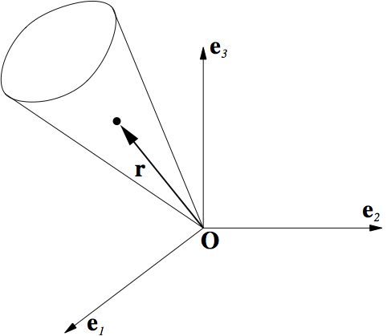
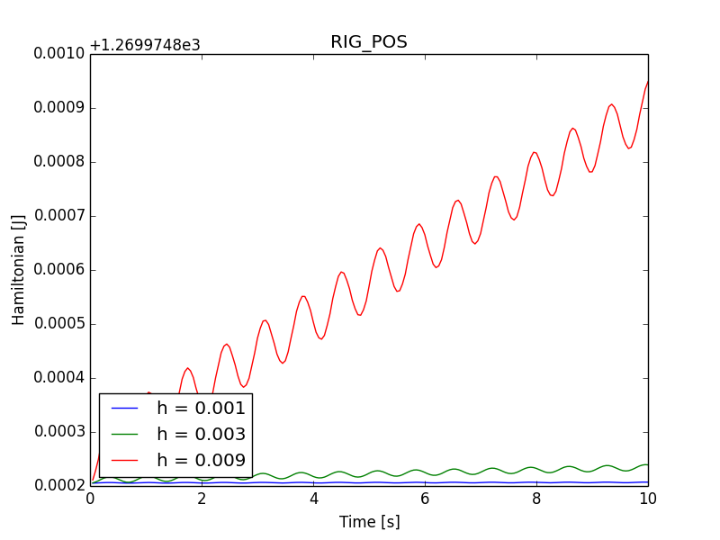
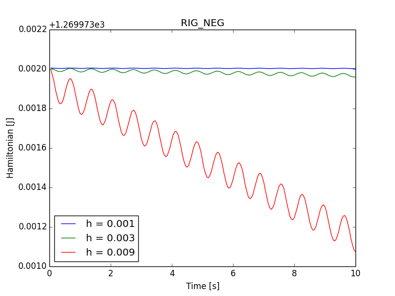
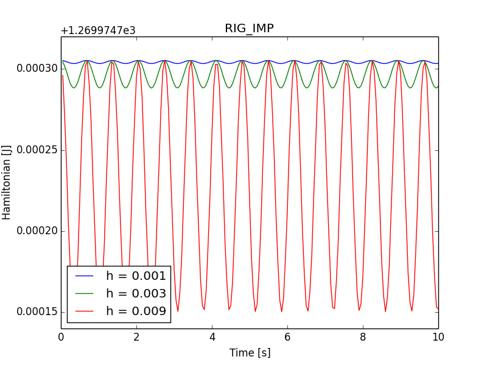

.. _solfec-validation-heavy_symmetrical_top:

Heavy symmetrical top
=====================

.. |br| raw:: html

   

+---------------------------------------------------------------------------------------------------------------------------------+
| **Reference:** `J. C. Simo, K.K. Wong, Unconditionally stable algorithms for rigid body dynamics that exactly preserve          |
| energy and momentum, International Journal for Numerical Methods in Engineering, vol. 31, pp. 19–52, 1991.                      |
| <http://onlinelibrary.wiley.com/doi/10.1002/nme.1620310103/abstract>`_                                                          |
| |br|                                                                                                                            |
| **Analysis:** Explicit dynamics, forced, unconstrained rotation.                                                                |
| |br|                                                                                                                            |
| **Purpose:** Examine stability and accuracy of the integration scheme in the presence of severe geometrical nonlinearity.       |
| |br|                                                                                                                            |
| **Summary:** The heavy symmetrical top is spinning around the fixed point \mathbf{O}. In this example the applied torque depends|
| on the configuration, introducing additional source of nonlinearity. As the torque does not depend on the time step, the second |
| order accuracy can be exemplified.                                                                                              |
+---------------------------------------------------------------------------------------------------------------------------------+

The top of mass :math:`M` and the referential axis of symmetry :math:`\mathbf{E}_{3}` rotates in the uniform gravitational
field :math:`-g\mathbf{e}_{3}`. The spatial torque reads

.. math::

  \mathbf{t}=-Mg\mathbf{r}\times\mathbf{e}_{3},\,\,\,\mathbf{r}=l\mathbf{\Lambda}\mathbf{E}_{3}=\mathbf{\Lambda}_{i3},\,\,\,i\in\left\{ 1,2,3\right\}

where the assumed values are :math:`M=20`, :math:`g=1`, :math:`l=1`. As pointed out in [1]_, the heavy top model conserves the Hamiltonian

.. math::

  H=\frac{1}{2}\pi\cdot\mathbf{j}^{-1}\pi+Mg\mathbf{e}_{3}\cdot\mathbf{r}
  
where :math:`\pi=\mathbf{j}\mathbf{w}` is the spatial angular momentum, :math:`\mathbf{j}=\mathbf{\Lambda}\mathbf{J}\Lambda^{T}` is the spatial tensor
of inertia, :math:`\mathbf{J}` is the referential inertia tensor, :math:`\Lambda` is the rotation operator, and :math:`\mathbf{w}=\Lambda\mathbf{W}` is
the spatial angular velocity.

   Heavy symmetrical top with one point fixed.

Input parameters
----------------

+-------------------------------+----------------------------------------------------------------------------------------------+
| Referential inertia tensor    | :math:`\mathbf{J}=\mbox{diag}\left[5,5,1\right]`                                             |
+-------------------------------+----------------------------------------------------------------------------------------------+
| Spatial torque                | :math:`\mathbf{t}=-20\Lambda\left(:,3\right)\times\left[0,0,1\right]`                        |
+-------------------------------+----------------------------------------------------------------------------------------------+
| Initial rotation              | :math:`\Lambda\left(0\right)=\exp\left[\mbox{skew}\left(\left[0.05,0,0\right]\right)\right]` |
+-------------------------------+----------------------------------------------------------------------------------------------+
| Initial angular velocity      | :math:`\mathbf{W}\left(0\right)=\left[0,0,50\right]`                                         |
+-------------------------------+----------------------------------------------------------------------------------------------+

Results
-------

Taking the fact that

.. math::

  \pi\cdot\mathbf{j}^{-1}\mathbf{\pi}=\left(\mathbf{j}\mathbf{w}\right)^{T}\mathbf{j}^{-1}\left(\mathbf{j}
  \mathbf{w}\right)=\mathbf{w}^{T}\mathbf{j}\mathbf{w}=\left(\Lambda\mathbf{W}\right)^{T}\Lambda\mathbf{J}
  \Lambda^{T}\mathbf{\Lambda}\mathbf{W}=\mathbf{W}^{T}\mathbf{J}\mathbf{W}
  
and 

.. math::

  \Lambda_{33}\left(0\right)\simeq0.99875

the value of the Hamiltonian reads

.. math::

  H=\frac{1}{2}50^{2}+20\Lambda_{33}\left(0\right)\simeq1269.975

:numref:`rig_pos`, :numref:`rig_neg` and :numref:`rig_imp` show the Hamiltonian plots over the time interval :math:`\left[0,10\right]`
for time steps :math:`h\in\left\{ 0.001,0.003,0.009\right\}`.  It is seen that for the largest step the decay of the Hamiltonian is
smaller than :math:`0.1\%`, while it should be noted that the corresponding amount of the rotation per time step is about :math:`26\deg`.
This amount of the relative rotation per time step is generally too large for the contact analysis. It is seen that for smaller steps
the conservation of the Hamiltonian rapidly improves and becomes nearly exact for :math:`h=0.001`, where the amount of the relative
rotation is about :math:`3\deg` per step.

.. _rig_pos:

   Hamiltonian plots for several time steps and the RIG_POS integration scheme.

.. _rig_neg:

   Hamiltonian plots for several time steps and the RIG_NEG integration scheme.

.. _rig_imp:

   Hamiltonian plots for several time steps and the RIG_IMP integration scheme.

.. [1] `P. Krysl, Explicit momentum-conserving integrator for dynamics of rigid bodies approximating the midpoint Lie algorithm,
  International Journal for Numerical Methods in Engineering (2005), 2171-2193. <http://onlinelibrary.wiley.com/doi/10.1002/nme.1361/abstract>`_
