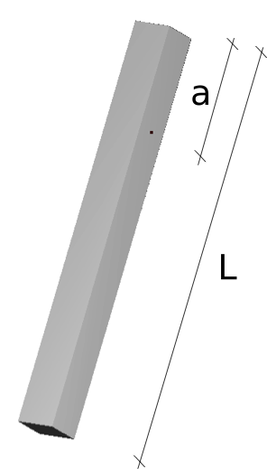

.. _solfec-validation-pinned_bar:

Pinned bar
==========

.. |br| raw:: html

   

+---------------------------------------------------------------------------------------------------------------------------------+
| **Reference:** `W. G. McLean, E. W. Nelson, C. L. Best, Schaum's Outline of Theory and Problems Reference: of Engineering       |
| Mechanics, Statics and Dynamics, McGraw-Hill Book Co., Inc., New York, NY, 1978, p. 336.                                        |
| <https://books.google.pl/books/about/Schaum_s_Outline_of_Engineering_Mechanic.html?id=fxkWKWW29sgC>`_                           |
| |br|                                                                                                                            |
| **Analysis:** Explicit dynamics, bilaterally constrained motion.                                                                |
| |br|                                                                                                                            |
| **Purpose:** Examine the accuracy of an analysis involving spherical joints.                                                    |
| |br|                                                                                                                            |
| **Summary:** A homogeneous bar, pinned at a distance a from one end, with total length :math:`L`, is subjected to gravity       |
| loading and released from rest at an angle :math:`\theta=30\deg` from the vertical. The rotational speed when it passes through |
| :math:`\theta=0\deg` is calculated and compared to an analytical expression.                                                    |
+---------------------------------------------------------------------------------------------------------------------------------+

The length of the spatial angular velocity vector at :math:`\theta=0\deg` reads

.. math::

  \left|\omega\right|=\sqrt{\frac{0.402g_{3}\left(L-2a\right)}{L^{2}-3La+3a^{2}}}
  
provided the bar was released at :math:`\theta=30\deg`.

.. _pinned_bar0:

   The pinned bar in the initial configuration.

Input parameters
----------------

+---------------------------------------------------+-----------------------------------------------+
| Density :math:`\left(kg/m^{3}\right)`             | :math:`\rho=1`                                |
+---------------------------------------------------+-----------------------------------------------+
| Square cross-section :math:`\left(m^{2}\right)`   | :math:`b\times b=0.1\times0.1`                |
+---------------------------------------------------+-----------------------------------------------+
| Length :math:`\left(m\right)`                     | :math:`L=1`                                   |
+---------------------------------------------------+-----------------------------------------------+
| Distance to joints :math:`\left(m\right)`         | :math:`a=0.25`                                |
+---------------------------------------------------+-----------------------------------------------+
| Gravity acceleration :math:`\left(m/s^{2}\right)` | :math:`\mathbf{g}=\left[0,0,-9.8\right]`      |
+---------------------------------------------------+-----------------------------------------------+

Results
-------

The time step used in the analysis is :math:`h=2^{-8}`. The hinge is modeled by a pair of spherical joints.
The computations are terminated for the first n such that :math:`\theta\left(nh\right)\le0` (interpolation of
the results to the exact point :math:`\theta\left(t\right)=0` is omitted). The table below summarizes the results

+-----------------------------------------------------------------------------+-----------+----------+---------+
|                                                                             | Target    | Solfec   | Ratio   |
+-----------------------------------------------------------------------------+-----------+----------+---------+
| Length of angular velocity when :math:`\theta=0\deg\,\, \left(rad/s\right)` | 2.121     | 2.116    | 0.997   |
+-----------------------------------------------------------------------------+-----------+----------+---------+

.. _pinned_bar1:

.. figure:: pinned_bar/pinned-bar.gif
   :width: 50%
   :align: center

   Animation of the pinned bar (reload page or click on image to restart).
