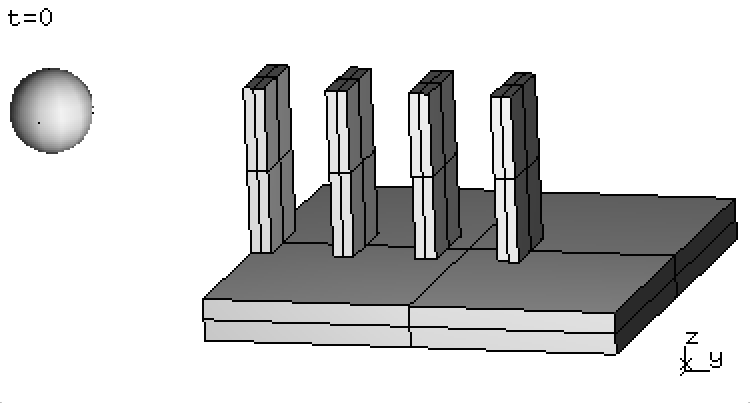
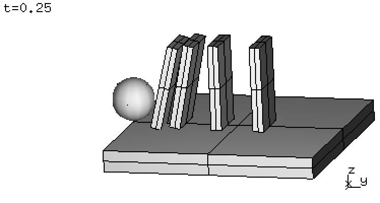
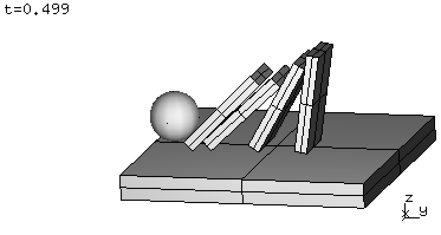

.. _solfec-xdmf-example:

Export domino example
=====================

The source code below demonstrate the XDMF export functionality using a domino toppling example.
Lines 1--17 set up the simulation. Lines 19--34 exemplify the export capability. Within Solfec sources
this example can be found as `inp/devel/xdmf-export.py
<https://github.com/tkoziara/solfec/blob/master/inp/devel/xdmf-export.py>`_.

.. literalinclude:: ../../../solfec/inp/devel/xdmf-export.py
   :linenos:

Assuming we are inside of Solfec source directory, this example can be executed as follows:

::
  
  ./solfec inp/devel/xdmf-export.py

This will invoke lines 1--17 and output results into the out/domino directory. Here are few screenshots
from the Solfec viewer:

.. |dom3| image:: figures/xdmf-domino-3.png    
   :width: 90%
   :align: middle

+--------+--------+--------+--------+
| |dom0| | |dom1| | |dom2| | |dom3| |
+--------+--------+--------+--------+

We then need to run Solfec again, just as above:

::
  
  ./solfec inp/devel/xdmf-export.py

in order to execture lines 19--34 and output the out/xdmftest[0--4] directories. Recall, that when results
are present solec runs in the 'READ' mode, facilitating access to post--processing routines.

The first export instance:

::

  XDMF_EXPORT (solfec, 0.0, 'out/xmftest0')

only saves the initial :math:`t = 0.0` state into out/xmftest0 directory. This can be useful ...

.. tip:: Modify Solfec to allow for 'READ' mode export only when time = 0.0 is used.
