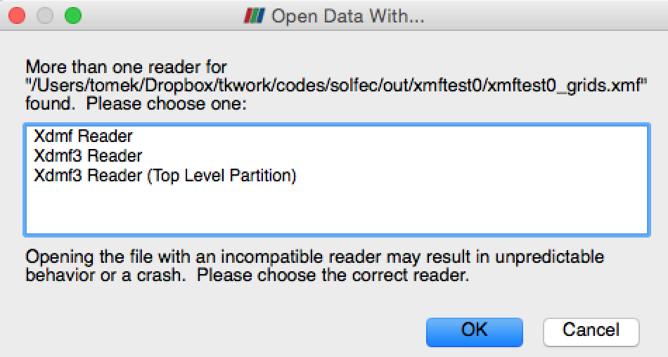
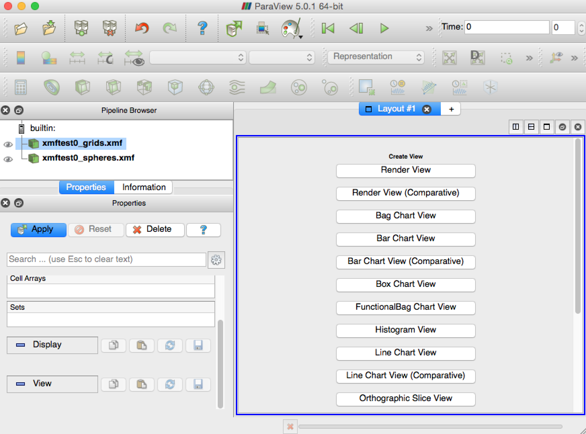
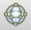
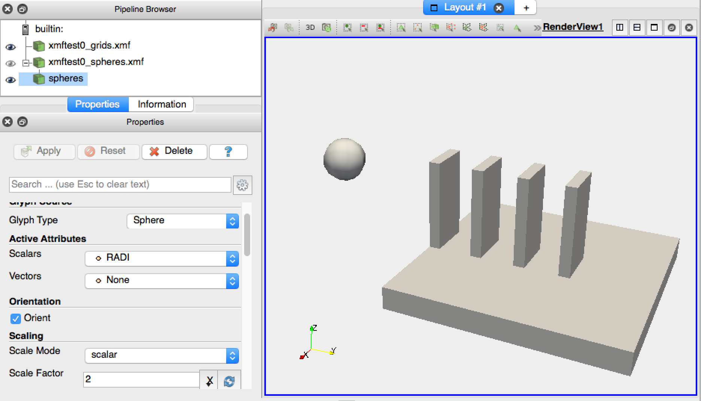
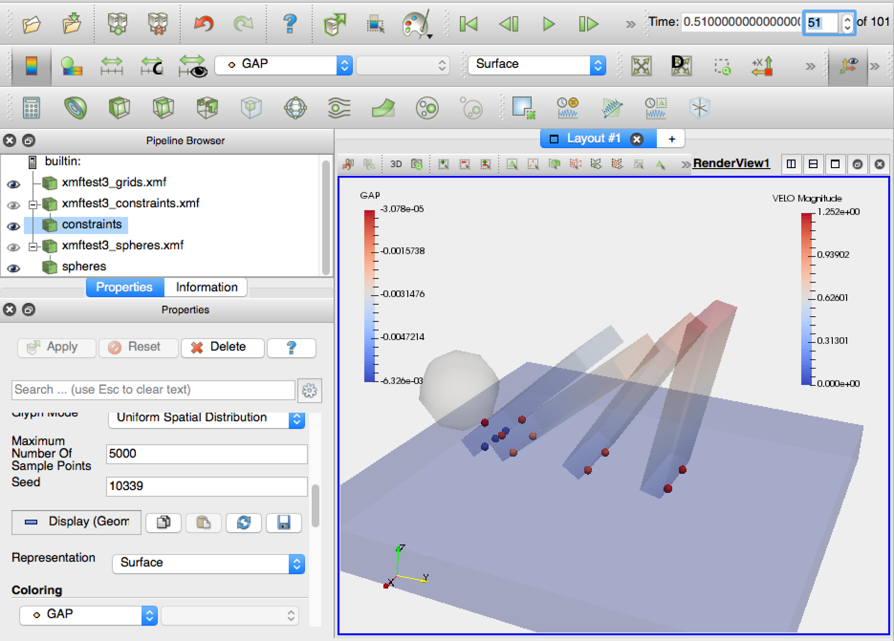
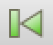
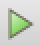

.. _solfec-xdmf-paraview:

Paraview session example
========================

This section gives an example of a `Paraview <http://www.paraview.org>`_ session involving viewing results
generated by the domino toppling example described in the :ref:`previous section <solfec-xdmf-example>`.
Although our presentation is self--contained, `Paraview tutotials <http://www.paraview.org/tutorials/>`_ greatly
expand on the minimalist exposition provided here.

Viewing basic geometry
----------------------

Let's start by viewing the results saved into the *out/xmftest0* directory. These were generated in the 'WRITE'
mode [1]_ prior to any calculations. Consequently, *out/xmftest0* only stores the initial geometry
of the problem. Let's open the *\*.xmf* files found inside of this directory by using File :math:`\to` Open and
selecting *xmftest0_grids.xmf* and *xmftest0_spheres.xmf* files. When opening a first of those files you will
be prompted to sellect an XDMF reader. Use any of the *Xdmf3* options, cf. :numref:`paraview-0`.

.. _paraview-0:

   XDMF reader selection in Paraview (use any of the *Xdmf3* options).

After opening both the *grids* and the *spheres* files, your application window may look like :numref:`paraview-1`.
Let's select the *Render View* in the "Layout #1" window and click onto the little eye to the left of **xmftest0_grids.xmf** item
in the *Pipeline Browser*. We should now be able to manipulate (rotate by left clicking and moving around) the graphical
representation of the domino model, cf. :numref:`paraview-2`.

.. _paraview-1:

   Paraview application window after opening *xmftest0_grids.xmf* and *xmftest0_spheres.xmf* files found in the *out/xmftest0* directory.

.. _paraview-2:

.. figure:: figures/paraview-2.png
   :width: 70%
   :align: center

   Render view with item *xmftest0_grids.xmf* enabled in the Pipeline Browser.

To complete presentation of the initial geometry we would like to enable rendering of the sphere. To do this we need to
select the *xmftest0_spheres.xmf* item in the Pipeline Browser, followed by clicking *Apply* in the properties window underneath.
This will cause the glyph icon, |glyph|, to become active allowing us to use a sphere based representation
of the *xmftest0_spheres.xmf*  dataset. We can change the default *Glyph1* label that appeared in the Pipeline Browser
by left clicking on it once (or selecting *Glyph1* and pressing enter). Let it be called *spheres* instead, cf. :numref:`paraview-3`.
Finally, using the *Properties* dialog box underneath the Pipeline Browser, we set up the *Glyph Type* as *Sphere*, and set the
*Scale Mode* to use the *scalar* field which has been automatically picked up as RADI just above. This means that the unit glyph 
size will be scaled by the scalar RADI value read from the xmf file. In our case the glyph size is the sphere diameter and since
RADI represents the sphere radius, we need additionally set the *Scale Factor* to be equal 2. By pressing *Apply* we make
the sphere visible, as seen in :numref:`paraview-3`.

.. _paraview-3:

   The properties for the *spheres* glyph and rendering of the *out/xmftest0* results set.

.. tip:: When initially viewing results by pressing the eye symbol in the Pipeline Browser,
  Paraview often automatically selects an attribute to be viewed (e.g. displacement). You can use
  the attribute drop--down menu circled in :numref:`paraview-4`, and select "Solid Color" in order
  to draw plain geometry.

Viewing results attributes
--------------------------

We are going to use the *out/xmftest3* results in order to demonstrate viewing attributes. You can delete the previous results
by selecting them in the Pipeline Browser and pressing backspace. Use the  procedure outline above in order to load files:

- *out/xmftest3/xmftest3_grids.xmf*,
- *out/xmftest3/xmftest3_constraints.xmf*,
- and *out/xmftest3/xmftest3_spheres.xmf*.

Add glyphs for both *constraints* and *spheres* just as it was done for the spheres results above. Set the same scaling for
the spheres and use a constant scaling factor of 0.02 for the constraints. Constraints, e.g. contact points, are typically
located in between of solid mesh surfaces, and hence they are often not visible. Select the grids results in the Pipeline
Browser and find the *Opacity* sliding bar in the Properties window. Turn it down to about 0.2 and repeat the same procedure
for the spheres glyph. Now all solid geometry is slightly transparent allowing us to view it together with the spheres
representing contact points between the base block and the domino pieces, cf. :numref:`paraview-4`.

.. _paraview-4:

.. figure:: figures/paraview-4.png
   :width: 70%
   :align: center

   The initial geometry for the *out/xmftest3* results set. Opacity of grids and the sphere has been decreased in order to facilitate viewing of constraints glyphs.

Let's now select the *grids* results set in the Pipeline Browser and use the drop--down menu circled in
:numref:`paraview-4` in order to view the velocity field magnitude of domino pieces. Paraview automatically
inserts a legend called "VELO Magnitude" into the render view in order to index the colors that are drawn
on domino surfaces. You can double click onto the legend and move it around if the default placement is not
appropriate. Now, highlight the *constraints* results set in the Pipeline Browser and select the
"GAP" attribute from the drop--down menu. A legend labeled "GAP" is additionally inserted into the render
view. We can now use the *step* edit box, highlighted in the top--right area of :numref:`paraview-5`, and
select a time step at which we wish to view the results.  In our case, out of the 101 steps available, we
have selected step 51.

.. _paraview-5:

   Rendering of attributes, simultaneously for grids and constraints, using the *out/xmftest3* results, at step 51.

.. _paraview-reactions:

.. note:: Contact reactions are conveniently rendered using the arrow glyphs. Select the *constraints* glyph in the
  Pipeline Browser and set the Glyph Type to *Arrow*. In the *Vectors* drop--down menu in the *Active Attributes*
  area select the REAC vector field. Change the scale factor of the glyph to about 0.15 and press *Apply*.
  Then use the attribute drop--down menu, circled in :numref:`paraview-4`, and select REAC.

Exporting a video clip
----------------------

In :numref:`paraview-5` to the left of the time step selection box, we can see a set of buttons looking like
a video playback control panel. This is what they essentially are. You can press the first frame button, |first|,
in order to rewind the simulation back to its initial frame. To close our tutorial we are going create and a video clip,
animating the reaction forces, rendered as explained in the :ref:`note above <paraview-reactions>`. First,
you can simply press play, |play|, in order to play the animated results within Paraview. To export the
same animation as a video clip use *File* :math:`\to` *Save Animation* and then follow the instructions.

.. only:: html

  The first clip below demonstrates an animation of the domino toppling with the domino velocity and contact gap magnitudes juxtaposed as color maps:

  .. youtube:: https://www.youtube.com/watch?v=F8dyb3Ay2D4
    :width: 360
    :height: 343

  This second clip depicts the animated contact forces:

  .. youtube:: https://www.youtube.com/watch?v=MvQuHUG_FTs
    :width: 360
    :height: 314

.. only:: latex

  A single frame from the generated video clip is included in :numref:`paraview-6`.

  .. _paraview-6:

  .. figure:: figures/paraview-6.png
     :width: 70%
     :align: center

     A frame from the domino toppling animation, also available as `this youtube clip <https://youtu.be/MvQuHUG_FTs>`_.

.. [1] Solfec operates either in 'WRITE' mode, computing and writing new results, or in 'READ' mode, reading and post-processing existing results.
