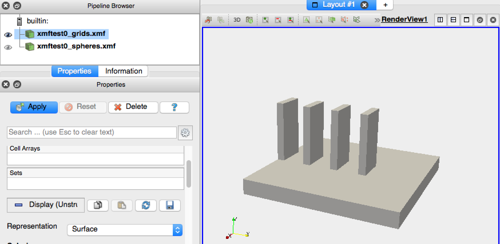

.. _solfec-xdmf-paraview:

Paraview session example
========================

This section gives an example of a `Paraview <http://www.paraview.org>`_ session involving viewing results
generated by the domino toppling example described in the :ref:`previous section <solfec-xdmf-example>`.
Although our presentation is self--contained, `Paraview tutotials <http://www.paraview.org/tutorials/>`_ greatly
expand on the minimalist exposition provided herein.

Let's start by viewing the results saved into the *out/xmftest0* directory. These were generated in 'WRITE'
mode [1]_ prior to any calculations. Consequently, *out/xmftest0* only stores the initial geometry
of the problem. Let's open the *\*.xmf* files found inside of this directory by using File :math:`\to` Open and
selecting *xmftest0_grids.xmf* and *xmftest0_spheres.xmf* files. When opening a first of those files you will
be prompted to sellect an XDMF reader. Use any of the *Xdmf3* options, cf. :numref:`paraview-0`.

.. _paraview-0:

.. figure:: figures/paraview-0.png
   :width: 50%
   :align: center

   XDMF reader selection in Paraview (use any of the *Xdmf3* options).

After opening both the *grids* and the *spheres* files, your application window may look like :numref:`paraview-1`.
Let's select the *Render View* in the "Layout #1" window and click onto the little eye to the left of **xmftest0_grids.xmf** item
in the *Pipeline Browser*. We should now be able to manipulate (pan and rotate by left clicking and moving around) the graphical
representation of the domino model, cf. :numref:`paraview-2`.

.. _paraview-1:

.. figure:: figures/paraview-1.png
   :width: 70%
   :align: center

   Paraview application window after opening *out/xmftest0/xmftest0_grids.xmf* and *out/xmftest0/xmftest0_spheres.xmf*.

.. _paraview-2:

   Render view with enabled *xmftest0_grids.xmf* item in the Pipeline Browser.

The last thing to be done for this results set is to enable the graphical representation of the sphere. To do this we need to
select *xmftest0_spheres.xmf* in the Pipeline Browser, followed by clicking *Apply* in the properties window underneath.
This will cause the glyph icon, |glyph|, to become active allowing us to use a sphere based representation
of the *xmftest0_spheres.xmf*  dataset.

.. [1] Solfec operates either in 'WRITE' mode, computing and writing new results, or in 'READ' mode, reading and post-processing existing results.

.. 
  .. only:: html
  .. raw:: html
  <iframe width="560" height="315" align="middle" src="http://www.youtube.com/embed/F8dyb3Ay2D4?rel=0" frameborder="0" allowfullscreen></iframe>
  .. only:: latex
  A screenshot of YouTube vide will be placed here ...
