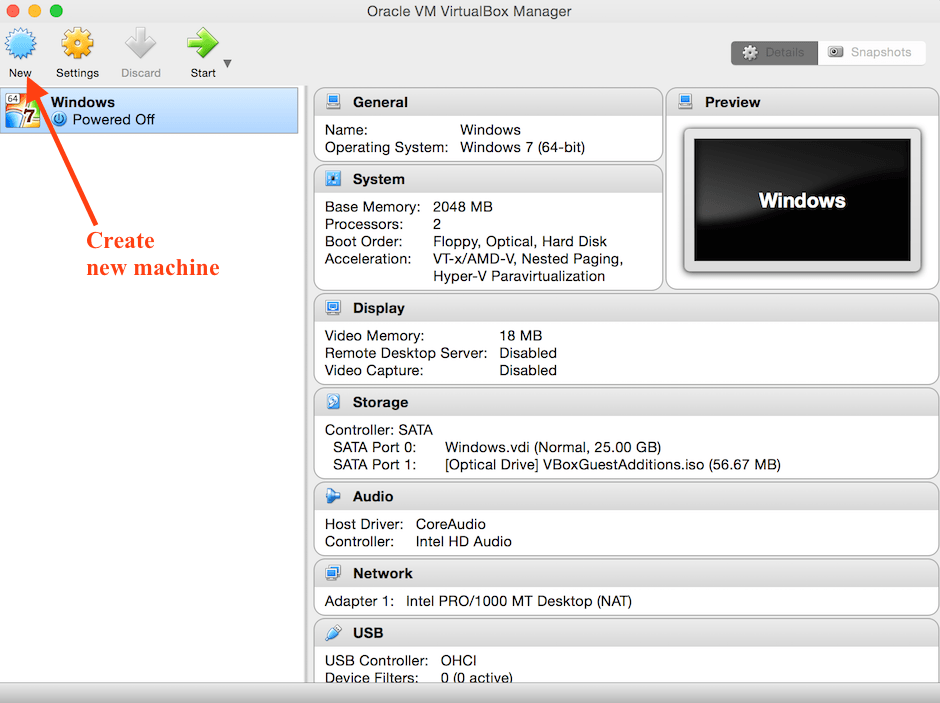
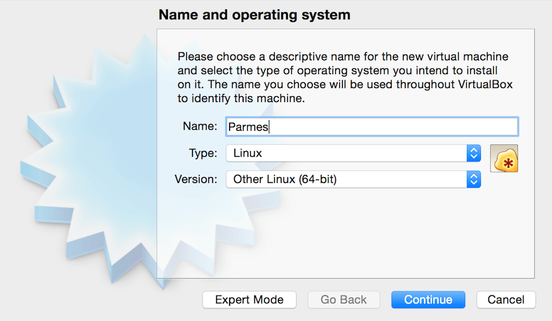
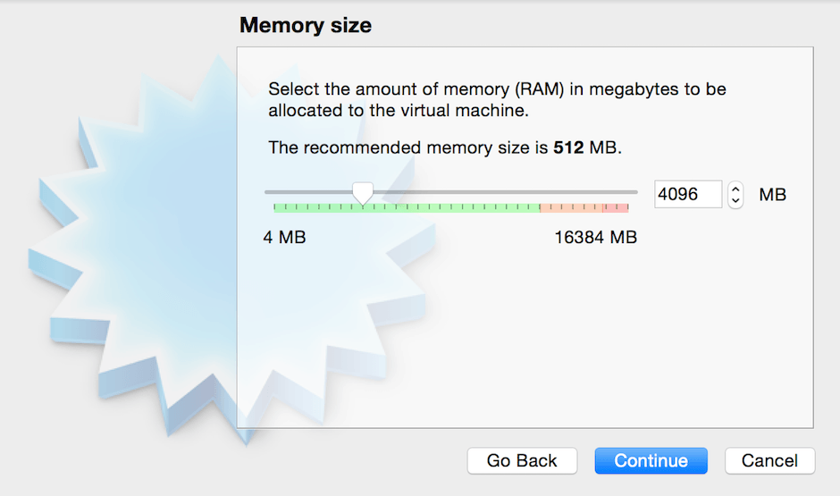
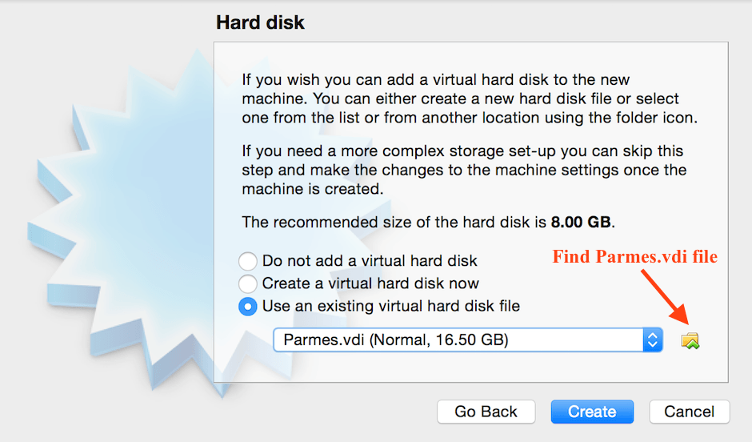
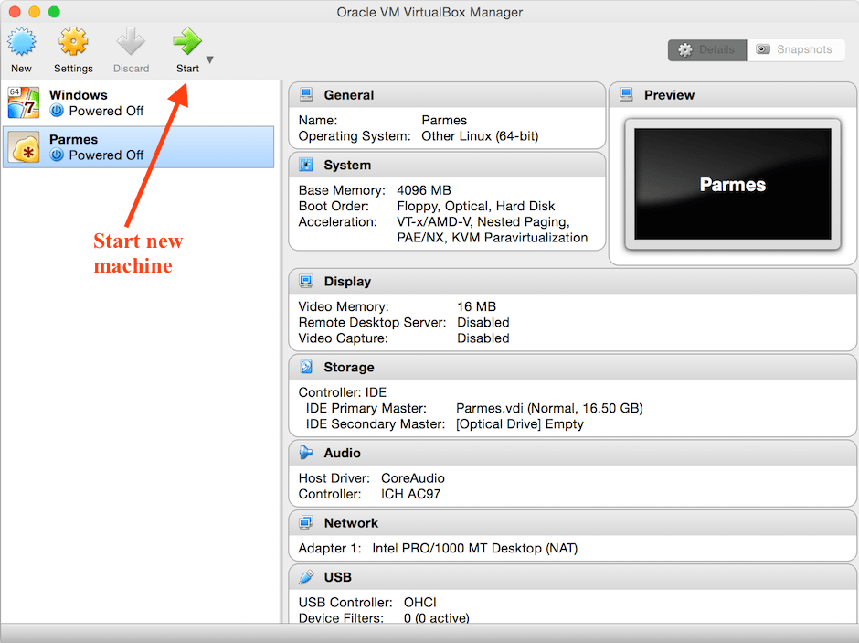
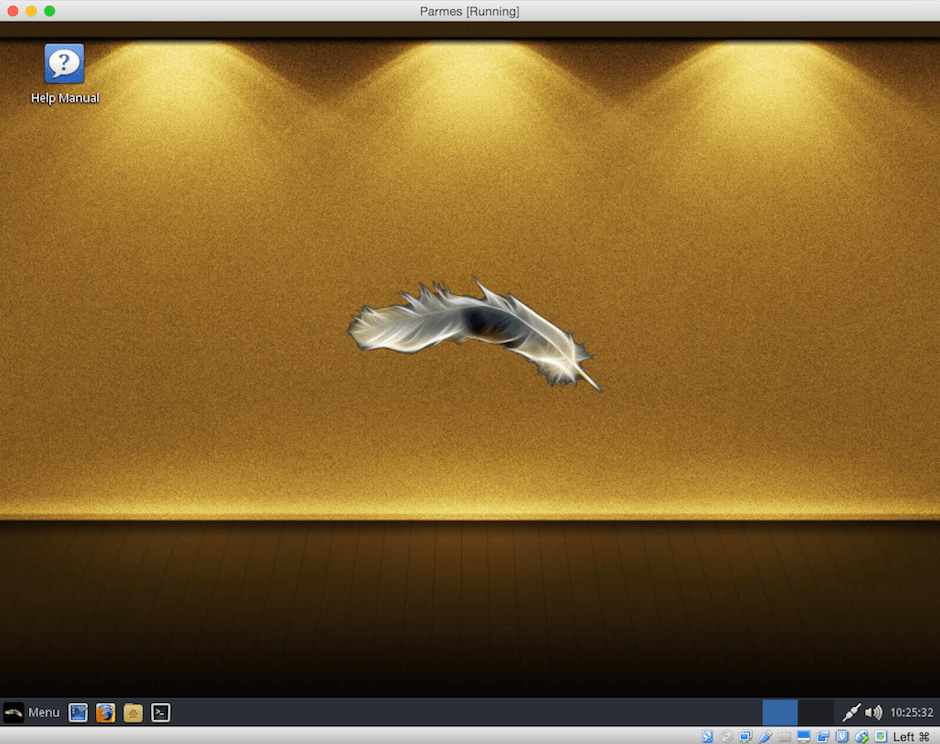
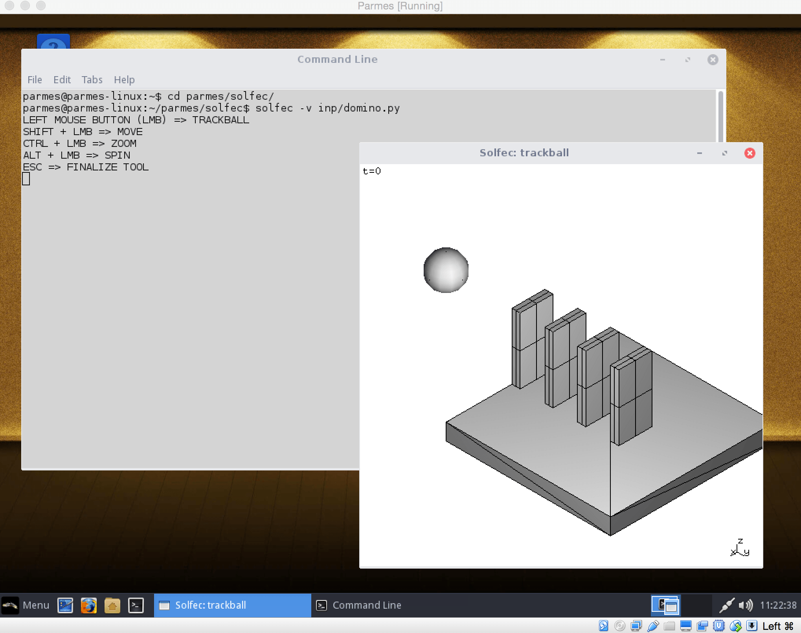

.. _vbox-index:

Parmes VirtualBox Image
=======================

You can download:

* `a zipped VirtualBox image Parmes.zip <https://drive.google.com/uc?export=download&id=0B0lQ6Rj8GeMVSXE3OUk3QzV6dTA>`_

and use below guidance in order to set up a `VirtualBox <https://www.virtualbox.org>`_ installation
of `Linux Lite <https://www.linuxliteos.com/>`_ with `PARMES <../>`_ software pre--installed.

After downloading unzip the Parmes.zip file into Parmes.vdi. Then start VirtualBox and press "New" to create a new virtual machine (:numref:`vbox1`).

.. _vbox1:

   Press "New" to create a new virutal machine.

Select name, type and version of the operating system, as in :numref:`vbox2`. Press "Continue".

.. _vbox2:

   Select name, type and version of the operating system.

Select memory size as in :numref:`vbox3` (you may select less or more and later modify as needed), and press "Continue".

.. _vbox3:

   Select memory size.

Select "Use an existing virtual hard disk file" and find Parmes.dvi on your hard drive (:numref:`vbox4`). Press "Create".

.. _vbox4:

   Select hard drive: use Parmes.vdi file.

You can then select and start the new machine as in :numref:`vbox5`.

.. _vbox5:

   Start new machine.

After a moment Linux Lite desktop becomes available, :numref:`linuxlite1`.

.. _linuxlite1:

   The default Linux Lite session.

The provided `Linux Lite <https://www.linuxliteos.com/>`_ system is set up as follows:

* a default **parmes** user is automatically logged in

* the *parmes* user password and the *root* password are "**parmes**"

* directory */home/parmes/parmes* contains all `PARMES <../>`_ software

* file */home/parmes/.bashrc* extends the PATH variable to include `PARMES <../>`_ executables

**Disk capacity**

* The provided system image has a size limit of 16GB

* It may be practical to use Virtual Box `"Devices --> Shared Folders" <https://www.virtualbox.org/manual/ch04.html#sharedfolders>`_
  option in order to share an external folder with your virtual machine

**Multi--user use**

* The default **parmes** user is practical in case of a single--user use of the machine

* It may be useful to `add additional users <https://www.linuxliteos.com/manual/install.html#adduser>`_ in case
  you would like to share this machine with more than one person

* Each user can set up his own environment by copying files:

  ::

     cd $HOME
     cp -r /home/parmes/parmes ./
     cp /home/parmes/.bashrc ./

**Using the software**

:numref:`linuxlite2` shows a `Solfec <../solfec>`_ viewer session of a domino toppling example.
Executables :ref:`*solfec*, *solfec-mpi* <solfec-1.0-running>`, and :ref:`*parmec4*, *parmec8* <parmec-running>`
are available at the command prompt.

.. _linuxlite2:

   :ref:`Solfec-1.0 <solfec-1.0-index>` viewer session of a domino toppling example.

.. topic:: Updating `PARMES <../>`_ software

  File $HOME/parmes/Makefile facilitates update of `PARMES <../>`_ software. Enter the $HOME/parmes directory and type:

  ::

    make

  This will update the entire source code tree and recompile all software. **Note, that all local changes inside of $HOME/parmes will be lost.**
  Serial, shared memory parallel, and MPI parallel versions of the software are all compiled by default. See also the `TGZ page <../tgz>`_ for
  additional make options.
